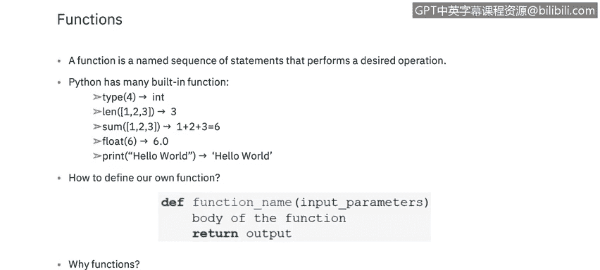
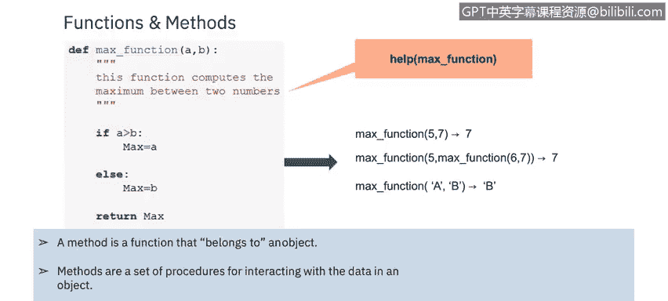
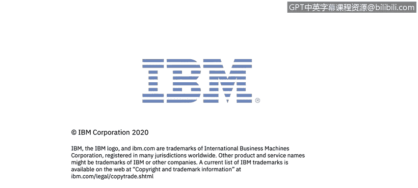

# IBM网络安全分析师专业证书课程5：《渗透测试、事件响应与取证》penetration-testing-incident-response-forensics - P33：32_函数和方法.zh - GPT中英字幕课程资源 - BV1Dr4y1d7EB

Welcome to Python functionss and methods brought to you by IBM。In this video。

 you will learn to understand functions and methods of Python scripting。

A function is a block of code， which only runs when it is called。

 You can pass data known as parameters into a function。A function can return data as a result。

Python has many built and functions。 You can see a few of them here。 type， land， sum， float， print。

 some of which we've already explored in other videos。😊。

Imppyython a function is divine using the Daf keyword。To call a function。

 use the function name followed by parentheses。 Next， we will take a look at arguments。

 Information can be passed into functions as arguments。

 Arguments are specified after the function name inside the parentheses。

 You can add as many arguments as you want。 Just separate them with a comma。

The terms parameter and argument can be used for the same thing。

 information that are passed into a function。A parameter is a variable listed inside the parentheses in the function definition。

 An argument is a value that is sent to the function when it is called。

Why functions to write our own chain of commands， simplifyiming the readability。

 The rebut usable and can be used many times。

By default， a function must be called with the correct number of arguments。

 mean that if your function expects two arguments， you have to call the function with two arguments。

 not more and not more less。A method in Python is somewhat similar to a function。

 except it is associated with object and classes。Methods in Python are very similar to functions。

 except for two major differences。 The method is implicitly used for an object。

 for which it's called。The method is accessible to data that is contained within the class。

We will learn more about Python libraries in the next video。

