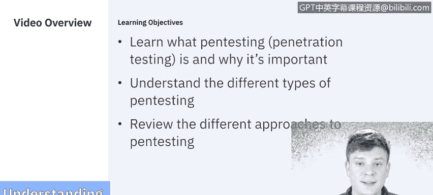

# IBM网络安全分析师专业证书课程5：《渗透测试、事件响应与取证》penetration-testing-incident-response-forensics - P36：1_02_what-is-penetration-testing.en_subtitled - GPT中英字幕课程资源 - BV1Dr4y1d7EB

To start things off， we need to discuss what is penetration testing。In this video。

 we'll discuss what penetration testing or pen testing is and why it's important。

 and then we'll discuss the different types of penetration tests and the different approaches you can take。

The National Institute for Security and Technology defines pen testing as security testing in which assessors mimic real world attacks to identify methods for circumventing the security features of an application。

 a system or a network。 It often involves launching real attacks on real systems and data with tools and techniques commonly used by hackers。

With cybert becoming the norm， it's more important than ever to undertake regular vulnerability scans and penetration testing to identify vulnerabilities and ensure the cyber controls in place are working。

 Now because these are real attacks on real systems。

 this is not something that's going to be performed monthly or quarterly。

 a lot of companies are electing to do this annually to make sure that the controls are in place while minimizing the impact on their business with the increasing importance of penetration testing。

 So does the understanding of the operating systems they can be conducted on。

 Windows O S is the most popular operating system by far， followed by Unix， Linux and Mac O。

Some systems are run on Chrome OS and Ubuuntu， but not nearly as frequently as the top three。

Android is by far the most popular operating system， followed by iOS and Blackberry OS。

Windows mobile is less common， and rarely on very， very old cell phones。

 you will find Web O and Sbiian OS still around。Now that we've defined what pen testing is and understand the different operating systems that it can exist on。

 we need to discuss the different approaches you can take to conducting a penetration test。

No two tests are going to be the same because each company uses different tools， systems。

 applications， we need to be flexible in our approaches。So let's take a look at some of those。

 The first off is an internal employee versus an external hacker。

80% of attacks happen internally to companies， so it becomes important to test a system as if you were an employee or an ex employee and you know already having access to some of these tools can get you a lot further than let's say if you were an external。

 which you would just use the most common or appropriate tools that an external hacker would use。

The next approach is looking at web or mobile applications， which is pretty similar。

 these assessments often include making sure that the code is secure and up to date with the security policy and there's a lot of authentication and password cracking attempts to try and test the vulnerabilities there。

Social engineering is kind of a tactic we'll use throughout a lot of these approaches， but by itself。

Social engineering is creating almost a feeling or a mentality of anxiety within somebody to gain access to information that you normally wouldn't。

 historically we know social engineering as like phishing attacks with emails。

 but they can also be phone calls， they can be in person and often they're done through providing you know threats。

 ultimatums， misinformation， creating senses of urgency。

 escalating and all around creating a situation in which you're getting somebody to divulge information or to gain access to something you wouldn't normally have access to。

Next is going to be the wireless network， so we know most companies will have an internal wireless network for all of its employees to use。

 so it becomes very important that we test that and make sure that it's complying with the security policy。

And since every employee is connecting to that internal network。

 often they'll try and use their own devices， whether they're phones or computers。

 so those all become areas of vulnerabilities for us to test。And even beyond people。

 things are now always connected to the internet， be it webcams or thermostats or even coffee makers connect to the network now So you know there's the network itself。

 all the people that are connecting to the network with devices that might not be secure or you know physical things connected in the network。

 all different approaches we can take industry control systems are historically very outdated with their passwords with their Os and are highly susceptible to social engineering because they often use the default passwords and configurations Now industry control systems don't exist everywhere。

 they're mostly in the oil， gas and electric industries but you can imagine that those industries have a widereach impact if compromise so it becomes increasingly important to test those So these are all just different approaches we can take to pen testing。

 but let's take a step back now。And actually look at the penetration test itself and what that might include。

As I mentioned in the initial definition of pen testing。

Penetration tests can occur across applications， networks。

And systems like mobile devices or different operating systems。

And while each of these different approaches may vary。

The methodology in which we use remains largely the same。

 so there's always going to be this initial planning phase where you work out a contract an agreement with the company which will define kind of the scope of the attack and since you're attacking a real system。

 it becomes very important that you set very strict boundaries and are very clear with what may or may not happen。

And once you have a plan worked out with what you want to do。

 there's going to be kind of a reconnaissance or a discovery phase where you gain as much information as you can both actively and passively。

And once you feel like you have enough information。

 you move forward to the exploit or the attack of the actual penetration test。

And then after the attack is complete or you've accomplished whatever you set out to accomplish in the planning phase。

 the reporting becomes hugely important for the company to act on so that they know all what was successful what was not successful Here are the areas of vulnerabilities。

 Here's the things you're at risk for。 So what we're going to do is in the next series of videos we're actually going to break down each of these phases of a penetration attack so you can further understand all the considerations and methodologies that we can use for a successful penetration test。

