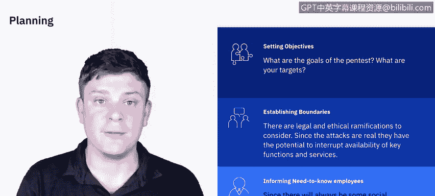

# IBM网络安全分析师专业证书课程5：《渗透测试、事件响应与取证》penetration-testing-incident-response-forensics - P3：2_渗透测试计划.zh - GPT中英字幕课程资源 - BV1Dr4y1d7EB

The first phase of penetration testing we're going to be discussing is planning。In this video。

 we'll begin to break down the different phases of a pen test。 We' starting with the planning phase。

So we're going to break down the planning phase in each of its components。

 as well as consider the ramifications of a real attack on a real system。

Let's get started。The first step of a penetration test is going to be planning。

And to plan you'll need to set your objectives so you'll be meeting with your client and going over exactly what the goals of the penetration test are going to be。

 is it targeting specific data， a specific person or group we discussed in previous modules that you could be focusing on a network and application。

 a system so there's a lot to be taken into consideration what's so important here though is that everything goes into a contract。

Because the contract is going to set the boundaries for what you are are or are not able to do。

So when establishing your boundaries， you need to take into consideration the legal and ethical ramifications of doing a real attack on a real。

System， a product or service， so the things you do could very well impact the availability of these products and services。

So you need to take into consideration do we want to do this during the weekdays。

 during the weekends， how far do we take this， do we take it all the way down。

 do we take it until we just gain access so there's a lot of boundaries to set and those need to be in writing because if those are exceeded if you go beyond what was set in those boundaries there could definitely be legal ramifications for them。

The last thing to consider。Is do you need to inform any need to know individuals now the whole purpose of a penetration test is to simulate a real world attack？

But you also don't want to be arrested in the middle of your test because you're trying to gain access to like you're doing social engineering。

 you might be trying to gain access to a physical space that you don't have access to so all those things really need to be weighed and they need to be laid out in the planning phase。

So that's mostly what we take into consideration for planning。

 the next phase is going to be how we gather information， the discovery。

