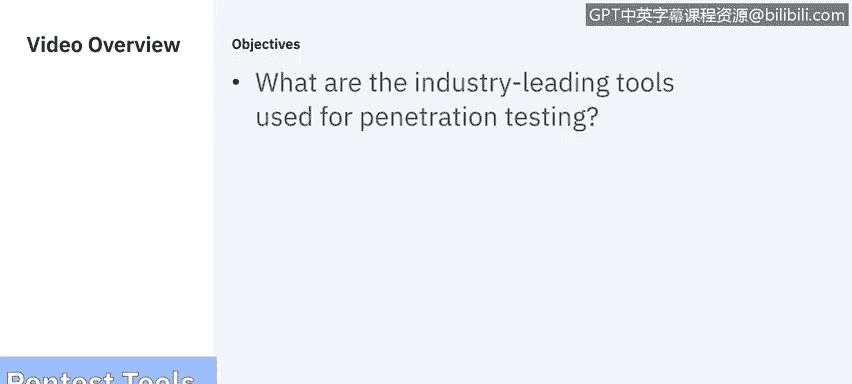
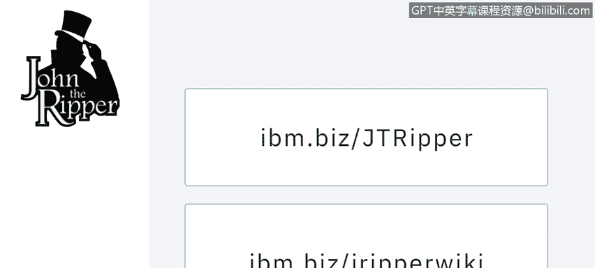

# IBM网络安全分析师专业证书课程5：《渗透测试、事件响应与取证》penetration-testing-incident-response-forensics - P42：7_01_tools.en_subtitled - GPT中英字幕课程资源 - BV1Dr4y1d7EB

Welcome to penetration testing tools。Brought to you by IBM。In this video。

 Raoul will be taking us through industry leading tools used for penetration tests As he covers each tool。

 a URL will appear on the screen。 I highly encourage you visit each URL while Raoul is discussing that specific tool。

 These URLs will take you to the tools website and such sure other related links。

 At the end of this video， you will be asked to choose three tools that interest you the most and spend time deep diving into their websites to learn more。

 One of the most useful tools that have been using in my penetration testing practices is K Linux。

 Cal Linux is like your toolbox。😊。

It's an all in one deian pace Linuxus distribution， which contains several hundred tools。

 which are gear。Towards various information security tests， it has tools for security research。

 penetration testing， forensics and reverse engineering。

It had been my trusted companion when I've been trying on my CFs。

 It is an excellent tool too to perform sandboxing。

Which is trying for virus research in a secure environment。 It has a custom kernel。

Which you can patch to any level so you can try to inject gold。 You can try to。

Perform rootki analysis。 you can try to attack it， practice with it。

 It is nice to have at least a couple of virtual machines of cas。

On your latest distribution so you can practice with it。 One of the most useful tools。

 and a must if you want to pass your C。

Your certified ethical hacker is a map。Is an open source network scanner which is used to discover host and services on a computer network。

 You can passively attack a network。By sending a map to listen on the router packages。

Be distributed to the network， and。Do a map。Of which servers are part of the network。Also。

 you can do an active scan， which will tell you which。

Fors are open and which services are being published。

 The next tool we're going to look at is John River。

Gunital Reer is a tool that requires you to have a dump。

Of password file or an encrypted file that you want to theed。To a text format， historically， it's。

Way to defeat and detect Vig Uni passwords。 We can use gender report to try a dictionary attack。

We can try him to ripap away the passwords on a shadow file。

There are a lot of things that this guy can do， the Me plate project is a repository for attacks。

So using the meta application， you can attempt a plethora of attacks depending on the target's architecture。

So if you already have information about the version of the OSs or the version of the apps。

If they have an old FTP， it's。90% sure that you can find the attack on the Mepl app。

And just apply it into the server。 By the way， it's also already added into the call Linux repository。

 where check is mandatory for everyone here。It's a packet analyzer。

 It will tell you what is going on in the network。 The previous version was Ethere。

 So if you used Ethere a long time ago， word shark is not so different but is more elegant now。

Is cross platform， it means you can use it in Linux， you can use it in Windows and Mac。

 always a good idea to have it installed as some time。

Our clients would like to send us a dump for us to analyze。 And this guy is the best way to do it。

 Hack the box is not a 2%， but it is a nonprofit。

Is an organization which creates a lot of boxes。Linux and Windows for you to hack。

It's completely legal to attempt hacking these boxes is completely free。To work on them。

But they do sell some courses and instructions。 If you buy a subscription from them。

 they will send you even solutions of some of their boxes。There are a lot， a lot of tools for this。

 These that I'm showing you are just some of them。 Please investigate about other tools and choose the ones you prefer。

 Take care and see you in the next lesson。

