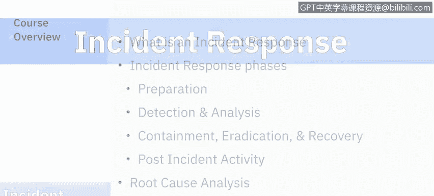
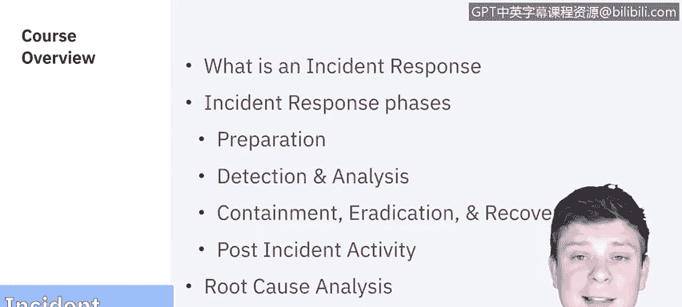

# IBM网络安全分析师专业证书课程5：《渗透测试、事件响应与取证》penetration-testing-incident-response-forensics - P43：8_01_incident-response-overview.en_subtitled - GPT中英字幕课程资源 - BV1Dr4y1d7EB

Welcome to Pen testing， incidentcident Rese and forensics brought to you by IBM。In this series。

 we'll be focusing on incident response。

In this series， we'll be covering what an incident response is。

 as well as the different phases that makes up an incident response。 Those phases are preparation。

 detection， analysis， containtainment， eradication and recovery and the post incident activity。

 Each of these will be with their own little sections。 We'll then cover some root cause analysis。

 and we'll wrap up this series with a demo on incident response。

