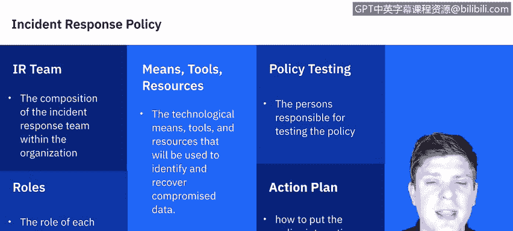
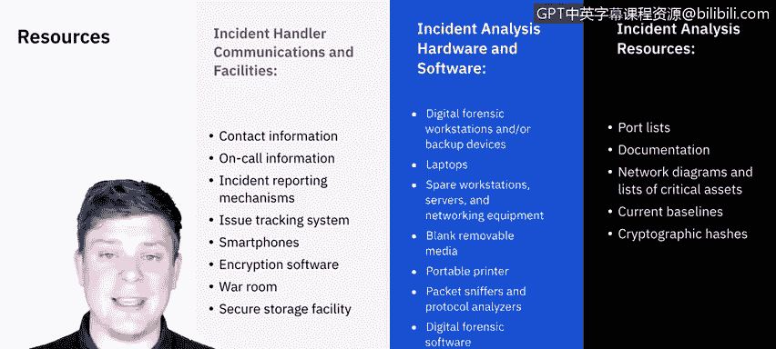

# IBM网络安全分析师专业证书课程5：《渗透测试、事件响应与取证》penetration-testing-incident-response-forensics - P45：10_01_incident-response-preparation.en_subtitled - GPT中英字幕课程资源 - BV1Dr4y1d7EB

Welcome to incidentci response preparation， brought to you by IBM。In this video。

 we'll be learning about incident response policies。

 We'll then review the resources needed for an incident response teams to be successful。

 We'll learn about the recommended practices for securing networks， systems and applications。

 and we'll end with a preparation checklist。 Let's get started。

Every successful incident response team will have a policy in place that helps decide who， what。

 when， where， why， and how an incident will be responded to。

Here are some of the things that the policy will need to cover。

 it'll need to cover who the incident response team is within the organization。

 as well as the different roles of the incident response team。

 so this will help determine the scope of support for each person in the team。Itll cover the means。

 tools and resources that will be used to identify and recover compromised data。

 Itll cover policy testing， which is really important given the ever evolving landscape of threats in the cybersecurity world。

It'll also cover just an action plan， so an actual detailed outline of how we execute this plan from start to finish。

Next， let's expand on the resources that I mentioned in the policy。

We can really break down resources into three categories。

 the first of which is the incident handle communications and facilities。

 So we need to know all the contact information of all of the personnel on our team as well as the off hours on call information。

 So if something happens， what's the chain of command， Do I have my manager's number。

 do I have the on calls person's number， my manager' manager。

 you got to know all that information because time is one of the most important factors in incident response。

You'll need to know what your incident reporting mechanisms are and have them in place。

 so what software you're using， what databases， ticketing systems， so on and so forth。Smartphones。

 we mentioned， you know， having people on call， does everybody have a company issued cell phone that they can have with them at all times in case an incident occurs？

What encryption software are we using to be able to encrypt the data that we recover or clone or？

What have you， do we have a centralized place like a war room where all the parties can get together and actually communicate in the same room。

 do we have a secure storage facility for any assets that are recovered？

The next category is the hardware or software that we're using so do we have the digital forensic workstations as such as backup devices ready。

 does everybody have a laptop， backup laptops， spare workstation servers。

 network equipment or the virtual machine equivalentvalence of those。

 do we have blank removable media external hard drive CDs flash drives。

 do we have a portable printer to print out any logs or evidence that we need。

 do we have packet sniffniers， protocol analyzers so that if it was a webat。

 we can monitor the network and find out sources of where they're coming from or。

General information like that。And then what evidence gathering accessories are you going to need from there？

The last category is going to be for the incident analysis itself。 Do you have a list of all reports。

 Do you have the proper documentation to go through？

Do you have a network diagram that lists all the critical assets that you have？

What are the current baselines of the network and the organization， you know， if you have services。

 software， things like that， do you know the baseline so you can check them against what's happening now in the aftermath to compare and contrast and do you have cryptographic hashes？

So these are not a comprehensive list， but this is a really good idea to understand just how many things can go into an incident response。

Incident response teams have a lot on their plates。

 And one of the best ways they can manage their workload is to help prevent incoming incidences as best as they can。

 Usually， this is out of scope for incident response team to create the prevention of events that turn into incidents。

 but it's something that they can help advise on， and。I's worth mentioning right。

 So keeping the number of incidents reasonably low is really important to protect the business process of the organization in general。

 If security controls are insufficient， higher volumes of incidences occur overwhelming the incident response team。

 So the best offense really is a good defense。So some of the things that incident response teamss can help provide advice on or just communicate to other people in the organization that you know we need to shore up risk assessment has to be on point so periodic risk assessments of systems and apps should determine what risks are posed by combinations of threats and vulnerabilities host and network security so all hosts should be hardened appropriately using standard configurations adhere here to strict ACLs and be monitored continuouslyly for the network the network perimeter should be configured to deny all activity that is not expressly permitted that's justitless network security。

You're looking at malWware prevention， so you'll need a good software to detect andStop malware and should be deployed throughout the entire organization having that endpoint security。

And then user awareness and training so users should be made aware of different policies and procedures。

 especially if they' changed regarding to the use of networks， systems and applications。

 so again this isn't necessarily the strict job of an incident response team， however。

 having these shored up and making sure that all personnel involved in employees are trained。

Really helps reduce the number of instances， which then increases the response rate of the incident response team。

The last thing I'll leave you with with preparation was provided by the Sands Institute。

 which is just a great checklist。 Are all members aware of the security policies in the organization。

 Do all members of the computer incident response team know who to contact。

 do all incident responseers have access to journals and access incident response toolkis to perform the actual incident response process and have all members participated in the incident response drills to practice the incident response process and to improve the overall proficiency on a regular established basis。

So that's what we have for preparation。 Let's go ahead and move on to detection and analysis。

