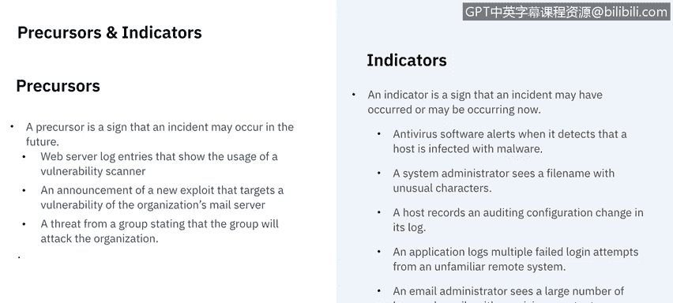

# IBM网络安全分析师专业证书课程5：《渗透测试、事件响应与取证》penetration-testing-incident-response-forensics - P46：11_03_incident-response-detection-analysis.en_subtitled - GPT中英字幕课程资源 - BV1Dr4y1d7EB

Welcome to Incident Rese， detectionte and analysis brought to you by IBM。In this video。

 we're going to learn the differences between a precursor and an indicator and their common sources。

 We'll also discuss the different types of monitoring systems used for detection。

 We'll then learn about the importance of prioritization and documentation and will end with reviewing the possible communication channels needed after detection。

Let's get started。The first thing we need to break down in detection is really the precursors and the indicators。

 so a precursor is a sign that an incident may occur in the future。

 so you get a heads up as to something that's going to happen or as an indicator is a sign that something may have already occurred or is occurring now。

 it's something you notice in the present and say wow， something's either happening or has happened。

Examples of a precursor could be web server log entries that show the usage of a vulnerability scanner。

 so you say， hey， somebody's using a vulnerability scanner against us， something's going to happen。

 there could be an announcement of a new exploit that targets a vulnerability of an organization's mail server。

