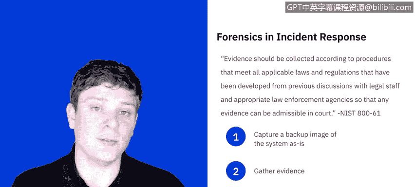

# IBM网络安全分析师专业证书课程5：《渗透测试、事件响应与取证》penetration-testing-incident-response-forensics - P47：12_04_containment-eradication-recovery.en_subtitled - GPT中英字幕课程资源 - BV1Dr4y1d7EB

Welcome to Incident Rese， containment， eradication and recovery brought to you by IBM。In this video。

 we'll learn what to take into consideration when selecting a containment strategy。

 We'll also learn why backup and forensics are a part of the containment process。

 We'll then review the goals of eradication and recovery。

 and then we'll review the sands checklist for this section。 Let's get started。

Containment is important before an instant overwhelms resources or increases in damage。

 Containment strategies vary based on the type of incident。 For example。

 the strategy for containing an email born malware infection is quite different than that of a network based D O S attack。

The whole point of containment is to be able to stop the threat and mitigate any further damage in order to do this。

 you need incredible decision making and such decisions are easier to make if there are predetermined strategies and proceduresc for containing the incidentcident。

 the National Institute for Standards and Technology breaks down the different things to take into consideration when choosing a containment strategy。

 You'll need to look at what the potential damage and two and theft of resources is。

You'll need to take a look at is there a need for evidence preservation？Service availability。

 so if the impacted a service， how quickly do you need to be back up or is that an important factor for you？

The time and resources needed to implement the strategy。

 Do you need to coordinate between other teams， Do you have those resources available and then how long is it going to take to execute。

 and then the effectiveness， So， yes， I can execute， But is this going to resolve the issue。

 Is this just a band-aid， You know， how much work are we going to put in knowing that it may or may not fully resolve the issue。

And then what the duration of the solution is。 So is this a quick fix to say， hey。

 I can do something right now to stop you know， the threat for further progressing。

 but we'll need to maybe look at something over the next couple weeks， months， something like that。

Now， I did mention the need for preserving evidence。 This happens with forensics。 Now。

 evidence should be collected according to procedures that meet all applicable laws and regulations that have been deployed from previous discussions with legal staff and appropriate law enforcement agencies so that any evidence can be admissible in court。

In order to do this， some things have to happen right away。 First and foremost。

 you need to capture a back image of the system， as is before any changes are made to it。

 So before everybody gets their hands on it， you need to make a clone of it and only work off of that clone so that the original is not tampered with。

Second， you gather evidence from that image that you captured。

 you can port that into an environment and explore what happened from there。

Last and most important is following the chain of custody protocols。

 This means that information is going to change from hand to hand。

 So you need to carefully document who has access to the evidence。

 who accessed it and when and if it moved， where it moved to， when it moved to how it being secured。

 So at any given time， there should be a paper trail。

 document in exactly what has happened to the evidence since it was captured。Now。

 we'll go into this in much further detail in the next lesson。

 which is going to be all about forensics。 But for now， know that it does serve a crucial ruling。

 We now look to eradication and recovery。 Nist summarizes these as you know。

 after an incident's been contained， Radication may be necessary to eliminate components of the incident such as de Lady malware disabling breached user accounts。

 as well as identifying and mitigating all vulnerabilities that were exploited。

In other words， we're really looking to say。Ive detected something that exists。

I have stopped it with containment， and now I need to get rid of it。

 How do I get rid of everything that this touched。And so this can include everything from reimaging。

 shutting down access to things， disabling services。

 there's a lot of different things that can go into how do I just。

Purge everything that the threat touched。And given the extent of that is going to play into how the recovery goes。

 So recovery may involve such actions as restoring systems from clean backups。

 Reing systems from scratch， replacing compromise files with clean versions， installing patches。

 changing passwords， tightening the network perimeter， such as the firewall rule sets。

 boundary router access control lists， etc ceter。So all of this。

 I would love to go into further detail， but all of it's going to change based on the systems based on the incident that had occurred。

 and there's so many different variations， it's kind of out of scope of this specific presentation。

 but know that eradication and recovery will often go hand in hand and that it's rarely the same twice。

Now， regardless of what happens， high level of testing and monitoring are often deployed to ensure the restore systems no longer are impacted by the incident。

 this could take weeks， this could take months depending on how long it took to bring back the compromise systems into production is often done in phases just to make sure they can closely monitor and ensure that everything is back up and running。

The last thing I want to touch on is the checklist from Sans Institute。

 which breaks down a series of questions from containment， eradication and recovery。

 So for containment， can the problem be isolated， Are all affected systems isolated from non affectedected systems and have forensics copies of affected systems been created for further analysis。

 answer to any of these is no you need to dig deeper as to why。For eradication， is it possible。

 Can a system be reimaged and then hardened with patches and or other countermeasures to prevent or reduce the risk of attacks。

 Have all malware and other artifacts left behind by the attackers been removed and the affected systems hardened against further attacks。

And for recovery， what tools are you going to use to test。

 monitor and verify that the systems being restored to production are not compromised by the S methods that cause the original incident？

