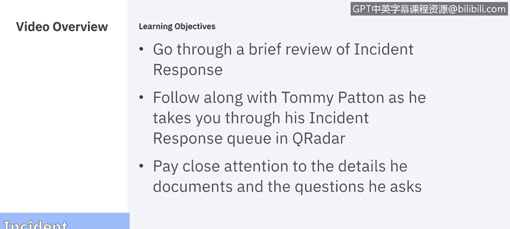
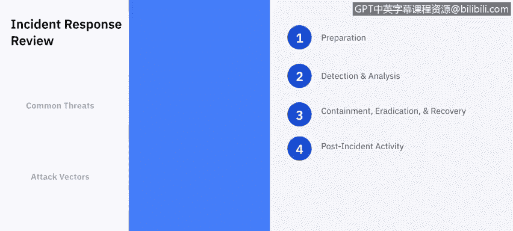

# IBM网络安全分析师专业证书课程5：《渗透测试、事件响应与取证》penetration-testing-incident-response-forensics - P49：14_01_incident-response-demo-part-1.en_subtitled - GPT中英字幕课程资源 - BV1Dr4y1d7EB

Welcome to a demo of Incident response brought to you by IBM。In this three part video。

 we'll be following along with Tommy Patton， who's taking us through a brief review of incident response。

He'll then take us through his Q radar incident response Q to show us examples of incident response in how he documents each case。

 I ask that you pay a close attention to the details he brings up and the questions he asks along the way。

 With that， we'll turn it over to Tommy。

My name is Tommy Pennton。 I've been in the cybersecurity field for about five years。

 I have worked with many different security tools and responded to countless security threats。

 many of them triggering incident response。Before defining incident response。

 we must first know the security threats we are faced with on a day to day basis。

Some of the most common security threats are software attacks， data exfiltration。

 information sabotage， and even theftA equipment。Now that we have identified common security threats to an organization。

 we will identify the different impact vector a hacker may take to gain control of a system or network。

One example of an act vector is a website hosting malicious content。

 waiting for a vulnerable user or browser to exploit。Thankfully。

 many modern day security tools such as IBMQ radar， MacfeE policy Ortor， Next generation firewalls。

 and countless others are available for us to use。Curator is a system information event management tool for short。

In the simplest terms， curator is a wall collection tool with the capabilities to search， detect。

 and alert。He read our collect system event information from devices or applications on our network。

 including log information from operating Systems McAfe E Policy Ortrator。

Next generation firewalls and about 400 others by default。After Qatorator collects the information。

 curatorator processes and stores the data collected。Yourit will normalize the collected information。

And analyze the data using a set of rules。 We will be seeing cur radar in action in just a moment。

MAfe E Policy Ortor is a host based security system or HBSS McAfee HPSSS is used in many different environments to detect。

 prevent and remove malic files。MAfe HBSS has multiple point products。

 including McAfee endpoint Pro or ENS， McAfee hosts Intrusion Pre System or HIPS。

All is the auditor and many others。Today we' will be seeing an example of Mccafee inNS finding malware。

 removing the malware and how to respond to such an incident。

Next generation firewalls or next gen firewalls are one of the first lines of defense on a network。

 Next generation firewalls are able to filter network packets through stateful inspection。

 conduct signature matching， packet payload inspection， and many others。Using firewalls。

 Epo and curator alone， we can alert and respond to many different security threats。

 Our curator is deployed。 Our Windows systems， DNS。

 firewalls and Epo are sending logs to cur radarator。

 We have our Mac of the agent with the ENS installed and have begun to hearing events Before we start investigating an offense。

 Let's go over the incident response process。 The National Institute of Standards and Technology。

 Or Nist for short defines an incident response process in four steps。Preparation。

 detection and analysis， containment， eradication and recovery。

And the last step is post incident activity。The first step to incident response is preparation incident response preparation is the gathering of information required to respond to the incident so one of the first things that you want to gather is a list of assets ranking them by their important stool organization as well as the risk if compromised。

It's also important to gather a list of shareholders and individuals needed to contact when an attack occurs。

This will prove beneficial during an incident because at a time of crisis。

 you don't want to waste time looking for phone numbers or emails。Or even who to contact。

And the last thing that you want to establish is what type of events will trigger an investigation。

For example， would a standard user failing to log in multiple times at 8am。 trigger an offense？

Probably not sensitive start time for people on our office is 8amm。

What if the same event occurred in the middle of the night？Yeah。

 multiple failed logs in the middle of the night may require an investigation。

 especially since people in our office don't typically work at night。Knowing what assets to monitor。

 which events to trigger an investigation and who to contact will make the incident response process less stressful。

 The second step in incident response is detection and analysis。

 incidentci response detection in an analysis begins when an alert is received。

The detection and analysis process begins with researching the events。

 triggering the alert and gathering as much information related to the alert as possible。

 After the information is gathered， we will start analyzing the data gathered to determine the entry point footprint and validity of the alert。

 We would want to know， was it an authorized action by new administrator or was the attack using an administrator's account from a remote device。

Is one device effective or was it multiple devices Once those kinds of questions are answered。

 we can begin the documentation and escalation process to notify all the parties that are involved and begin to document the incident itself。

 the time frame the actions that were taken to mitigate and contain eradicate and recover。

 step 3 of the incident response process is containment， eradication and recovery。

After the entry point is identified， we want to contain the threat to prevent further damage to our systems。

 Once the system is contained， we can work on removing the threat and then recovering any of the affected systems to restore business as usual。

 The last step of incident response process is post incident activity or after action reports。

With business running as usual， the last step and the incident response should be completed。

 reviewing the actions taken during the incident response process will provide the opportunity to learn from your deficiencies。

After action reports can be kept to document the actions used to make the incident response more efficient from my own experience。

 we've taken incident response from days to minutes。

 it definitely does help to document your mistakes and learn from them。

Now that we've identified security threats attack factors and the incident response process。

 as well as talked about some of the security tools used to detect， monitor， and prevent。

We can begin to review some of the offenses that we have in our key radar。

