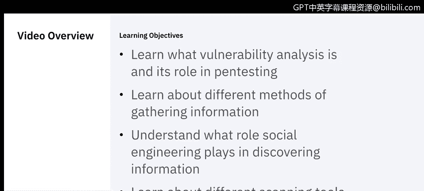
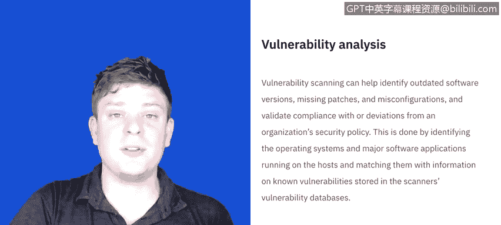

# IBM网络安全分析师专业证书课程5：《渗透测试、事件响应与取证》penetration-testing-incident-response-forensics - P4：3_渗透测试发现.zh - GPT中英字幕课程资源 - BV1Dr4y1d7EB

Welcome to penetration testing phases， Discovery。 This video will come to you in two parts。

 The first part is going to be learning what vulnerability analysis is and its role in pen testing。

 And then we'll introduce Raoul， who is a systems information and event manager with IBM。

 who will discuss how we go about discovering information。 We' to learn about different methods。

 The role social engineering plays， as well as different scanning tools that could be used。

 Let's get started。😊。

Before running a penetration test， doing a vulnerability scan can help identify outdated software versions。

 missing patches， and misconfigurations invalid validate compliance with or deviations from a security policy。

This is largely important because we want to have an aim， right。

 we don't want to go into a discovery phase blindly。

 so we use the specific tools there are lots available out there to do a vulnerability scan。Now。

 how it works is it identifies the operating systems and major applications that's being used on the host and it matches it with known vulnerabilities from the tools vulnerabilities database。

 so it does the scan and says， here's everything that exists on the system。

 here are all the known vulnerabilities， and now we have a starting point when we do our discovery phase。

To start our discovery phase， as promised， I'm going to turn it over to Raoul。

Who will begin discussing the different tools and methods to gather information。

When we're talking about reconnaissance。We're talking about the different methods， where we can。

Get information from our objective bit and specific server repeat the company itself。

One of the first items that we may go through is Google Docs。

Google Docs are a special commands we can use on Google to get more information about an item。

We can search inside of the webage of the company， try to get into the Internet if they have。😔。

Open Ser， some companies use Google as their internal search engine。

And we can perform some data analysis。By using a couple of Google commands。

We can use a passive reckon， which basically is。Observing people。In the company， if we're going to。

Check them。Vulnerability of building or physical facility。😔。

Or we can use listeners on the outside of the network and check how do players send to other people。

We can use an active record， which will be endm in network。Checking out the open ports。😔，We can。

We'll start using a bunch of tools trying to use a hill Mary attack on the web page。😔。

We can try to actively look for vulnerabilities。 Now an active reckon is a very loud way to say we're watching you。

I wouldn't recommend it unless it's in a very discreet way。

The last part is basically as the employees。Sometimes you can get most information of an employee by using social engineering。

😔，You can。Pretend to be someone important， pretend to be a client。Get some information。

In very aggressive ways， some people will go as far as。

Pring and employee for In information。Or some of the tools we're going to use？😔。

And map is a free network mapper。 but if you have a better tool for it。

 Go for it and network analyzer。If we capture some。Packets inside of the network。

 you can analyze them using。W chaer is in。Any other analyzer tool that you have at disposal？

If you are。😔，Lucky enough to be able to retrieve a copy of the password file。

 you can crack it using a password cracker。An example here is John Ripper。

 which is one of the oldest one。And a hacking tool well。Right now， you can go to a wasp。

And take up the latest tools。Me myself， I use metaplid as a。Hacky database tool repository。

