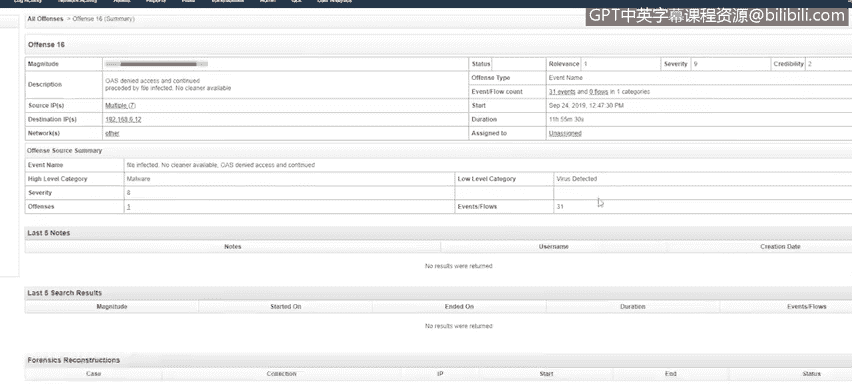
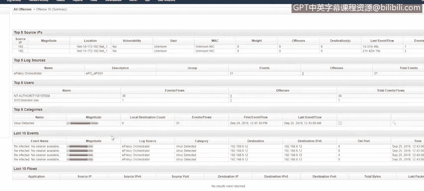
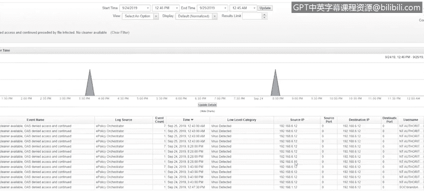
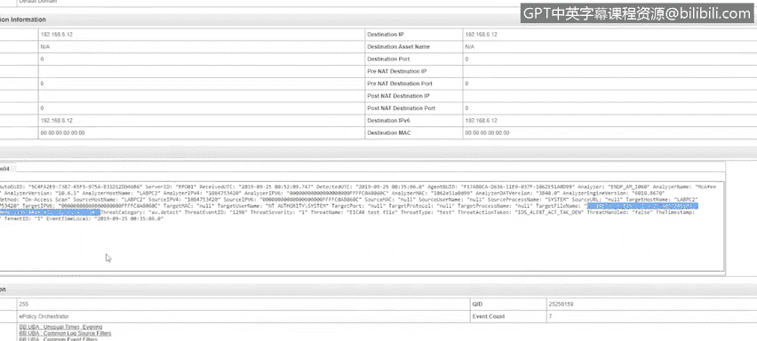
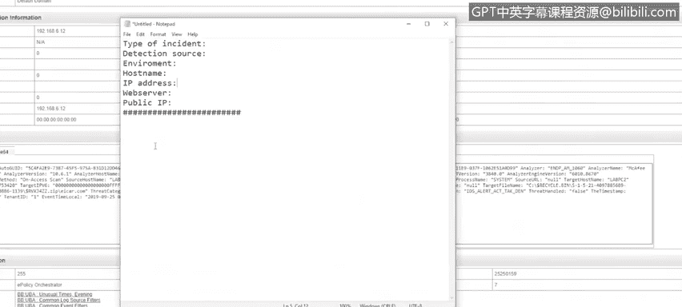
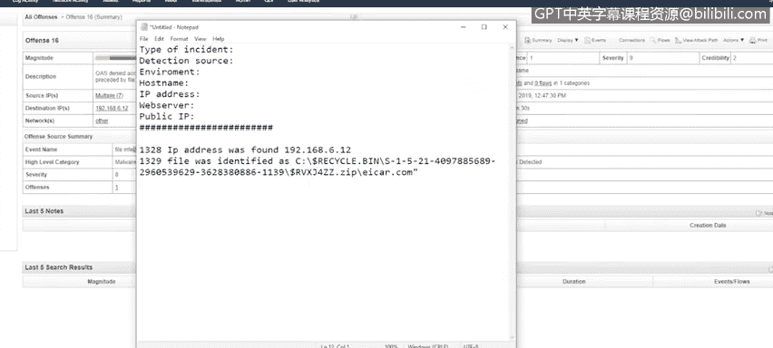
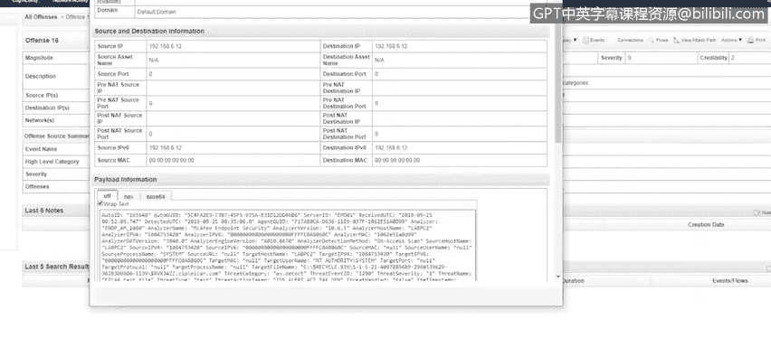
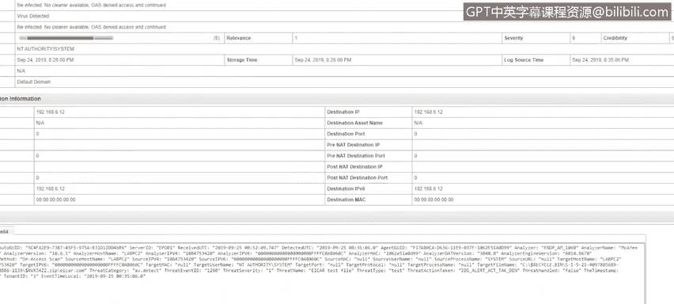
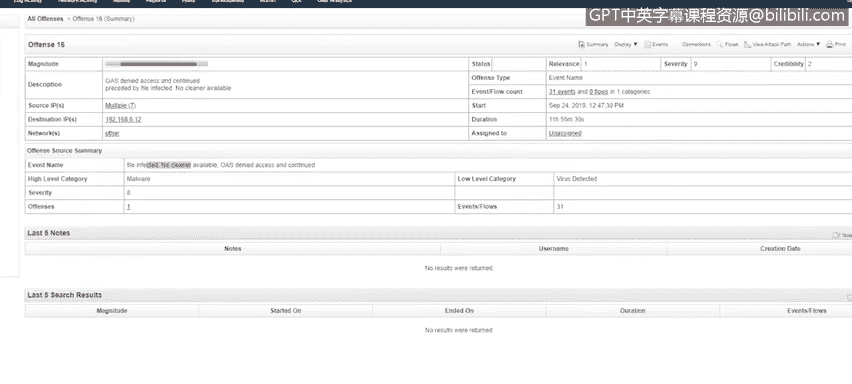
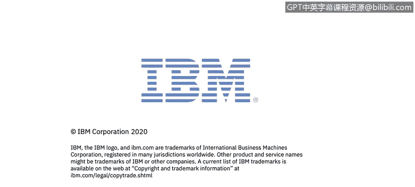

# IBM网络安全分析师专业证书课程5：《渗透测试、事件响应与取证》penetration-testing-incident-response-forensics - P51：16_03_incident-response-demo-part-3.en_subtitled - GPT中英字幕课程资源 - BV1Dr4y1d7EB

Welcome to Incident Reponse demo， Part 3， brought to you by IBM。Sinceence here is older。

Going to go ahead and take a look at it。

It also has a pretty high severity。

Even then the credibility is low。So the first thing I notice here is the event name， file infected。

 no cleaner available， OES is denied access to the command。

On the summary page， as you can see here， there a file was infected and there's no cleaner available。

要朋友们。

Check the events。

And it looks like a virus was detected on this machine。

We have the source I。And then we can also find the file name in here。So we found the file。

And it looks like it's actually triggering on a file that's in the recycle bin。

I haven't copied that out because。Fairly soon ahead start our incident response。

S right down the time。Give some detailed modes。

And once I've identified the system， I've identified the file。

I to go ahead and contact the network team again， get that switchport disabled。

Once I submitted that ticket to the network team to have the report disabled。

I'm going to go ahead and look back on my list of individuals to contact。

That we created in step one of incident response。Where we prepared the shareholders list。

In the event of an attack。Once I contact them， I'm going to go ahead over and kick off my EV scan and wait for the results。

So once I've kicked off my E skin， I'll be going to go ahead and fill out the rest of the incident response form。

I had any more notes in here that I have。

So once I've completed the AV scan， I come back。The file wasn't removed， it's still there。

 it also detected you know a few other files。I'm going recommend that this system be reimd as well。

 So we send that to our I am。 And it was back。 He tells us， you know。

 you're going to go go ahead and reimage it。At that point in time。

 we want to go ahead and end our after action report。

And an after action report can be just a running。I have a pad document。啊。

Keep a list of mistakes or efficiencies that happened during the incident response。

 the first incident that we completed for the DNS query。

I looked at the events and then I went and looked at the DNS query to see if it was。Mo wishesious。

And then I had to go back to the events to see if it was actually successful。

So something I could have done to improve my efficiency is。When I looked at the events， I could have。

Ensured that it was successful before I even looked it up。

If the DNS would have been blocked by your DNS server。

 then I would have wasted the time to go out and look up that I P。

 Another thing that I didn't do in the first one was I didn't alert any of my shareholders。

 I didn't tell anyone that I was going through the incident response。😔，And then in the second one。

 which was four。The US attack。There was a lot of events there。 I didn't。

 I didn't look to see if there was。嗯。Maybe multiple source addresses。Or maybe it wasn't even。

The developers that were logged in， maybe it was somebody else。嗯。

So I didn't do a full investigation there。うん。Definitely something that。

Might have wanted to look a little further into。With the after action review， it's for you to learn。

 it's important to do because it can improve your response time。Drastically。

 just walk through the incident response process one more time。

And make sure I hit on the important details。Step one is preparation。

 you want to know what you're looking for， know it assets you're monitoring kind of events that you're。

You I trigger on and start down that incident response path。

As well as the people to contact in the case of an incident。

Step 2 of incident response detection and analysis。

 incident response detection and analysis begins with getting alert and then beginning to gather information。

And researched the events that had triggered the alert in determining if it is a real event or if it's a false positive。

As well as determining how large is this incident， the step3 of incident response is containment。

 eradication and recovery。For the first one， the containment portion is。To。Disconed from the network。

If it's a workstation， it's easy to walk over and pull the cable out of the wall。

If it's something like a server or a VM。You have to contact that team that's responsible for those network connections。

And the two incidents that we wrote up the report for。

We did disable it using the network team typically that's the quickest way you don't know where that workstation is or you know it's across the building or something。

And then， after。After you contain it， you want to eradicate it。Make sure you look for other threats。

 actually that files not been placed on the share and it's being copied all over the place now。

Make sure that system is not。Communicating with other systems。

More than it normally does or you know on a different port than it normally does。

And then the last step is recovery。 So you want to get the system back to。And state。Typically。

Approval has to be given from the manager。To allow that system on the network or give direction to say it needs three image。

In our case， both of the incidents needed the system reimd。And last but not least。

 the post incident activity。Partt of incident response step forward。

So in the after actionction report， like I mentioned earlier， just want to add any stake in there。

 anything that you could do better， anything that will make your incident response time more efficient。

 thanks for watching。

