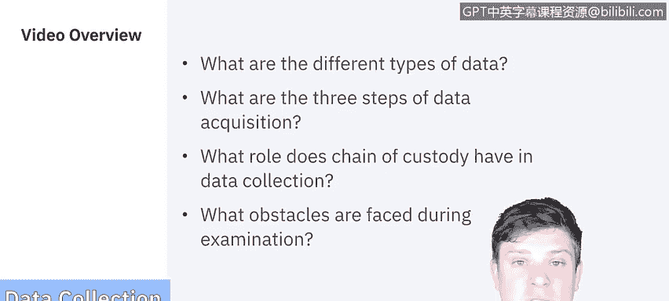
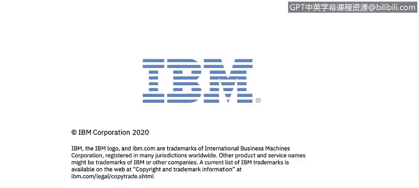

# IBM网络安全分析师专业证书课程5：《渗透测试、事件响应与取证》penetration-testing-incident-response-forensics - P54：19_01_data-collection-examination.en_subtitled - GPT中英字幕课程资源 - BV1Dr4y1d7EB

Welcome to the forensic process， Data collection and Exa brought to you by IBM。

In this video we'll be covering what the different types of data are。

 we'll then go over the three steps of data acquisition。

 the role chain of custody plays in data collection and then what obstacles are faced during examination Let's get started In the introduction of forensics。

 we went over lots of different types of data types。

Things from CDs and DVDs， internal external drives， volatile data network activity。

 application usage， and portable digital devices in the physical space。

But collecting data goes far beyond what we discussed there。

 each collection method actually has its own unique challenges to consider， so beyond that。

 think of externally owned property， so maybe an incident happened and it involved an employee's personally owned computer or cell phone。

Things like computers at the home office where you might not have access to them。

And if they're at the home Office and you can't access them， what are alternate sources of data。

 is there a backup somewhere， a server that it' connecting to things that we have to start to think outside of the box because we no longer have access to a physical device。

Things like logs so it's really important for the conservation of data and auditing to be able to have a centralized logging system if possible。

And if your organization and your legal department agreed to it。

 even things like key longergerers where you can monitor the keystrokes on a computer is another way to gain data。

 though that is far less common in organizations。

The National Institute for Standards and Technology breaks down the collection of data into three main categories。

 the first is actually developing a plan to acquire the data。

Now important factors for prioritizing what data to collect is trying to determine what the value is going to be of that data。

 whether it's volatile data or not， so volatile data as we discussed in the prior video is data that's only available now in this moment whereas if there was a state change to the computer if it were to shut off disconnect from the network。

 something requires authentication， something could change the state of that data。

 that data would then take priority， how do we get the volatile data first and then you know how much effort is it actually going to take to actually get this data。

So those are all things we have to consider when you know making our plan on how to acquire the data the second step is actually getting your hands on it in this section we'll be using our forensic tools to collect the volatile data and then duplicate the nonvol data sources so we don't compromise the original data source and at that point we would need to secure the original source so that it's not tampered with in any way during the investigation。

The last step that we deal with is verifying the integrity of that data so the forensic tools that we use can create hash values for the original source。

 so when we take an image or a backup it'll create a hash value for that that we can then compare to the duplicated version because if anything changes to the original it's going to generate a different hash value and we can see that the two are no longer identical so using those will allow us to validate the integrity of the data。

One of the most important things to be mindful of when doing data collection is observing the chain of custody。

 so a clearly defined chain of custody should be followed to avoid allegations of mishandling or tampering of evidence。

So what it is is it involves keeping a log of every single person who had physical custody of that evidence。

 documenting the actions they performed on it， being able to store the evidence in a secure location when it's not being used。

 make sure that you make a copy of it so that you're not working on the original and then verifying the integrity of the original versus the copied evidence so the chain of custody basically is an overview。

 its an audit trail of saying here's everything that came into contact the who， what， when。

 where and why， so that at any point in time in a court of law。

 you can say there are no gaps in how the evidence was handled。

This is so important that we're actually going to be spending more time on the chain of custody in the separate video。

 but for now， know that。It has to be top of mind whenever we're collecting data。

The next step in the forensic process is examination。 Now， examination is exactly what it sounds。

 examining the data that we've collected。With that though。

 there are lots of obstacles that we face and it's not going to be the same for each scenario By and large。

 though， these are the common hurdles that we have to overcome。We need to bypass controls。

 so operating systems and applications may have data compression。

 encryption or advanced access control lists， which make it very difficult to examine the data that we've collected。

And not only just getting to the data， but just how much of it there actually is。

 so hard drive may have hundreds of thousands of files。

 not all of which are relevant to the case at hand。

 so being able to filter through all that to find what's most relevant for our case is pretty time consuming。

Luckily， though， there are tools that we can use and different techniques that exist to help filter and exclude data from searches to help expedite the examination process。

Now that we've covered the collection and examination of the data。

 the next two steps in the forensic process are going to be the analyzing and reporting we'll see in the next video。

