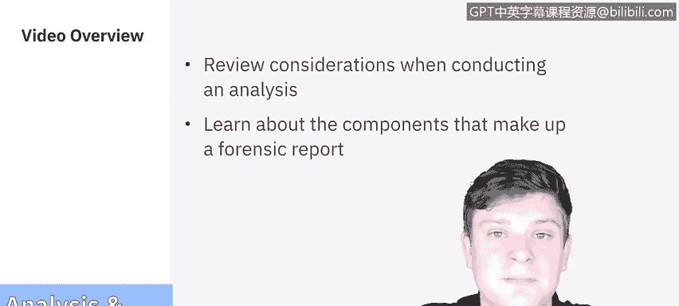
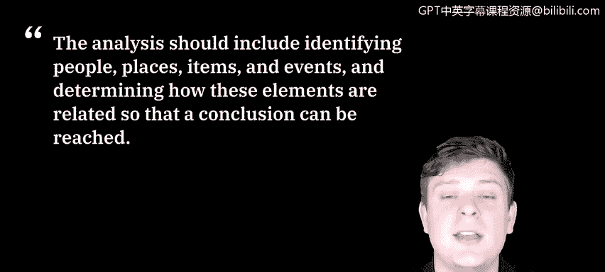
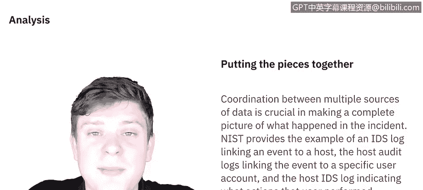
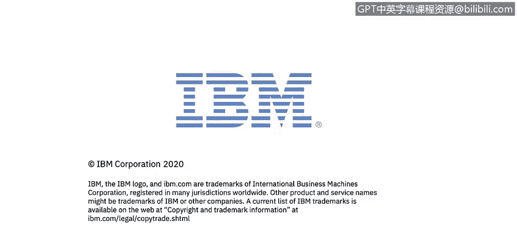

# IBM网络安全分析师专业证书课程5：《渗透测试、事件响应与取证》penetration-testing-incident-response-forensics - P55：20_03_analysis-reporting.en_subtitled - GPT中英字幕课程资源 - BV1Dr4y1d7EB

Welcome to the forensic process analysis and reporting brought to you by IBM。In this video。

 we'll review the considerations taken when conducting an analysis and then we'll learn about the components that make up the forensic report。

Let's get started。The analysis should include identifying people， places。

 items and events and determine how these elements are related so that a conclusion can be reached。

 The analysis really is putting all the pieces together。

 Coordination between multiple sources of data is crucial in making a complete picture of what happened during the incident。

The National Institute of Standard and Technology provide an example of an intrusion detection system log linking an event to a host。

 The host audit logs linking the event to a specific user account and the host Intrusion detection system log indicating what actions that user performed。

 So we have multiple sources here all contributing to what the analysis of the picture is。

Having the most complete picture possible is what lends itself to solving these incidents。

In some cases， it could even solve pretty big crimes。

 Id like to share a few of the most famous crimes that were solved using digital forensics。

 Perhaps the most famous case to be solved through digital forensics is that of the B。

 T K killer Dennis Raidder。 with B。 T。 K referring to his M O of bind torture kill。

 A Raer enjoyed taunting police during his killing spree in Wichita， Kansas。

 But this also provided to be his fatal flaw， A floppy disk greater sense to the police later revealed his true identity。

 He was soon arrested。 Pled guilty and spent the rest of his life behind bars。😊。

Another more recent case solved digital forensics was that of Doctor Conrad Murray Personal physician to Michael Jackson。

 Digital forensics played a crucial role in the trial in that after Jackson passed away unexpectedly in 2009。

 The autopsy found Jackson's deathft to be the result of prescription drugs。

 Investigators discovered documentation on Doctor Murray's computers showing his authorization of lethal amounts of drugs and he was convicted of involuntary manslaughter。

 Another one was going to be the Craigslist killer。

 when one one was killed in another attack after meeting individuals on Craigazslist。

 Boston was on high alert。 Fortunately， law enforcement had their suspect within a week of the murder thanks the digital forensics。

 Investigators tracked the I P addresses from the emails used in Craiglist correspondence。

 to an unlikely suspect of 23 year old medical student， Philip Markoff。

 Without the trail of digital evidence who knows how prolific Markoff could have become。

Now these are just a few examples of the many， many cases that are solved by digital forensics。

Let's move on to reporting。Your forensic report or case summary is meant to form the basis of your opinions while there are a variety of laws that relate to expert reports。

 the general ground rules are as follows。 If it's not your report， you can't testify against it。

 Your report needs to detail the basis of all your conclusions。

 and you'll need to detail every test conducted the methods and tools used and those results。

Let's break down the different components of the forensic report。

And then we'll discuss some best practices as provided by the Sands Institute In the forensic report。

 there are four major categories。 the overview case summary。

 the forensic acquisition and examination preparation。

 the findings and report also known as your forensic analysis， and then what your conclusion is。

Let's break these down a little further。The first section is going to be the overview this section explains how the investigator originally got involved in the case and how the initial incident or request or evidence was initially provided to them。

Please take into account that this document could be used in the court of law。

 so it must be concise and complete as possible。 The next section is the forensic acquisition and exam preparation。

 The section is very important， as you must detail your interaction with the digital evidence and the steps taken to preserve the forensically acquired evidence。

Any additional steps you take such as forensically wiping storage examination media should be notated in the section of your report。

 the section of your report is usually where you as the examiner or analyst encounter the digital evidence and thoroughly document what you've done。

 which is really important to the integrity of the digital evidence and your chain of custody。

An expert report must first detail exactly what analysis was used。

 how the expert conducted their examination in analysis， what tools were used。

 what were the results of that， the details of the machine that was tested。

 the machine that was used to conduct those tests， and then the conditions that the tests were conducted in。

Any claim an expert makes in the report should be supported by intrinsic reputable sources。

 for example， if an expert report needs to detail how domain name service works to describe a DNF poisoning attack。

 then there should be references to recognized authoritative works regarding the details of domain name services。

For findings and report， really there's a set of best practices outlined by the SAs Institute。

The first one is going to be taking lots of screenshots。

 bookmarking evidence via your forensic application of choice。Using your built in。

 logging and reporting options with your forensic tool。

 highlighting and exporting data items into CSV or text files so that they're universally accessible and using a digital audio recorder versus handwritten notes when necessary that way you can avoid all confusion。

To wrap up this video is going to be the conclusion of the report。In the conclusion。

 it's going to be a summation of all your findings and analysis。

 it should be concise but also technically accurate to all the points you made throughout the report。

And while it is good to summarize， it shouldn't be so long that it overshadows your actual analysis that you did。

 which will carry most the weight of your finding。 In the next video。

 we'll be covering how to use data we get from data files。 We'll see you there。

