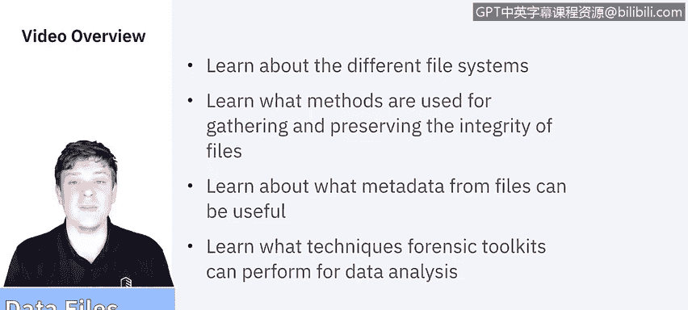
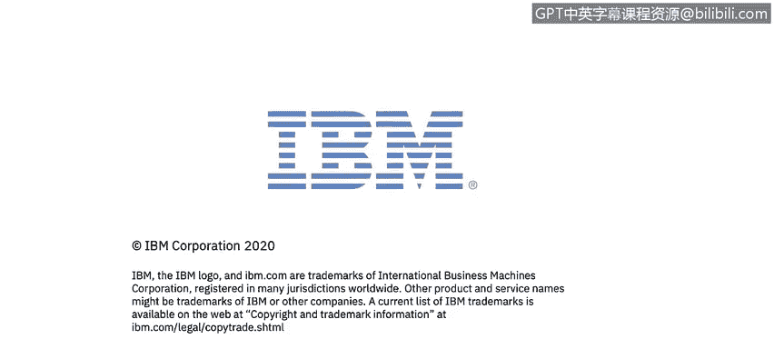

# IBM网络安全分析师专业证书课程5：《渗透测试、事件响应与取证》penetration-testing-incident-response-forensics - P56：21_01_data-files.en_subtitled - GPT中英字幕课程资源 - BV1Dr4y1d7EB

Welcome to using data data files brought to you by IBM In this video。

 we'll be learning about the different file systems We'll learn what methods are used for gathering and preserving the integrity of files。

We'll learn about what metadata from files can be useful。

 and then last we'll learn what techniques forensic tools can perform for data analysis。

Let's get started According to the National Institute of Standards and Technology。

 a file can be many different data types， including a document， an image， a video， or an application。

 successful forensic processing of computer media depends on the ability to collect。

 examine and analyze the files that reside on the media for the sake of this video。

 we're not going to deep dive into each of these， however， after the video is over。

 I highly recommend finding a good resource and learning what you can about the different file systems。

 their capabilities and their limitations。

For the desktops， Windows， Unix and Mac O， these are the major file systems that exist。

 There are many more， especially in the Linux Uni world。

 While it might seem easy to get data from files such as a document to spreadsheet， an audio file。

 a video file。

What's more intangible is the files that are no longer there， whether that's deleted files。

 Slackspace or free space。For deleted files， when a file is deleted。

 it's not typically erased from the media in this case， let's say a hard drive。 Instead。

 the information on the directory's data structure that points to the location of the file is marked as deleted。

 so it gives the appearance of no longer being there， however， the file is still on the hard drive。

 It just has the appearance of being gone。What happens to that is that when you start saving other files and you use up the space on your drive。

 it overrites anything that has a deleted directory。So until a hard drive is completely full。

 there is definitely ways to recover files that have been deleted。Now Slackspace。

Has to do with minimum file size allocation So depending on the file type。

 the operating system will have a minimum file size saying I'm going to at least dedicate this much space for this kind of file。

 even if the file itself is smaller than that allocated space。

 that wiggle room between is known as Slack space indeed can be recovered from it。

The last one is going to be freeSp， freeSp is the area on the media that is not allocated to any partition that free space though may still contain pieces of data from the deleted files。

 so we delete the files and it appears we have free space。

 but really we know that until that free space is taken up， it's still recoverable。

Another type of information we can get from files is the Mac data。 No。

 I'm not talking about Apple's Macintosh。 I'm talking about modification time。

 access time and creation time。 This is all metadata that's captured when a file is interacted with。

So it's important to know as much information about relevant files as possible。

 so recording the modification access and creation times allows analysts to help establish a timeline of the incident。

Modification time is the last time that file was changed， so not just opened。

 but if anything got altered or modified and then received， that is a modification。Access time。

Its going to be the last time that it was actually opened and then creation time when the actual file was established or created。

 so between that modification access and creation， analysts can depict a pretty good timeline of what happened in that file's history so now we ask ourselves。

 how do we get a hold of this data， how do we collect it？

Now there are two major camps in collecting files， there's the logical backups。

 and then there's taking a bit by bit image。So for a backup。

 it copies the directories and files of a logical volume。

 it does not capture other data that may be present on the media such as deleted files or residual data stored in Slackspace Think of this as if you were just plugging in an external hard drive and making a copy of the backups right or if you use an automatic backup system。

That periodically will reback up all the files within your file system。

 either when there's a change or at a predetermined time interval， that's a logical backup。

One of the benefits of a logical backup is that it can be used on a live system if using the standard backup software。

 usually that software backs up when either there's a change or at a standard time interval。

 so it's easy to be done on a live system and be confident that you're getting those changes。

 however， it can be resource intensive both time and resources of the computer。Now for imaging。

 this generates a bit for bit copy of the original media， including free space and SlackSp。

 Bistreamream images require more storage space and might take longer to perform than logical backups。

If evidence is needed for legal or HR reasons， a full bitstream image should be taken and all analysis done on duplicate more often than not we are going to be taking an image and what that means is it's really just a snapshot of saying this is exactly what was on the computer at this moment in time you just freeze time。

Create a clone of it， and you able to interact with that clone。Now you can do that disk to disk。

 meaning I can。Export like I can， for instance， take a Mac， put it in target disk mode。

 which essentially turns the whole computer to an external hard drive。

 and then just clone over everything that's on it onto another computer so that it's ready to be interacted with or I can do diskISA file so I can say take a clone of this and create a file that I can then you put on an external media and transport around as necessary。

Imaging should not be done on a live system since data is always changing， if done on a live system。

 you'll no longer have an accurate timestamp of what's happening because things are all the volatile data is continuing to change over time。

 so a logical backup would make more sense。Now that we've discussed the different type of data you can get from files as well as how to collect it。

 I want to spend some time to talk about the techniques that we use as facilitated by forensics tools。

Many forensic products allow the analyst perform a wide range of processes to analyze files and applications as well as collecting files。

 reading disk images， and extracting data from the files themselves。

The first technique that tools help facilitate is just using file viewers so instead of using the original source of applications。

 you can use a single tool to review every type of file which expedites the searches and eliminates the need for a working native app for every file type。

The next one is going to be to uncompressed files so you know zipped or compressed files are pretty common。

 but pretty early on in the forensic process the analysts should be uncompressing files so that those are included in the searches the only real caveat to that is sometimes things called compression bombs。

 things set up by the hacker or the malicious person。It essentially is sometimes tens， hundreds。

 thousands of files compressed within each other， but staying up to date on your antivirus or event detection should really help mitigate that。

Another one is using a graphical user interface for displaying directory structures。

This practice makes it easier and faster for analysts to gather general information about the contents of media。

 such as the type of software installed and likely the technical aptitude of the user who created the data。

 most products can display Windows Linux and Uni directories and others are specific for Mac OS。

Another key technique is identifying known files， so it may seem a bit obvious。

 but is very beneficial to eliminate unimportant files such as known good operating system and application files from consideration Anas should validate hashets such as those created by NISTs software reference library project or personally created hashets again this helps simplify the process and helps you focus on the files that you need。

The big thing here that a lot of the forensic tools do is performing string searches and pattern searches。

 so a string search is aid in pursuing large amounts of data to find keywords or strings。

 various searching tools are available that can use Boolean， fuzzy logic， synonyms and concepts。

 stemming and other search methods。嗯。The last one really is accessing file metadata。

 which could provide us a lot of context about the file and potentially information about the author。

So we're not going to go into all the individual tools in this video。

 but again after this video is over， there's going to be some extracurricular activities where I encourage you to go out and review a lot of the forensic analysis tools that exist。

