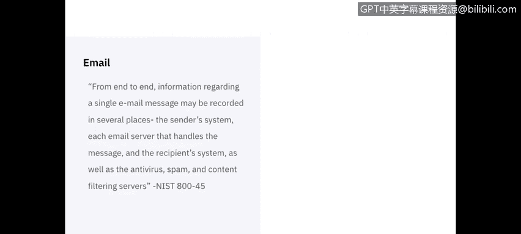
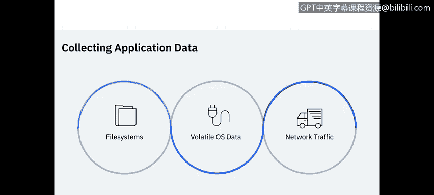

# IBM网络安全分析师专业证书课程5：《渗透测试、事件响应与取证》penetration-testing-incident-response-forensics - P58：23_04_application-data.en_subtitled - GPT中英字幕课程资源 - BV1Dr4y1d7EB

Welcome to using data applications brought to you by IBM。In this video。

 we will learn about the different components of an application and how they are meaningful to a forensic analyst。

 We will also learn about the different types of applications that provide meaningful forensic data and what considerations are taken when collecting application data。

The National Institute of Standards and Technology summarizes application data as the following。Oss。

 files and networks are all needed to support applications。 OSs is to run the applications。

 Network to send application data between systems and files to store application data。

 configuration settings and logs from a forensic perspective。 applications bring together files。

 Oss and networks。

Let's start by breaking down the components of an application that matter the most of forensic analysts。

 The first component are the configuration settings。

 configurationfiguration settings may be temporary or set dynamically during a particular application session。

 or permanent。Many applications have some settings that apply to all users and also support some user specific settings。

The settings may be stored in the following three ways， configuration files。

 run time options or added to the source code。A configuration file is usually a text file or a file with proprietary binary format。

 It may or may not be stored in the same host as the application。

 Runtime options are applications permitting certain configuration settings to be specified at run time through the use of command line。

Some applications that make source code available， like open source applications or scripts。

 actually place user or administrator specified configuration settings directly into the source code。

Next， we look at the authentication of an application。

Applications may have external authentication where the authentication takes place on a directory server。

 for example， in which case the external authentication would have more information than the host。

 Proet authentication is most commonly seen in username and passwords that our application， not O。

 S specific。Pass through authentication is where the application uses whatever the OS authentication is。

Lastly， a host user environment is seen mostly in enterprise environments where authentication is checked for an application against a domain of approved users。

Most applications generate some type of logs and record them to an OS specific log or something proprietary。

The most common types of logs are event， audit， error， installation and debugging logs。

 Even logs record actions that were performed。 The date and time each action occurred。

 and the result of each action。Audit logs or security logs specifically track audited activities such as authentication attempts。

Air logs track errors applications have with time stamps。

 In logs track when an application is installed or updated。

 and the debugging logs are usually only meaningful to the software developer。

Data is very broad term， but nearly every application is specifically designed to handle data in one or more ways。

 such as creating， displaying， transmitting， receiving or modifying data。

 as well as protecting and storing data。 application data files may be generic or proprietary file format and may be stored in multiple different places such as databases。

 temporary files either in memory or application， or permanent files。

 It should be noted that temporary files may be created due to improper shutdown of an application。

 and those files may be located within an application， or at an O specific location。😊。

Supporting files may offer the least amount of critical information out of all the components。

 but when all else fails， it can provide bits of information that may lead to a better understanding of the data。

 Many applications come installed with supporting documentation or user manuals that can help analysts determine what any given application was used for and where the application may store the supporting files。

 Lis or shortcuts as many windows user know them as are pointers to something else。

 Anas can determine what program a link runs and where it is located。

 graphicphics usually are a little interest， But if an icon image are recovered。

 Anas can sometimes determine which executables were running。

Application architecture tells us how an application logically separates the components， which。

 in turn， gives analysts a better idea on where the application data will be stored。

 App are built to function as local， Peer to peer。 client Serreber based or a combination of the three。

 Local applications are meant to keep everything local to the host。

 There are applications like tax or graphics editors and office productivity suites。

Kinient service structures are most complicated because they can have anywhere from 2 to 4 locations of data between the local host。

 application server and database server。 Web based applications substitute local hosts for web browser and add a web server。

 peerer to peer applications are set up to directly share information between hosts。

 such as file sharing， instant messaging or chat applications。

Certain types of applications are more likely to be the focus of forensic analysis， including email。

 web usage， interactive messaging， file sharing， document usage。

 security applications and data concealment tools。 Let's deep dive into a few of these to provide examples。

 starting with email。 E has become one of the most predominant means for people to communicate electronically。

 A single email hosts an incredible amount of seen and unseen data on the surface of an email message。

 we have a header， which usually details who the message is being sent to and the body of the email that contains the content。

😊，Hidden away in the header， Information is data such as the type of email client the sender used。

 which mail server sent the message， as well as the importance of the message。

 And if there is specific content type such as attachments or embedded graphics from end to end。

 information regarding a single email message may be recorded in several places， the sender system。

 Each email server that handles a message。The recipients system。

 as well as antivirus spam and content filtering services。

Next， we have web usage， which breaks down into data we can gather from the host and the web server Web data we can get from the host typically lies in the Web browser application。

 Analys can get favorite websites， history of sites visited with time stamps。

 cash web data files and any cookies that were saved。 On the other hand， we have the web servers。

 which typically keep logs of the request they receive。😊。

These logs will give us timestamps of each request， I addresses， which web browser made the request。

 what the type of request was and the resource requested。

 Web data provides a rich amount of meaningful data。

 even when data is not accessible from the host The last type of application I want to cover is interactive communications。

 This includes group chats， instant messaging and audio video applications。

 group chat typically uses a client server architecture。

 The most popular standard group chat protocol for simple textbased communication is internet relay chat or IRC。

 In messaging and application configuration settings may contain user information lists of user that the user is communicated with file transfer information and archive messages or chat sessions and lastly。

 with the typically progressing integration of audio and video technologies such as voiceover I people are permitted to conduct telephone conversations over。

Networks such as the Internet， providing more media based data。With the overview of application data。

 the last portion of this video will discuss the collection of this data。

 This should be a review of content we've covered in prior lesson。

 so this will be a high level overview。😊，Application related data may be located within file systems。

 volatile OS data and network traffic volatile OS data may contain information about network connections used by applications。

 the application processes running on a system and the command line arguments used for each process。

In the files held open by applications， as well as other types of supporting information。

 Given the nature of volatile data， these should be considered first。

 the most relevant network traffic data vow user connections to a remote application and communications between application components on different systems。

 Other network traffic records might also provide supporting information。

 such as network connections for remote printing from an application and DNS lookups by the application client or other components to resolve application components。

 domain names to I addresses。

