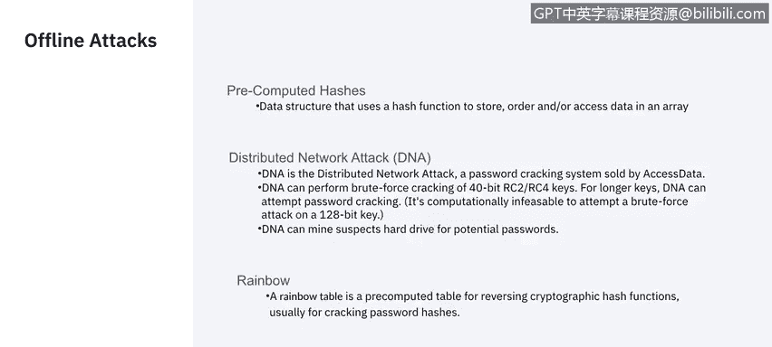

# IBM网络安全分析师专业证书课程5：《渗透测试、事件响应与取证》penetration-testing-incident-response-forensics - P5：4_渗透测试其他发现详细信息.zh - GPT中英字幕课程资源 - BV1Dr4y1d7EB

Welcome to Penration Test Discy phasese， part2。In this video， Raoul。

 who's a system information and event manager at IBM。

 will be taking us through the different methods of gaining access into a system。

Well be discussing passive， active， offline and approaches without the use of technology。

Let's get started。Now， how do we gain access to them？Objective。

The possible online tags that I'm going to touch here are。Wre sniffing， wire， wire sniffing。

 Basically， we are capturing everything that comes from the company。Forour later analysis。

 Captain packets leaves no trace， now man in the middle。If we are able to hijack a session。Then。

We're going to be able to get as much information from that user as we can。

 even access to his privacy level。 Now， the replay attack。The we are using here is。

When we identify session and information they are sending to authenticate。We may。

Use a copy of that information to try to authenticate a session ourselves。

It's a very successful way to get exit。Now， active online attacks。Your basic password casing。

Normally aided by a dictionary。Where we're going to attempt passwords until we get the right one。

 that's also called brute force attack。By using a Trojan and a spywareer， a key， a logger。

We are going to try to infect the victim， and get。Basically， anything that they type。

Or even remote access to his computer。Hash injection。

 hash injection is basically getting the password file from their server。And。Try to decode it。

And phishing attack is。Right now， at  trendy。Word here。And。We are going to。Copy to duplicate。

A trusted page。Which the victim uses。And use it to get。Their password to the real page。

That kind of attacks， normally。Takes place when。Access to a bank or to a special database is required。

Ofline attacks。Precomputer hashes， which is basically the same as the hash injection。

This reported network attack。And。The rainbow attack， which is basically。A I should attack。

The non electroniclect attacks。Which are the ones that we're going to use other people。2。

Social engineering， we get someone to call someone to。Entertain some ideas。

With the employees or letting them know that you're the boss and you need some help from them。

Shouldiler T is where we're going to use someone to physically see when the employees input in their password。

So they can see the keys that he's using。😔，And dumper diving。Depending on where you are。

 it's not illegal to。Check。The th of a company。And you may get information in the form of documents。

 which are not properly disposed of。And who knows？ Maybe you can get some passwords。

 some account numbers， something to。

Investigate upon。