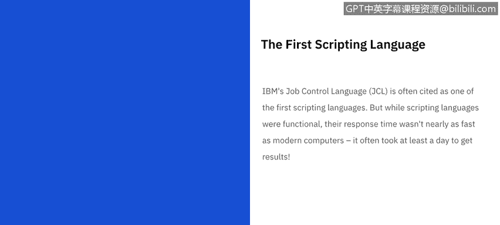
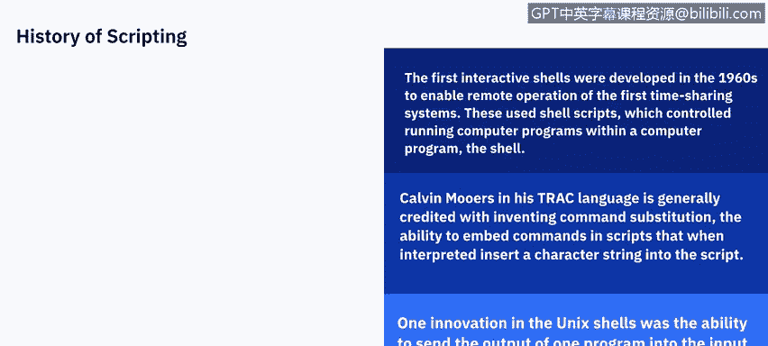
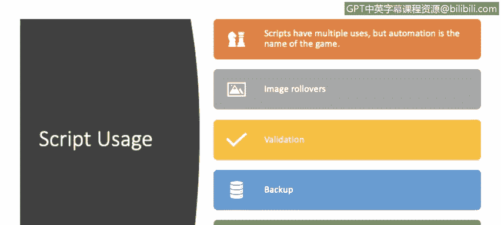
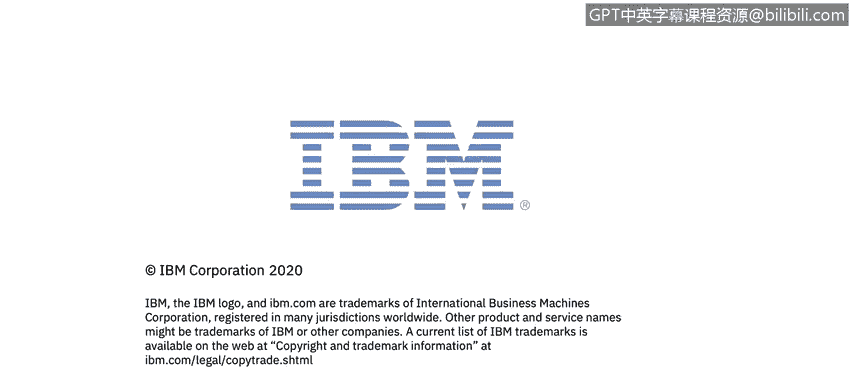

# IBM网络安全分析师专业证书课程5：《渗透测试、事件响应与取证》penetration-testing-incident-response-forensics - P61：26_02_history-of-scripting.en_subtitled - GPT中英字幕课程资源 - BV1Dr4y1d7EB

Welcome to a history of scripting brought to you by IBM。In this video。

 we'll be discussing the history of scripting languages and their common uses today。

Scriping has been with us all along with computers。 In fact。

 scripting was the only way to use a computer back in the early days。 In the 1950s and 60s。

 programmers submitted punch cards to mainframe operators， and the machines ran in batch mode。

IBM's job control language， JCL is often cited as one of the first scripting languages。

But while scripting languages were functional， the response time wasn't nearly as fast as modern computers。

 it often took at least a day to get any results。For both Dos and the OS。

 the unit of work is the job itself。 A job consists of one or several steps。

 each of which is a request to run one specific program。For example。

 before the days of relational databases， a job to produce a printed report for management might consist of the following steps。

 a user written program to select the appropriate records and copy them to a temporary file。

Assorting the temporary file into the required order， usually using a general purpose utility。

 then a user written program to present that information in a way that's easy for the end users to read and includes other useful information such as subtotals and a user written program to format selected pages。

Of the end user information for display on a monitor or a terminal。

Originally， mainframe systems were oriented towards batch processing。

Many batch jobs required set up with specific requirements for main storage and dedicated devices。

 such as magnetic strips， private disc volumes and printer setup up with special forms。JC。

L was developed as a means of ensuring that all required resources are available before a job is scheduled to run。

For example， many systems such as Linux allow identification of required data sets to be specified on the command line and therefore subject to substitution by the shell or generated by the program at runtime。

On these systems， the operating systems job scheduler has little or no idea of the requirements of the job。

 In contrast， JCL explicitly specifies all required data sets and devices。

 The scheduler can pre allocatelocate the resources prior to releasing the job to run。

 which helps avoid a deadlock of sorts。The first interactive shells were developed in the 1960s to enable remote operation of the first time sharing systems。

 and these used shell scripts， which controlled running computer programs within a computer program known as the shell。

Calvin Moores， in his track language， is generally credited with inventing command substitution。

 the ability to embed commands within scripts that then interpret and insert a character string into the script。

When these interactive time sharing systems started to be developed in the 1960s。

 the idea of scriptable shells came into practice。 One of the earliest was the Maltics project。

 When a few Bell labb programmers pulled out of the project they decided to implement their own system。

 which they dubbed Unix。 One innovation of the Unix shells was the ability to send the output of one program into the input of another making it possible to do complex tasks in one line of shell code。

 Other scripting languages have followed in the Unix world such as A W K and SD for manipulating text。

To discuss how scripts are currently used today， I'm going to turn it over to Raoul。

 who's with IBM Security。What do we use his scripts for？Scrips are autoators。

We have a task and we don't want to write a command for each task every time。

Especially since writing a program will take us around 10。就。1en minutes to two weeks。

 depending on the complexity of the task。So we need to write a program that will allow us to call him。

Every time thewin。A task。If be performed。On。A certain database， certain。Set the files。So yes。

 the name of the game is automation。So basically right now。We use his scripts。For commerce。

When we see those image rollovers。Where you want to see an item。check a bigger picture。

Thatson is correct。Validation。衣服。We are being requested to fill out our credit card in。Fielel。

And we try to put our name in there。And the field says， no， I need critical number。

That validation is dump's script。Database is backups。

We don't want to be manually tied to a computer when we need to perform a backup。

We uses the scripts for the backups to be done at certain time to a certain。Hardest。And testingin。

We might have a human to perform tests one and over and over again。But do I。

We use scripts to perform the testing automatically。

