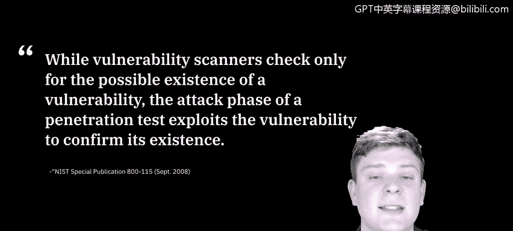
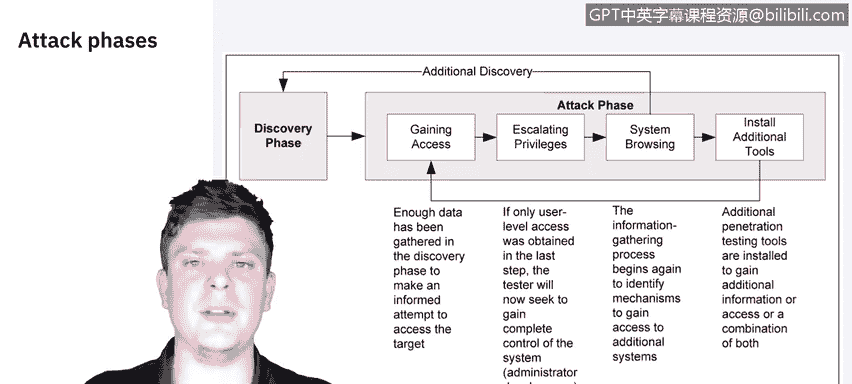
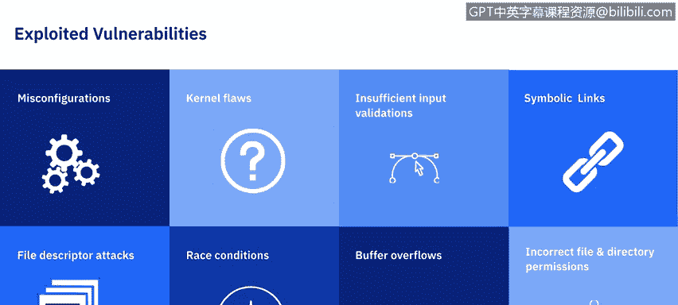

# IBM网络安全分析师专业证书课程5：《渗透测试、事件响应与取证》penetration-testing-incident-response-forensics - P6：5_渗透测试攻击.zh - GPT中英字幕课程资源 - BV1Dr4y1d7EB

Welcome to Penration Test Phases Att。In this video。

 we'll discuss the different phases of a pen test attack。

 as well as learning what type of vulnerabilities are usually exploited。 Let's get started。

 While vulnerability scanners check only for the possible existence of a vulnerability。

 the attack phase of a penetration test exploits the vulnerability to confirm its existence。

Next， let's break down that attack phase to see its different components。

The first step in the attack phase is making sure you can gain access to the systems。

 In our last video， Raoul took us through gathering information through the discovery phase and what tools and methodologies we can use to gain access。

So you'll see in this diagram provided by the National Institute of Standards and Technology。

 that the discovery phase， gaining access and attack aren't all mutually exclusive。

 All these steps kind of bleed together， and we will revisit them throughout the process。

So gaining access is where we have to begin once we get into the system or have access we need to determine what privilege level that we acquired if we are just a standard user。

 you're then going to escalate privileges until you have full control or at least administrative access to make changes。

And once you've obtaineded that， you can then start browsing and gathering information to identify mechanisms that you can gain control of as well as additional systems。

 Now youll notice in the diagram that system browsing actually loops back to a discovery phase。

This means that each time you discover a new system or new tool that you can get into。

 you can conduct another discovery phase to see how we can get access to this。

 what does it connect to， what does it reach out to what tools might we need and then you begin the process again until you decide yes。

 this is where we need to be according to our goals Let's go ahead and install our monitoring or exploitation tools。

To gather more information or gain access or whatever you need to do from there so this is kind of the life cycle we go through and go discovery。

 gaining access， escalating our privileges until we have the ability to browse the systems or tools and once we're happy with that we can either keep discovering as much as we can or we can go ahead then and install the tools that we need。

While this looks great on paper， it doesn't really go into detail about what we're exploiting or what vulnerabilities we're actually looking for。

 so let's go ahead and break those down。

As categorized by the National Institute of Standards and Technology。

 these are the categories that most vulnerabilities can be broken down to。 So on your screen。

 you'll see eight different ones that we're going to cover， the first of which is misconfigurations。

Misconfigurations are just vulnerabilities that are introduced through security settings。

 particularly insecure default settings that are usually easily exploitable。

 The next category are kernel flaws。 So the kernel code is the core of an operating system。

 and it enforces the overall security model for the system。

 So any security flaw in the kernel will put the entire system in danger。Next。

 we have insufficient input validation。Many applications fail to fully validate the input they receive from users。

An example is a web application that embeds a value from a user in a database query。

If the user enters， let's say， an S， Q L command instead of。

 or in addition to the requested value and the Web application doesn't filter the S， Q L commands。

 the query may be run with malicious changes that the user requested， causing what is known as an S。

 Q L injection attack。Next， we have symbolic links。

 a symbolic link or Sim link is a file that points to another file。

Operating systems include programs that can change the permissions granted to a file。

If these programs run with privileged permissions， a user could strategically create Sim links to trick these programs into modifying or listing critical system files。

 Next up is file descriptor attacks。 So these are。Next up is file descriptor At fileile descriptors are numbers used by the system to keep track of files in lieu of file names。

Specific types of file descriptors have implied uses。

 so when a privileged program assigns an inappropriate file descriptor。

 it exposes that file to compromise Next up is race conditions。

Race conditions can occur during the time a program or process has entered into a privileged mode。

 A user can time an attack to take advantage of the elevated privileges while the program or process is still in that privileged mode。

 Buffer overflows can occur when programs do not adequately check input for appropriate length。

When that occurs， arbitrary code can be introduced into the system and executed with the privileges often at the administrative level of the running program。

 The last categories some vulnerabilities can fall under is the incorrect file and directory permissions。

Filent directory permissions control the access assigned to users and processes。

Poor permissions could allow many types of attacks。

 including the reading or writing of password files or additions to the list of trusted remote hosts。

 further resources for deep diving into the attack phase of a penetration test include Owap's check sheet for conducting a penetration test on a web app and the penetration testing execution standard or PT E S。

 They have a fantastic document out there that outlines the entire penetration tests process。

 But if you specifically focus on the exploitation part， you'll find some great information。

 While we've discussed a lot of theory on what a penetration test should look like or the different processes it can include。

😊。

It's time to start to include some concrete examples。

 so once again we're going to turn it over to Raoul in the next video who will be discussing the tools we use to conduct these tests。

