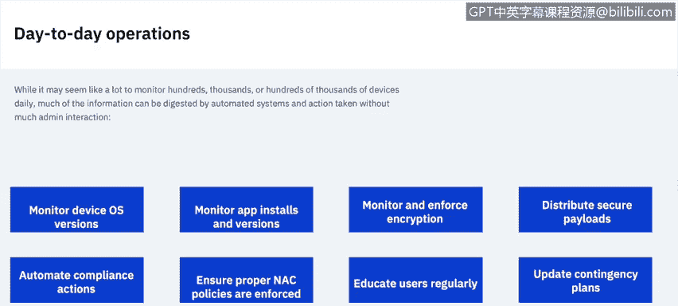

# IBM网络安全分析师专业证书课程6：《网络威胁情报课程（IBM）》｜ibm-cyber-threat-intelligence｜ - P13：12_移动终端保护.zh - GPT中英字幕课程资源 - BV1jN411679K

In this video， we're going to go over mobile endpoint protection。

 We'll learn about the two major mobile operating systems and their differences。

 Understand the primary vulnerabilities， weak points and backdo Learn more about security options available for mobile devices and understand what mobile endpoint management entails day to day。

 There are two major mobile operating systems on the market right now。 I and Android。 In the past。

 there have been some others such as Windows phone and really the one that kind of introduced mobile to the enterprise。

 Blackberry， but right now， i and Android make up most of the devices on the market。

 Windows is officially end of life and Blackberry has started rolling out Android as their primary operating system。

 I was developed by Apple exclusively for their products。

 There are no thirdpart Apple products running i。

It was launched in 2007 and is currently on version 13。

Despite early proliferation and pop culture appeal。

 Apple smartphones really only make up about 13% of the devices on the market based on usage。

Roughly 60% of the tablets worldwide ride run iOS or iPadOS。

 and MDM capabilities have been available since iOS 6。

Android began as a small project by Android Inc， a team working on an alternative to Simeon and Windows Mobile OS。

 purchased by Google in 2005， it is based on the Linux kernel and is now developed primarily by Google in a consortium known as the Open handset Alliance。

While Google does provide the face of Android and a large variety of the devices on the market。

 there are non Google Android devices that are out there floating around for use in various different industries。

The first public release was in 2008 and is currently on version 10。

Roughly 86% of smartphones and 39% of tablets run some form of Android。

 and MDDM capabilities have been available since Android 2。2。

So how do mobile endpoints differ from traditional endpoints such as servers， desktops and laptops？

Well first， users do not interface directly with the operating system。

 unlike traditional desktop software， there is no way for them out of the box to gain route access and see the various components and folders that make up the E。

Instead， a series of applications act as a broker between the user and the operating system。

 so when you open up the settings button on your device。

 you're not directly editing the settings yourself。

 the settings is an application that issues commands on your behalf to the operating system to do things like adjusting the system volume。

Otability can be easily monitored because of this and anomalies reported that present a risk unless we're talking about certain open source devices on the Android market。

 by and large your consumer devices come out of the box pretty standard， you open it up。

 you boot it on， the operating system loads in a particular order a security chain is established and then the user is presented with the UI where they can run applications If at any point that system chain is broken。

 it's pretty easy to tell and report back on。Antivirus software can also be useful。

 it can see certain applications that are installed on devices and read certain signatures。

 but unlike on desktops it can't see all the content。

 it cannot peek inside all the applications and see what's there。

 it's limited in its view and can't be customized to see things that it normally wouldn't be able to see。

So what are the primary threats to mobile endpoints。

 we're going to separate this into three categories， system based， app based and external。

System based threats usually come in the form of trying to alter the operating system in some way to gain access to features that aren't standard on the device。

 This is usually the form of jail breaking and rooting。

 Jailbreak is unique to I because it's not supported in any way whatsoever。

 Jail breaking automatically voids all of your warranties in your system resources can become maliciously infected in ways that you might not have attended。

It's usually done in order to gain access to applications that were not approved or available on the app Store。

Rooting is a little bit different on Android because it does have its uses。

 especially if you're an app developer and also with Android devices you can install applications externally without having to root it。

 but roototing still does present problems especially if we use it to customize the operating system in such a way that is not previously authorized by Google。

 you might create vulnerabilities that can be exploited。

Apptbased threats come in the form of course of applications。

 primarily we see this as phishing scams via SMS or email。

 you receive an email or an official looking text message that contains a link and you click on it。

 it can do things to your device that become a security hazard。

Miicious code can infect even public applications so make sure that you're always installing apps from a trusted source Yes。

 Apple and Google do a good job of scanning their applications for vulnerabilities。

 but it doesn't mean they hit all of them， so stick with the companies that you know that they have a history a proven track record of security。

They can also request access to hardware that's irrelevant to their functionality there's an example from a long time ago of a flashlight application for Android that flipped the camera light on so the device could be used as a flashlight。

 however， for some reason it needed system access to contacts， for example。

 which is not something you think that a flashlight app would need。

Web browsers also contain vulnerabilities I'm sure a lot of people have' seen when you go to particular sites a pop up might show up in your browser that says that your device has been infected and just click on this link to go ahead and get a program that can resolve it for you Trust me when I say that Apple and Google aren't putting those kinds of popups in the browsers like that so it's in every scenario something external trying to get you to click on a link inside the application that could install something malicious。

Then of course there are external threats， Networkbased of attacks are always a problem。

 Wi-fi and Bluetooth vulnerabilities can be exploited by tethering devices to external media if you have somebody holding your device also social engineering is often used to gain unauthorized access and it can be used in different ways it could be somebody just seemingly coming up to you with a harmful request to use their phone to call their wife because their battery guide however。

 then they have your number and later on that day they use that to send you a text message that looks official but it's actually not and they get you to click on a link and either enter certain information or potentially download an application So how do we protect mobile assets Well first there's MDm or mobile device management。

 they require constant monitoring so this allows you to control the content on the devices and restrict access to features。

If the device has potentially hazardous information on it。

 so if there is known malware in an application and that application is installed on device。

 MDM can help remediate that and also block the user from accessing sensitive information until that's remediated and also lock devices down so they're inaccessible if's lost or stolen。

App security is a big one， there's a bunch of third party companies out there that can provide app ratings。

 as mentioned there is antivirus programs that run， although they are limited in reach。

 especially compared to their desktop counterparts。So a combination of features。

 generally the public play store security measures or excuse the public app store security measures。

 as well as thirdparty rating systems can really help kind of give you the big picture of what's going on with applications that are on the market and it's always a good idea to make sure that you don't install thirdpart applications from outside of those stores unless you 100% trust the people that they're coming from even in that scenario it's always trust but verify。

And of course， user training， educating users on the threats that exist on the market that can impact them is always important and you can always frame this in the context of their personal day- to- day usage as well threats that come out don't necessarily just impact the organization they can impact a user's private data too。

 giving them access to sensitive documents and even their pictures on their camera so you just want to make sure that we're up to date on our user education and making sure they understand where the threats lie on the market for mobile devices。

What do the day to day operations look like for somebody who's handling mobile devices and is in charge of their security it's a lot to monitor。

 hundreds or hundreds of thousands of devices might exist in the environment。

 but much of the information can be digested by automated systems in action taken without much admin interaction。

Always want to monitor the device operating system versions。

 make sure that you're up to date on the operating system versions this is especially important on multiple devices because generally by and large there's no individual patching features so you don't go in and just patch the WiF hardware you update the entire operating system which includes fixes for vulnerabilities and bugs。

You also want to monitor app installs and versions again。

 more important on operating systems that are mobile because you can't easily go back a version on an application once it's installed。

 you have to completely remove it and reinstall it if the old version is even available on the app store anymore if this isn't an application that you have direct access to and it comes from the iOS app Store or the Google Play store。

 you're only going have what's available via their market to install。

 And if that current version is buggy， you have to remove it from the device。

 you won't be able to roll back to an earlier version。

Monitoror enforce encryption This is always important it's much easier to do nowadays as a lot of devices come encrypted out of the box。

 but you always want to add layers of security there and make sure that you're enforcing passcodes and if available that your users are leveraging those passcodes and of course things like biometric for unlocking the device。

 whether that's a fingerprint or face ID for example。Distribute secure payloads。

 so it's always important to make sure that you have the payloads that you know are secure and you're distributing those devices。

 don't take payloads from third partyy companies that you have invented。

 you ever want to take anybody at face value when they say their product is secure。

 make sure trust but verify。Autommate compliance actions this is a great one because it's so easy to do if something happens where the device is vulnerable if it's gelbroken。

 if device attestation fails， if an application is no bad as installed on the device。

 making sure that you can block the users from accessing sensitive information or even removing those malicious applications can be automated so that admins don't have to get involved。

 but they're still actively warned when those processes go through。

Ensure proper NAC policies are enforced， super important nowadays， especially with mobile devices。

 mobile devices are often the starting point for ransomware attacks。

 users carry these devices on them all the time， 247。

 they're used to them being in their pocket and picking up and looking at information at the drop of a hat。

 often causing them to click on links without properly verifying them or slowing down to think about what they're doing as they might when they're using their work。

 desktop or laptop， so network access control can help make sure that only approved devices are accessing your network。

Educate users regularly， we always want to stay up to date on everything that's going on in the market。

 it can seem like a lot， especially if you're juggling both iOS and Android devices in addition to your desktops and laptops。

 but education is key to a successful deployment。And of course always update your contingency plans。

 what's going to happen as something massive infects devices across your environment。

 how soon can you shut down mobile devices from accessing your network。

 remove applications from them， or simply cut them off from secure resources。

So always have a contingency plan in place again， even doing all this day to day。

 no system is perfect， so you want to stay on top of it， stay on top of the app versions。

 the OS versions and what your' users are actually doing with these devices day to day。

 but once your admins have a rhythm down， I'm confident that it won't take too much time out of their day in order to monitor these devices and successfully keep them from infecting your larger networks should something go wrong。

