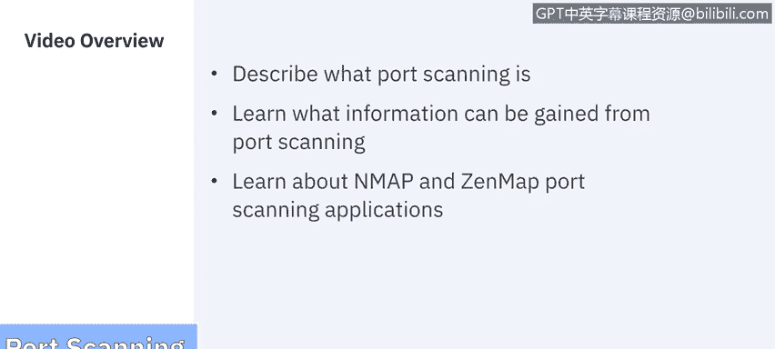
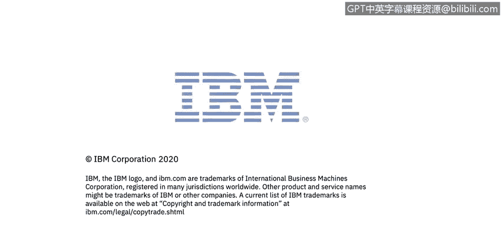

# IBM网络安全分析师专业证书课程6：《网络威胁情报课程（IBM）》｜ibm-cyber-threat-intelligence｜ - P15：14_端口扫描.zh - GPT中英字幕课程资源 - BV1jN411679K

Welcome to port scanningning， brought to you by IBM。In this video。

 we'll describe what port scanning is and what information we can gain from it。

 We'll also learn about the endm and Zenm port scanning applications。

Let's get started。According to the National Institute of Standards and Technology。

 Network Port and Service Ident involves using a port scanner to identify network ports and services operating on active hosts such as FTP and HTTP。

 and the application that is running each identified service such as the Microsoft Internet Information server or Apache for the HTTP service。

All basic scanners can identify active hosts and open ports。

 but some scanners are also able to provide additional information on the scan hosts。

Let's start with the basics， what is a port？Computer ports are the central docking point for the flow of information from a program or the internet to a device or another computer in the network and vice versa。

It's the parking spot for data to be exchanged through electronic。

 software or programming related mechanisms。Ports 0 through 1023 are well known port numbers that are designed for internet use。

 although they can have specialized purposes as well。

 they're administered by the Internet As numbers authority or the IAN A。

 These ports are held by top tier companies like Apple MSN SQL services and other prominent organizations。

 You may recognize some of the more prominent ports and their assigned services。 such as Port 20。

 which is UDP holds the file transfer protocol that we use for data transfer port 22 over TCP holds the SS H securecu Shell protocol for securecu logins FTP and port forwarding Port 50 over UDP is the domain name system DNS。

 which translates names to I P addresses。 and Port 80 over TCP， which is the World H T TP。

Now numbers 1024 through 49，151 are considered registered ports。

 meaning they are registered by software corporations， and then 49，151 through 65。

536 are dynamic and private ports and can be used by nearly everyone。

Now， these ports when engaged all solicit a response。

 so a port scanner is a simple computer program that checks all of those open ports in response with one of three possible responses open。

 closed， or filtered， dropped， blocked， etc。If the port is open or it accepts the ping。

 the computer responds and asks if there's anything it can do for you。

 if it's closed or just not listening， the computer responds， acknowledging that it's there。

 but that the port is currently in use and unavailable at this time。Now， if it's filtered or blocked。

 the computer doesn't even bother to respond and you get zero input from it。

Port scanning is a method of determining which ports on a network are open and could be receiving or sending data。

 It is also a process for sending packets to specific ports on a host and analyzing that response to be able to identify any vulnerabilities。

 There are five common types of scans that we're going to cover here。

The first type of skin is just the ping。It's the simplest port skin sending an ICNP EC request to see who's responding。

The next one is arguably the most popular， it's the TCP half open scan。

It's popular because it's very deceptive and it's very sneaky。

 it's also known as an SYN scan or sink scan， it notes the connection from the ping。

 but it leaves the target hanging。So you get information from the ping。

 but the host does not get that information。Now its counterpart。

 the TCP Connect takes that a step further by completing the TCP connection。

 this makes it slower and noisier， meaning it's easier to detect。The next type of scan is a UDP scan。

 Now， when you run a UDP port scan， you send either an empty packet or a packet that has a different payload per port。

 and you will only get a response if the port is closed。 It's faster than TCP。

 but doesn't contain as much data。And last is a stealth scan now these TCP scans are quieter than all the other options and can get past firewalls。

 but are still going to get picked up by the most current intrusion detection systems。

This leads us to one of the most popular port scanninging applications EndMap Now EndMap stands for network Mapper and is an open source tool for network exploration and security auditing。

It was designed to rapidly scan large networks， although it works fine against a single host。

EnMap uses raw IP packets in novel ways to determine what hosts are available on the network。

 what services， application， name and version those hosts are offering and what operating system and version of they are running。

And what type of packet filters or firewalls are in use and dozens of other characteristics。

While EndMap is commonly used for security audits， many systems and network administrators find it useful for routine tasks such as network inventory。

 managing service upgrade schedules， and monitoring hosts or service uptime。And last is Zenmap。

 which is still made by Endmap， but provides a graphical user interface。

 This makes the representation of data a lot more useful in the overall application much easier to use。

