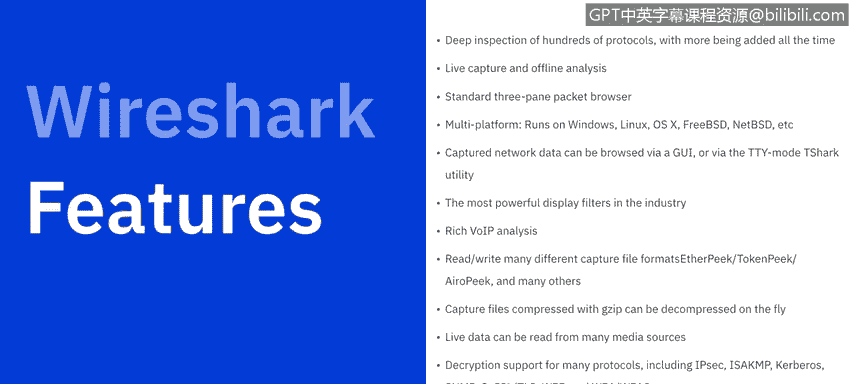
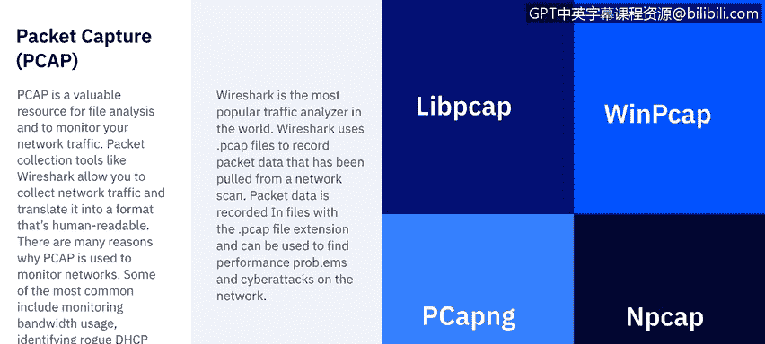

# IBM网络安全分析师专业证书课程6：《网络威胁情报课程（IBM）》｜ibm-cyber-threat-intelligence｜ - P16：15_网络协议分析器概述.zh - GPT中英字幕课程资源 - BV1jN411679K

Welcome to Network Procol Analyrs brought to you by IBM。

 This video we'll learn what network protocol analyzers are and we'll learn about Wireshark as the predominant protocol analyzer。

And then we'll seek to understand the packet capture file format。

Let's get started。A protocol analyzer， also known as a SNer， packet analyzer。

 network analyzer or traffic analyzer， can capture data in transit for the purpose of analysis and review SNs allow an attacker to inject themselves in a conversation between a digital source and destination in hopes of capturing useful data。

These network sniffs operate at the data link layer of the O S I model。

 which means they do not have to play by the same rules as the application and services that reside further up the stack。

 Snis can capture everything on the wire and record it for later review。

 They allow users to see all the data contained in that packet。The leading sniffer out there。

 wirere shark， wirere shark intercepts traffic and converts that binary traffic into human readable format。

 This makes it easy to identify what traffic is crossing your network， how much of it。

 how frequently and how much latency there is between certain hops and so forth。

Airshark is used by network administrators to troubleshoot network problems， by security engineers。

 they use it to examine security problems， QA engineers use it to verify network problems。

 developers use it to debug protocol implementations。

 and people in general can use it to learn about network protocol internals。For being freeware。

 wirere shark hosts an impressive amount of features。

It has deep inspection of hundreds of protocols with more being added all the time。

 It offers live capture and offline analysis。It comes standard with a three pan packet browser。

 runs across multiple platforms， Windows Linux， Mac O OS， free BDS net， BSD， etc cetera。

The capture data can be browsed via a graphical user interface or via the TTY mode， Tshark utility。

It has the most powerful display filters in the industry， as well as a rich voice over I P analysis。

It reads and writes many different capture file formats。

The capture files are compressed with Gzip and can be decompressed on the fly Live data can be read from many different media sources。

 decryption support for many protocols， including Is， IS AKM， Kpos， S V3， S L TlS， Web and WPAWPA2。

The coloring rules can be applied to the packet list for quick， intuitive analysis。

Output can be exported to X，ML， postscript， CSV， plaint， and many more。

 but makes wirere Sharks so impactful as the data that it captures。

Now packet capture is or PCAP is valuable resource for file analysis。

In monitoring your network traffic， packet collection tools like wirereshark allow you to collect network traffic and translate it into a format that's human readable。

 There are many reasons why Pcapap is used to monitor networks。

 Some of the most common include monitoring bandwidth usage， identifying rogue DHP servers。

 detecting malware， DNS resolution and incident response。

Wireshark is the most popular traffic analyzer in the world。

 Wireshrk uses the PCAP files to record packetca data that has been pulled from a network scan。

 the packetca data is recorded in files that are in the dot PCAP file extension and can be used to find performance problems and cyber attacks on networks。

Now， the。Packet capture or the P caps come in four different file format variants。

The first of which is going to be the Lib Pcap。LIB standing for library PCAP。

 this is going to be used in UniX based systems such as Linux and Mac OS。

W PCCAP is the variant for the Windows operating system and while it can be read by a wire shark is kind of an old format that is not used by default anymore。

Now PCAP N G is next generation。 This is the default format that wirereshark will capture packets in and is considered next generation because it both captures and stores data。

 and the last is N Pcap， which is only used by Nmap。

 a port scanning application that has the ability to capture packets as well。

