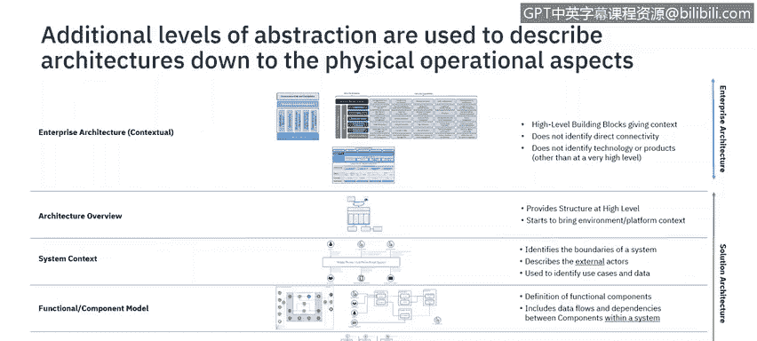
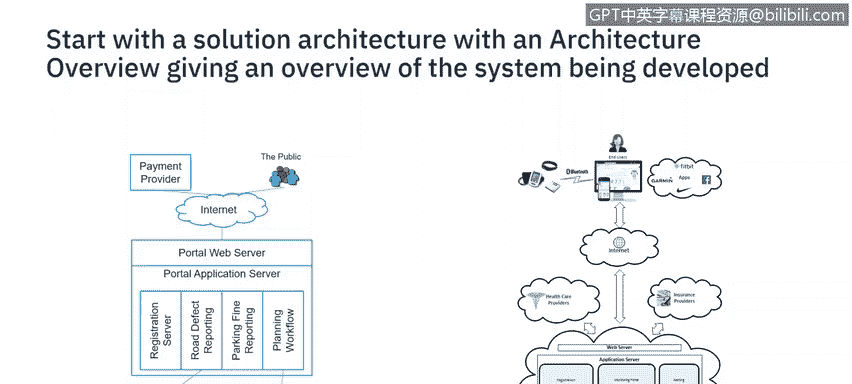
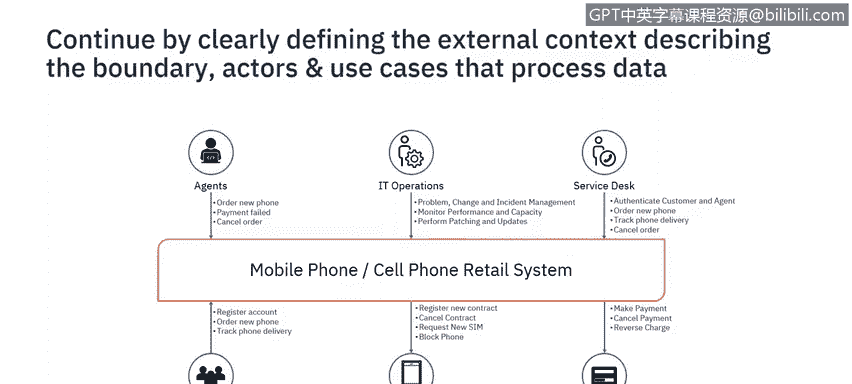

# IBM网络安全分析师专业证书课程6：《网络威胁情报课程（IBM）》｜ibm-cyber-threat-intelligence｜ - P19：18_解决方案架构.zh - GPT中英字幕课程资源 - BV1jN411679K

Welcome back to the unit on security architecture conceptcepts。 In the last video。

 we discuss concepts that will help you describe your enterprise security architecture。In this video。

 we'll continue our conversation on concepts that will help you describe your security solution architecture。

I will explain the solution architecture models， discuss the different representations at different levels of abstraction。

 and when to use representation in practice。During the development of the solution Arch for security。

 the threats will be identified and the specific controls specified。

Architecture develops through a series of steps decomposing from an overall enterprise architecture to specific solutions。

This slide shows the differing levels of representation from the overall enterprise architecture to the detailed operational model。

 specifying the different hardware components。There is an overlap between the different architectures that don't expect clean boundary。

 as sometimes hybrid versions of diagrams are used。

These diagrams will be used from two perspectives as a security architect supporting a solution being developed by a wider team。

Or as a security architect designing a security service where all aspects of IT architecture need to be considered。

This video is going to focus on specifying security for a solution。With an architectural overview。

System context， functional model and operational model。Before doing that。

 you might like to pause the video just to consider the different layers that are part of this architecture。

Once you have an idea of the solution。Required to be designed and delivered。

 document an architecture overview。As a high level conceptual diagram。

The diagram has no specific format。And needs to be sufficient to communicate the concepts of what you're trying to develop。

It enables a project to be initiated with an initial view of the system。

 but the diagram doesn't consider security yet。

Security can be considered by first identifying the boundary of the system。

We act as external to the system。These actors can either be human or system actors。

The actors each perform activities that are described for use cases。

These use cases process data that will flow to and from the system。

It is this data and the availability to perform these use cases that the security controls are protecting。

Therefore。Creating a system context will document the external data flows needed for protection。

And think about the actors and the use cases。We can then classify the sort of data being processed。

 and based on policy， this will guide the security controls needed with the environments that may be used。

This is useful。And once we know this， we can think about the security inside the system。

The actors and data flows external to the system。Initiates。Data flows inside the system。Therefore。

 the next step is to document the functional components of a system and the interactions between those components。

Each of those interactions will include a data flow。At this level。

 we can also look at the threat actors within a system and start to identify the controls needed to protect the data in transit and arrest。

At this level， we are documenting the application functionality。

 but not how the system will be implemented and operated。 We need another diagram for that。

The capabilities need to implement the application functionality needs needs to be identified。

Based on the classification of the data and the specific implementation。Components are placed。

Inter zones with different data classifications。Based on the organizational policies and standards。

The security controls will start to be identified。To a particular technology or product to this level。

Is a requirement for flash or Windows 2003 acceptable in your organization。

 It's these sorts of decisions that will need to be discussed。To support the environment。

 new actors may start to be identified such as security operations。

Is this capability outsourced or operated in house。If operated。Outsourced。

 then the security context will need to be updated to include a new actor。

The Actctor will have new use cases and data that will need to be protected in transit and at rest。

There's lots more that needs to be considered， but I hope this gives you an insight into the systematic way of thinking about security。

 using architecture thinking。

As the architecture has elaborated， some questions to ask， perhaps are。

 who are the stakeholders or actors to enforce the security。

Where are the locations for each of the systems， components and actors。

When are the security controls required， ideally with some sort of priorities for implementation。

 Why is the system needed， This can help priority controls。

 prioritize controls and their implementation。What is it that needs to be predicted。

 How will the data be need to be predicted？Thinking about all these sorts of questions will be an iterative process。

With earlier diagrams updated and then later diagrams then updated to reflect those requirements。

And those new improvements。That's it for now。 I'll speak to you in the next video about accelerating the solutions through the use of different security patterns。

