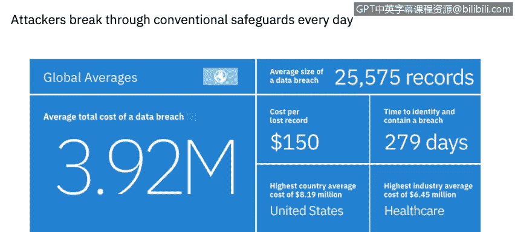
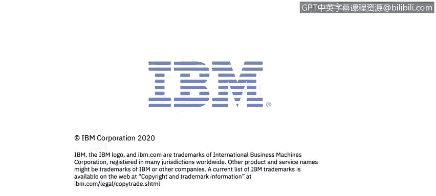

# IBM网络安全分析师专业证书课程6：《网络威胁情报课程（IBM）》｜ibm-cyber-threat-intelligence｜ - P1：0_威胁情报概述.zh - GPT中英字幕课程资源 - BV1jN411679K

Welcome to the course， Cyber Thr Intelligence brought to you by IBM。In this course。

 you will learn to identify the key concepts around threat intelligence。

 describescribe examples of network defensive tactics。

 Disc data loss prevention and endpoint protection concepts and tools。

 explore a data loss prevention tool and learn how to classify data in your database environment。

 describe security vulnerability scanning technologies and tools。

 recognize application security threats and common vulnerabilities。

 and explore a Sim product and review suspicious alert in how to take action。Hi， I'm Corine Ricecamp。

 a cybersecur professional in the IBM Security Learning Services team。

 I will be presenting several lessons as part of this course。😊。

You will hear from several subject matter experts within IBM throughout the series of videos。

 you will also have the opportunity to apply your knowledge with several virtual labs。

Let's get started。Welcome to Thrt Intelligence brought to you by IBM。In this video。

 you will learn to。Identify the key concepts around threat intelligence。

Cyber threat intelligence is information about threats and threat actors that helps mitigate harmful events in cyberspace。

Cyberth intelligence provides a number of benefits。

 including empowering organizations to develop a proactive cybersecurity posture。

Driving momentum towards a cyber securityity posture that is predictable。

 enabling an improved detection of threats and informing better decision making during and following the detection of a cyber intrusion。

Every organization today is facing similar challenges when it comes to IT security。

IT solutions need to be easy to use and access， but securing data assets and network access is paramount for almost every industry。

Let us look at some of the most prevalent drivers。 Here are just a few key data points from multiple reports studying cybersecurity trends in 2019。

Breach records， the number of breach records jumped significantly in 2019， with over 8。

5 billion records exposed more than  three times greater than 2018 year over year。

 The number one reason for the significant rise in the records exposed due to misconfigurations increased nearly tenfold year over year。

 These records made up 86 per cent of the records compromised in 2019。Human error at 31%。

 fishingish was the most frequent vector used for initial access in 2019。

 but that is down from 2018 when it compred nearly half of the total。IoT innovation。

Targeting of Iot T devices includes enterprise realms with over 38 billion devices expected to be connected to the Internet in 2020。

 The Internet of things or Iot T threat landscape has been gradually shaping up to be one of the threat vectors that can affect both consumers and enterprise level operations by using relatively simplistic malware and automated。

 oftenscripted attacks。Within the sphere of malicious code used to infect Io T devices。

 IBM X force research has tracked multiple malware campaigns in 2019 that have notably shifted from targeting consumer electronics to targeting enterprise grade hardware as well。

 activity that we did not observe in 2018。😊，Compromised devices with network access can be used by attackers as a pivoting point in potential attempts to establish a foothold in the organization。

Cost amplifiers。Cloud migration， I T complexity and third party breaches were cost amplifiers out of 26 factors that were studied contributing to the cost of a data breach。

 The five that contributed the most cost were third party involvement， compliance failures。

 extensive cloud migration， system complexity and operational technology。

 If a third party costs of data breach， the costs increased by more than $370000 for an adjusted average total costs of $4。

29 million。Organizations undergoing a major cloud migration at the time of a breach saw a cost increase of 300。

000 for an adjusted average cost of 4。22 million， and system complexity increased the cost of a breach by 290000 for an average cost of 4。

21 million。Finally， the skillski Gab， the recently published 2019 ISC Squared cybersecurity Workfor study pointed to a severe shortage of cybersecurity professionals。

 The study estimated for the first time that there are 2。

8 million skilled professionals worldwide currently working in the field and that an additional 4。

07 million more are needed to defend organizations。😊。

Today's threats continue to rise in numbers and scale as sophisticated attackers break through conventional safeguards every day。

 Or criminals， hackivs， Governments and adversaries are compelled by financial gain。

 Polics and notoriety to attack your most valuable assets。

 Their operations are well funded and business like attackers patiently evaluate targets based on potential effort and reward。

😊，Their methods are extremely targeted。 They use social media and other entry points to track down people with access。

 take advantage of trust and exploit them as vulnerabilities。 Meanwhile。

 negligent employees inadvertently put the business at risk via human error。Even worse。

 security investments of the past can fail to protect against these new classes of attacks。

As you can see from this cost of breach report in 2019， average total cost of a data breach is now 3。

92 million。With an average size of more than 25000 records in each data breach。

One of the main things that cause a breach to cost so much to an organization is the time to identify and contain a breach。

Which had an average of 279 days， within 2019。We will explore additional threat intelligence data throughout this course。

In the context of this research， insider threats occur because of the following。

A negligent or an inadvertent employer contractor， a criminal or malicious insider or a credential thief。

The key takeaway is the costliest insider threat per incident is theft of credentials。

These incidents have increased significantly in frequency and cost。 In fact。

 the frequency of incidents per company has tripled since 2016 from an average of 1 to 3。2。

 and the average cost is increased from $493000 to over $871000 in 2019 on an annual basis。

 organizations are spending more to deal with insider negligence。

 but the per incident costs is much lower。

