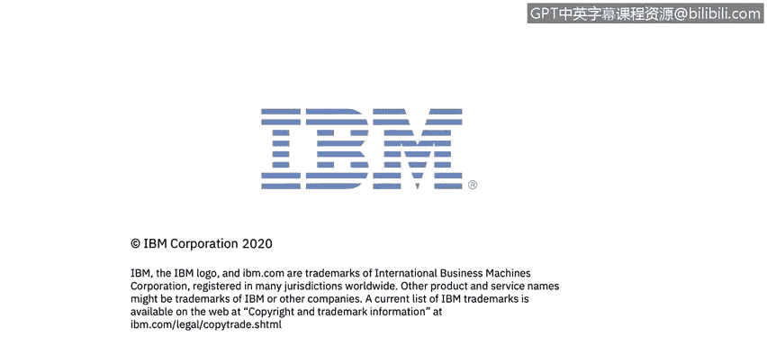

# IBM网络安全分析师专业证书课程6：《网络威胁情报课程（IBM）》｜ibm-cyber-threat-intelligence｜ - P21：20_应用安全概述.zh - GPT中英字幕课程资源 - BV1jN411679K

Welcome to application security， brought to you by IBM。In this video。

 you will learn to summarize key terms important to application security。

 describe the pros and cons of various software development life cycles。

 explore application security risks， and discuss application security techniques， dynamic analysis。

 static source code analysis， and industry tools。Let's take a look at the definition of application security。

Application security encompasses measures taken to improve the security of an application often by finding。

 fixing and preventing security vulnerabilities。 Different techniques are used to surface such security vulnerabilities at different stages of an application's life cycle。

 such as design， development， deployment， upgrade and maintenance。

Before we review the application's lifecycle， let's make sure we understand some key terminology and how application security fits with overall information security that we have covered in other courses and modules。

So what is the difference， network security is a protection of systems and information assets at the network level。

 typically involving areas such as routers and switches， servers， workstations and wireless networks。

 technologies such as firewalls， intrusion prevention systems and data loss prevention are put in place to keep these systems protected。

 Additionally， patch management tools and vulnerability scanners to discover and prevent security weaknesses at the network level。

 All topics we have discussed previously in this course。Application security， however。

 is the protection of application front ends， source code and information assets at the software level involving systems such as websites。

 databases， mobile apps and client and server applications。

 technologies such as web application firewalls and source code analyzers。

 are used to secure applications， operating systems such as Windows。

 Mac OS and Linux technically fall into both categories。

 but would typically be considered a part of network security。😊。

Both network security and application security are components of an overall information security program that includes policy procedures。

 incident response and disaster recovery， regardless of the specific threats and vulnerabilities associated with network systems and application environments。

 both network and application security work together to support the greater good of the business and overall IT risk mitigation。

😊，A couple of other terms we should review in regards to application security。

Threat is the potential for a security violation and the harm it will cause。

 If you have a data center in California， Earths are a threat in application security。

 the biggest threats are malware and hackers。 Ri is the likelihood of an attack。

 Compare the risk of an earthquake hitting a data center in San Francisco with a data center in Chicago。

 an application risk is the likelihood of malware hacker attack。

 the confidentiality integrityte or availability。 the CIA triad of an application。

Vulnerability is a security flaw and code。 known software vulnerabilities can be patched to reduce the risk of an attack。

 Un software vulnerabilities or zero day vulnerabilities are harder to demand against。

Different techniques will find different subsets of the security vulnerabilities lurking in an application and are most effective at different times in the software lifecycle。

They each represent different trade offs of time， effort， cost and vulnerabilities found。

 We will explore some of these techniques later in this lesson。

Utilizing these techniques appropriately throughout the software development life cycle will maximize security in the role of an application security team。

 You will see variations of the software development lifecycle of plan， develop， test。

 deploy and maintain， depending on your organization's specific guidelines。

 Each may refer to the different phases uniquely， and each organization will determine its software development methodology that works best for its software or is recommended within its industry。

Here are the most common software development methodologies。

Waterfowl is a top down development approach， which was most common in the past。

 It is simple and easy to follow， but not very flexible。

 and design flaws can be costly if discovered after the application is deployed。Agile。

 unlike the top down approach of waterfall， consists of short bursts of analysis， design。

 coding and testing。 This methodology is responsive and motivates the team to be productive。 However。

 driven by the pressure to meet the cycle deadlines。

 It is easier to forget application security testing。

 Scrum is agile development focusing on a sprint of one to four weeks， typically。

Like Agile and Scrum， the spiral software development methodology was invented with response to the perceived limitations of the top down waterfall methodology。

 It focuses on minimizing risk， which makes it possible to evaluate security at the end of each cycle。

 However， it is not as quick as agile， which may increase the cost of the software development。

The iterative form of software development breaks up development into smaller prototypes through repeated cycles which allows lessons to be learned from earlier iterations；

 however， if the planning cycles are too short， certain security needs may be missed。

During application testing， penetration testing should take place to test the software for vulnerabilities。

 Pen testing falls into three categories。 White box testing。

 White box testing provides the attackers with detailed information about the systems they target。

 This bypasses many of the reconnaissance steps that normally precede attacks。

 shortening the time of the attack and increasing the likelihood that it will find security flaws。

Black box testing black box testing， which does not provide attackers with any information prior to the attack。

This simulates in an external attacker trying to gain access to information about the business and technical environment before engaging in an attack。

Gray box testing， known as partial knowledge tests。

 are sometimes chosen to balance the advantages and disadvantages of white and black box penetration tests。

 Most common when black box results are desired， but cost or time constraints mean that some knowledge is needed to complete this testing。

Common technologies used for identifying application vulnerabilities include static application security testing。

 which is a technology that is frequently used as a source code analysis tool。😊。

The method analyzes source code for security vulnerabilities prior to the launch of an application and is used to strengthen code。

 This method produces fewer false positives， but for more implementations。

 requires access to the application source code and requires expert configuration and lots of processing power。

Dynamic application security testing is a technology which is available to find visible vulnerabilities by feeding the URL into an automated scanner。

This method is highly scalable， easily integrated and quick。

Des drawbacks lie in the need for expert configuration and the high possibility of false positives and negatives。

Interactive application security testing is a solution that assesses applications from within using software instrumentation。

This technique allows I to combine the strengths of both SaS and DS mouths as well as providing access to code。

 HTTP traffic。Library information， back in Connect and configuration information。

 some I products require the applications to be attacked while others can be used during normal quality assurance testing。

