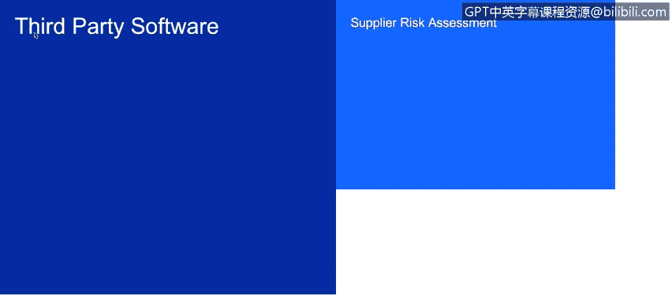
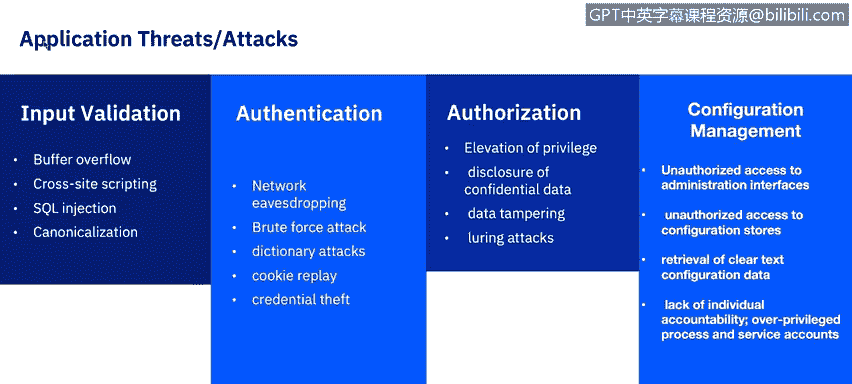
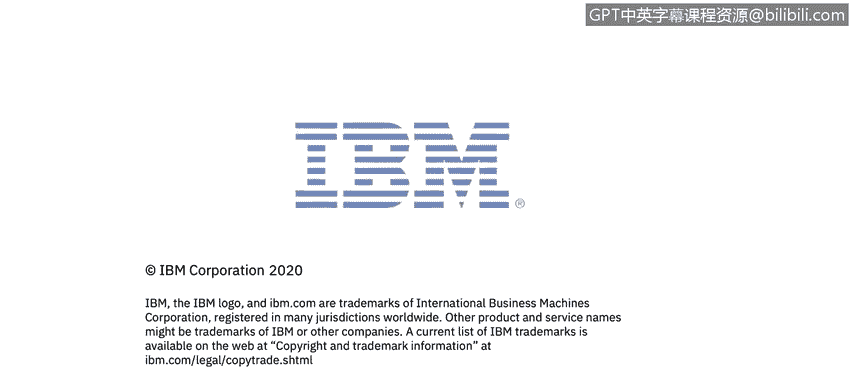

# IBM网络安全分析师专业证书课程6：《网络威胁情报课程（IBM）》｜ibm-cyber-threat-intelligence｜ - P22：21_应用安全威胁和攻击.zh - GPT中英字幕课程资源 - BV1jN411679K

Welcome to A Security threats and attacks brought to you by IBM。In this video。

 you will learn to explore application threats and add attacks and summarize the OAS top 10 application security risks。

In our discussions so far， we have been discussing applications developed in house。

 but what about third party applications before an organization selects any third party software。

 especially mission critical software and application security professional should assess the risk and ask questions about the security standards used to develop the software。

 is also important to know about security patching and any testing standards used by the third party。

😊。

The formal process of analyzing the risk to an organization's business of acquiring a third party software is called a supplier risk assessment or vendor risk assessment。

The first step is to identify how any risk would impact your organization's business。

 It could be a financial， operational or strategic risk。

 Next step would be to determine the likelihood the risk would interrupt the business。 And finally。

 there is a need to identify how the risk would impact the business。

Some risks may be too high that either a business process might change or another software may need to be evaluated。

Another important element of application security is installing a web application firewall or WAF。

A web application firewall filters， monitors and blocks HTTP traffic to and from a web application。

A WAF is differentiated from a regular firewall in that a WAF is able to filter the content of specific web applications while regular firewalls serve as a safety gate between servers by inspecting HTTP traffic。

 it can prevent attacks stemming from web application security flaws such as SQL injection。

 crossite scripting， file inclusion and security misconfigurations。

What are some of the most common threats and the associated tax for applications？

Input validation attacker modifies an existing application's run time behavior to perform unauthorized actions。

 exploited via binary patching。Code substitution or code extension。

Some common in attacks are crossite scripting， which we will explore deeper in a later lesson。

SQL injection， which we have explored in an earlier course。And buffer overflow。

Authentation is the process that verifies the identity of the individual。

Some common attacks are a brute force attack。Credential theft and network eavesdropping。

Authorization is a function of specifying access rights and privileges to resources。

 A very common authorization attack is elevation of privilege。

We will see several examples of this in the next qua， around breaches。Configuration management。

Typical configuration management attacks include unauthorized access to administration interfaces。

 unauthorized access to configuration stores， retrieval of Clt configuration data。

 lack of individual accountability， and overprivileged process and service accounts。

Exception management threat， like in denial of service attack。

 is a cyber attack in which the perpetrator seeks to make a machine or network resource unavailable to its intended users by temporarily or indefinitely disrupting services of a host connected to the Internet。

Finally。😊，Auditing logging is another common threat for applications。

 Some attacks include user denies performing an operation。

 attacker exploits an application without trace or an attacker covers his or her tracks。

There are many industry resources that should be consulted when working in an application security role。

 Let's look briefly at the OWAS top 10 web application security rows。Injection。

 injectionion flaws occur when untrusted data is sent to an interpreter as part of a command or query。

 The attacker's hostile data can trick the interpreter into executing unintended commands or accessing data without proper authorization。

Broken authentication， application functions related to authentication and session management are often implemented incorrectly。

 allowing the attackers to compromise passwords， keys or session tokens or to exploit other implementation flaws to assume other users' identities temporarily or permanently。

Sensitive data exposure， many web applications and APIs do not properly protect sensitive data such as financial。

 healthcare， and PII。Attackers may steal or modify such weekly protected data to conduct credit card fraud。

 identity， theft or other crimes。 Senitive data may be compromised without extra protection such as encryption at rest or in transit and require special precautions when exchanged with the browser。

XML externalnal Enities。Many older or poorly configured XML processors evaluate external entity references within XML documents。

 External entities can be used to disclose internal files using the file U R I handler。

 internal file shares， internal port scanning remote code execution and denial of service attacks。

Broken access control。Restrictions on what authenticated users are allowed to do are often not properly enforced。

Attackers can exploit these flaws to access unauthorized functionality and or data such as access other users' accounts。

 view sensitive files， modify other users' data， or change access rights。Security misconfiguration。

Security misconfiguration is the most commonly seen issue。

 This is commonly a result of insecurity default configurations。 incomplete or ad hoc configurations。

 opens cloud storage， misconfigured H T TP headers and verbo error messages containing sensitive information。

 Not only must all operating system frameworks， libraries and applications be securely configured。

 but they must be patched， upgraded and upgraded in a timely fashion。Crossside scripting。

Crossite scripting fls occur whenever an application includes untrusted data in a new web page without proper validation or escaping or updates in existing webage with user supplies data using a browser。

 API that can create HTML， or JavaScript。Crossite scripting allows attackers to execute scripts in the victim's browser。

 which can hijack user sessions， Defface websites， or redirect the user to malicious sites。

 Insecure decialization， Insecure decialization often leads to remote code execution。

 Even if decialization flaws do not result in remote code execution。

 They can be used to perform attacks， including replay attacks。

 injection attacks and privilege escalation attacks。Using components with known vulnerabilities。

 components such as libraries， frameworks and other software modules run with the same privileges as the application。

 If a vulnerable component is exploited， such as an attack can facilitate serious data loss or server takeover。

 applications and As using components with known vulnerabilities may undermine application defenses and enable various attacks and impacts。

😊，And finally， insufficient logging and monitoring， insufficient logging and monitoring。

 coupled with missing or ineffective integration with incident response allows attackers to further attack systems。

 maintain persistence， pivot to more systems， andtmper， extract or destroy data。

Most breach studies show time to detect a breaches over 200 days。

 typically detected by external parties rather than internal processes or monitoring。

