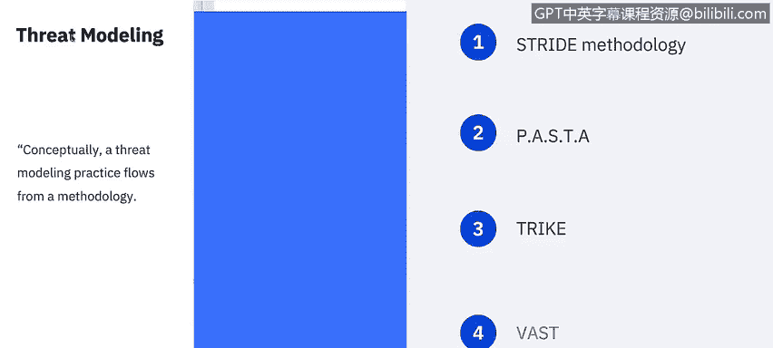
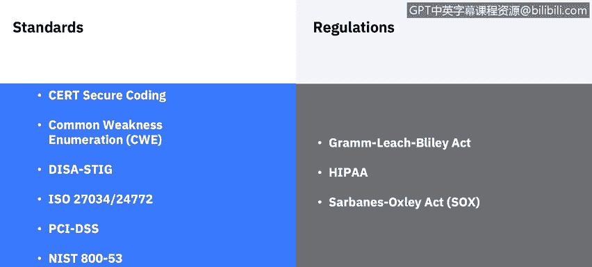

# IBM网络安全分析师专业证书课程6：《网络威胁情报课程（IBM）》｜ibm-cyber-threat-intelligence｜ - P23：22_应用安全标准和规范.zh - GPT中英字幕课程资源 - BV1jN411679K

Welcome to A Security Standards and regulations brought to you by IBM。In this video。

 you will learn to explore standards and regulations for application security。

I want to spend a couple of minutes on threat modeling before we have a standards and compliance review。

Threat modeling is a process by which potential threats such as structural vulnerabilities or the absence of appropriate safeguards can be identified。

 enumerated and mitigations can be prioritized。 The purpose of threat modeling is to provide defenders with a systematic analysis of what controls or defenses need to be included。

 given the nature of the system， the probable attacker' profile。

The most likely attack vectors and the assets most desired by an attacker。

Numerous threat modeling methodologies are available for implementation。

 typically threat modeling has been implemented using one of four approaches。

 independently acid centric。Attacker centric and software centric。

 Let's discuss a few of the most well known methodologies。

 strideide approach to threat modeling was introduced in 1999 at Microsoft。

 providing a anomic for developers to find threats to our products。

 stride patterns and practices and acid entry point where amongst the threat modeling approaches developed and published by Microsoft。

Pasta stands for the Pro for Att Sim and Thrt analysis。

Which is a seven step risk centric methodology。 It provides a seven step process for aligning business objective and technical requirements。

 taking into account compliance issues and business analysis。

 The intent of the method is to provide a dynamic threat identification enumeration and scoring process。

 Once the threat model is completed， security subject matter experts develop a detailed analysis of the identified threats。

 Finally， appropriate security controls can be enumerated。

This methodology intended to provide an attack or centric view of the application。

 an infrastructure from which defenders can develop an asset centric mitigation strategy。Tke next。

 the focus of the trike methodology is using threat models as a risk management tool Within this framework。

 threat models are used to satisfy the security auditing process。

 Thrat models are based on requirements model。 The requirements model establishes the stakeholder defined acceptable level of risk assigned to each asset class。

Analysis of the requirements model yields a threat model from which threats are enumerated and assigned risk values。

 The completed threat model is used to construct a risk model based on asset， roles。

 actions and calculated risk exposure。Finally， Va is an acronym for visual， agile。

 and simple threat monoing。The underlying principle of this methodology is the necessity of scaling the threat modeling process across the infrastructure and entire SDLC and integrating it seamlessly into an agile software development methodology。

 The methodology seeks to provide actionable outputs for the unique needs of various stakeholders。

 application architects and developers。 Cybersecurity personnel and senior executives。

 The methodology provides a unique application and infrastructure visualization scheme such that the creation and use of threat models do not require specific security subject matter expertise。

😊。

Security standards and regulations are important in all security domains。

 but may be the most important in stopping attacks within your organization。

 Here are a few of the additional standards you should become familiar with as an analyst or any cyberseity profession。

The CerRT C coding standard is the software coding standard for the C programming language。

 developed by the CerRTT Coordination Center and should be used to improve the safety。

 reliability and security of software systems。The Computer Emergency Rese team or CR for the Software Engineering Institute is a nonprofit United States federally funded research and development center。

The common weakness enumeration， or better known as the CWE。

 is a category system for software weaknesses and vulnerabilities。

 It is sustained by a community project with the goals of Under flaws and Software and creating automated tools that can be used to identify。

 fix and prevent these flaws。 The project is sponsored by the National Cybersecurity FfrRDC。

 which stands for federally funded Research and Development Center。

 and is operated by the MIR Corporation with support from US CerRT and the National Cybersecurity Division of the US Department of Homeland Security。

😊，The Defense Information Systems Agency has put together a security technicalical implementation guide as a cybersecurity methodology for standardizing security protocols within networks。

 servers， computers and local designs to enhance overall security。

 these guides when implemented enhance security for software， hardware。

 physical and logical architectures to further reduce vulnerabilities。😊。

Another set of standards for application security are from the International Or for Standardization。

 ISO and are part of the overall information security management set of standards specifically ISO 27034 which describes the minimum requirements when the required activity specified by an application security control or ASC are replaced with a Pre application security rationale or PASR。

 the ASC mapped to a PSR defined the expected level of trust for a subsequent application。

 an ISO 24772， which。😊，Is a standard around information technology， programming languages。

 which provides guidance to avoiding vulnerabilities in programming languages through language selection and use。

Another financial insute standard， PCI Data Security standard。Or PCI DSSS。

Is mandated by the card brands， but administered by the Payment Car Industry Security Standards Council。

 the standard was created to increase controls around cardholderer data to reduce credit card fraud。

And finally， N special publication 800-53 provides a catalog of security and privacy controls for all US federal information systems。

 except those related to national security， it is published by the National Institute of Standards and Technology。

 which is a non- regulatorygulatory agency of the United States Department of Commerce。

Compliance controls and testing also play an important part in application security I will review a few of the governing regulations you should be aware of as a cybersecurity professional。

 most may be a review but are worth mentioning。The graraham le blily。

Or G LB is also known as the Financial Services Moernization Act of 1999。

 until the GLB became law in 1999， there were strict governmental boundaries between financial institutions。

 Bank， insurance， companies and credit card providers were severely limited in the services they could provide in the information they could share with each other。

 GLB somewhat relaxed the regulations which cause concern with this increased latitude which could have far reaching privacy implications。

 because of this concern。 It included a number of limitations on the types of information that could be exchanged even among subsidiaries of the same corporation。

The Health Insurance Portability and Accountability Act of 1996 was created primarily to modernize the flow of healthcare information。

 stipulate how personally identifiable information maintained by the healthcare and healthcare insurance industries could be protected from fraud and theft and address limitations on healthcare insurance cover。

The Sarbanins Oxley Act of 2002 or Sox is a United States federal law that set new or expanded requirements for all US public company boards。

 management and public accounting firms， a number of provisions of the Act also apply to privately held companies。

 such as the willful destruction of evidence to impede a federal investigation。All of these。

Regulations are in addition to regulations that we've already covered in the compliance section of an earlier course。

As you can see， developing based upon security guidance and compliance are both an important part of application security。

😊。

