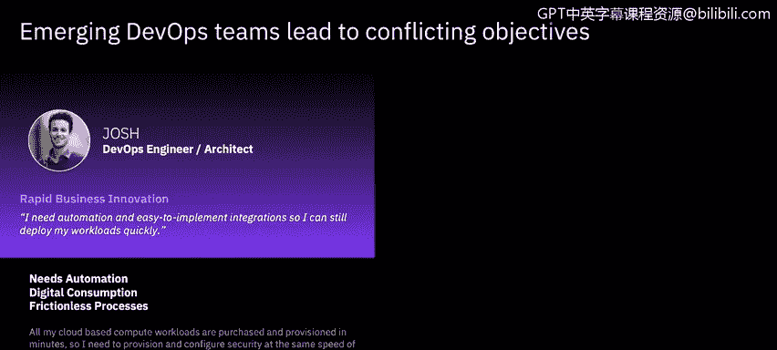

# IBM网络安全分析师专业证书课程6：《网络威胁情报课程（IBM）》｜ibm-cyber-threat-intelligence｜ - P24：23_DevSecOps概述.zh - GPT中英字幕课程资源 - BV1jN411679K

Welcome to Dovesack Ops and security automation brought to you by IBM。In this video。

 you will learn to understand the concept of Devops and automation and its effect on application security。

With the use of cloud comes the expectation that innovation and provisioning is sped up。

 Tradly security checks and testing has been seen to decrease this velocity。

 So organizations must now look at how they can ensure their deployments are secure。

 but that rapid innovation is not inhibited。

In order to facilitate rapid development， innovation and provisioning。

 security practices must keep up with the agile pace cloud of the cloud era。

 Planning cycles are shorter with more frequent deployments and more iterations as required。

 deployments are becoming smaller in nature and following a more standardized approach through consistent pipelines。

 reduction in time from build to deployment is being enabled by automation and self service。

 A level of autonomy is being afforded to teams。😊，Deevops came about because development teams primarily focus on producing new systems。

 applications and functionality and making them available to consumers as quickly as possible。

 operationss， on the other hand， look from a different aspect altogether。

 Their primary focus is on ensuring a responsive and stable system。😊。

The Devops philosophy bridges a gap and fosters integration。

 collaboration and communication to ensure a balance between development and quality。

 The development engineers are developing rapidly and autonomously。

 They are working alongside the operations engineers to ensure quality deployments that are bug free。

😊，But what about secure and vulnerability free apps。

 What about ensuring compliance with regulations that potentially keep changing。

 What about ensuring there is protection against an accountability of all development to protect data and intellectual property。

Both DevOs and security engineers want easily deployable， vulnerability free releases。

 They also want automation and integration to achieve this with minimum requirement to reskill and minimum overhead。

 This is why DevOs needs to morph into Devs ops， where security integration and automation are key。😊。

Desec ops is the integrated， automated， continuous security， always。

Integrating security with DevOs is Dev SOs， here is one approach。

The IBM Devsak Ups reference architecture isn't just a technical framework。

 encompassing people's mindset and culture in alignment with strategy， governance。

 risk and compliance。The framework guides how to develop securely。And run secure operations。

 embedding security and continuous learning to transform Dev ops into Devvs ops。

 We shall consider each of the framework elements in more depth over the coming slides。😊。

Alignment with strategy and governance plays a central role in the design of systems and their components。

 Checks can be put in place to continually assure requirements are being adhered to。

Risk is a continual factor in any IT system's management。

 and as such a process to manage it needs to be established and integrated into operational processes。

Success will be difficult if people and culture don't align with the desired ways of working。

The team must be given training and help to be aware of the role security plays and how it can be integrated in a seamless manner。

 They need to understand how the benefits outweigh any perceived barriers， And in turn。

 it needs to be demonstrated that these barriers either no longer need to exist or minimize or are within the gift of the team to reduce。

 Teams need autonomy， not bureaucracy。 They need to be able to own solutions。

 To choice and be equipped with the knowledge of factors to consider。

Continuous improvement helps everyone to perform better。

 We learn from our mistakes and are better for having experienced So Education and opportunity to learn should be provided and seen as part of the system pro and program life cycle。

😊，Collaboration between team members with different skill sets is crucial to increase student autonomy and secure deployments。

 When faults do occur， blameless postmortems are key to enabling lessons to be learned in a non threatening environment。

 Everyone is more productive in a trusting， safe environment where they are encouraged to innovate and explore。

😊，Take time to prepare security requirements based on understood threats and risks。

Build the system in such a way to counter and overcome these。

 Security Es should be seen as first class citizens and added to overall project backlog for tracking。

This is aligned with the NIS framework identify function。By considering threats and risks。

 a system can be architected with them in mind。 Checks can then be put in place to measure the success of the design and help ensure compliance and security。

 with new regulations having come into force regarding data protection， such as GDPR。

 businesses need to plan to protect themselves and their subjects' right to privacy。

The code and build phase is where security and component creation combine。

 It's where the benefits of a shift left strategy with security as code。

Integrationations can be truly experienced。Getting real time feedback on vulnerability and code weakness at development time empowers the developer to make informed decisions and resolve issues before code is committed。

 Security engineers can provide guidance on best practice for application coding and infrastructure configuration can help reduce flaws and take and take on remedial action to fix bugs found in subsequent test phases。

 Imed code and components should also be checked for vulnerabilities early in the life cycle to enable quick and concise remedial actions to occur。

😊，Shiiff left is central to the desire to fix issues earlier and reduce the cost of doing so。

 Initial vulnerability checks should be performed before committing code。

 They can be rechecked at build time， with the ability to block use of components with severe vulnerabilities。

 It is also possible to monitor release components that reside within a repository to update the stance of their use。

 Additional testing， as we have discussed in a previous lesson。

 like white box testing or black box testing may be performed as required。

Automated security checks should featured during tests and compliance checks with the ability to build upon the static tests performed locally by developers and during build time。

 a comprehensive set of integrated and automated tests can provide a pipeline with cont assurance。

 facilitating continual confirmation that system changes haven't impacted the。

System's ability to meet its security and compliance requirements。 This， in turn。

 reduces the risk associated with component changes in deployments。

 along with providing real time assurance reports to risk managers。

A comprehensive set of automated tests and checks will build on those performed by developers during coding and continuous integration。

Automated testing should exhibit a downward trend of vulnerability and flaw discovery as a shift left approach will will have empowered the developer to discover and take remedial action before the commit。

 Autoated security testing will reduce the requirement for manual penetration testing。 However。

 a comprehensive and effective approach to secure system creation is likely to see their inclusion for the foreseeable future。

