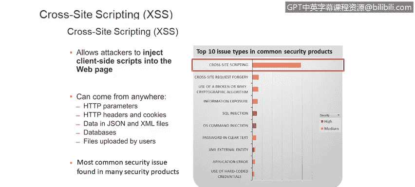
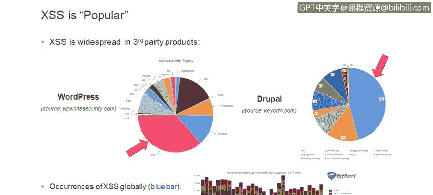
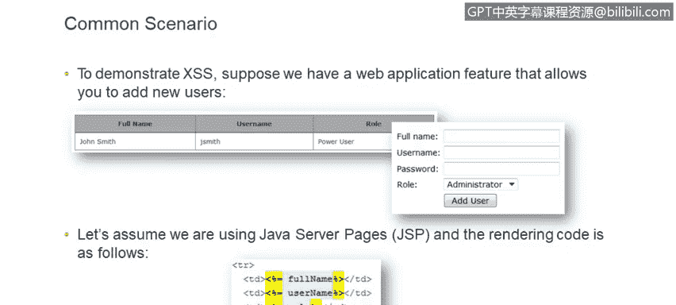
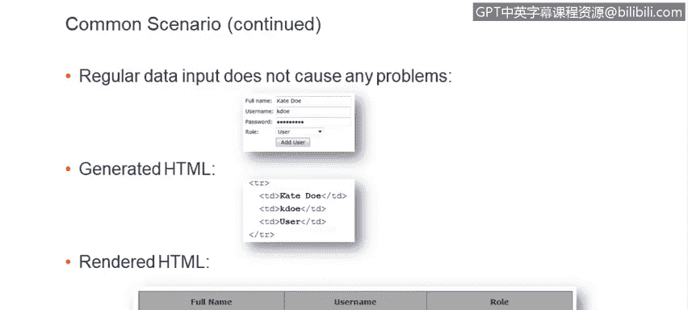
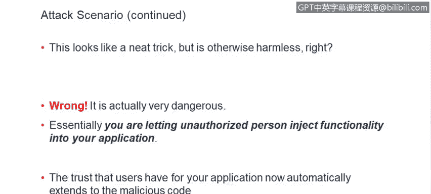
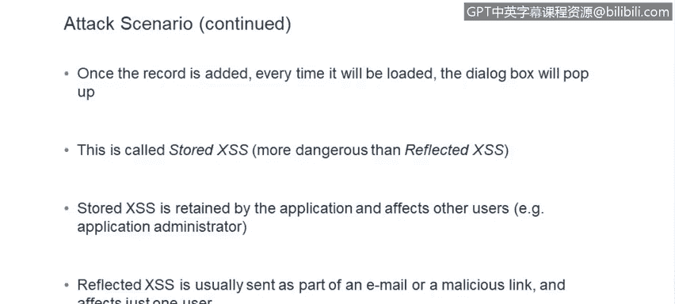
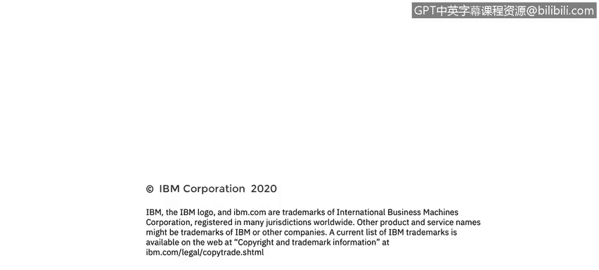

# IBM网络安全分析师专业证书课程6：《网络威胁情报课程（IBM）》｜ibm-cyber-threat-intelligence｜ - P27：26_跨站点脚本常见攻击.zh - GPT中英字幕课程资源 - BV1jN411679K

So let's start with the definition， what is cross size scripting？

Cross scripting is a type of vulnerability that allows unauthorized person to inject client sight。

 script or scripts。Into your web application。And this malicious scripts they can come from anywhere。

 most commonly， they come as part of。HtP parameters when somebody fills out a form on your website。

 for example， but they can come from other sources， HtP headers and cookies。

 they could hide in JSO and XML files that you exchange with the front end。

 they could embed themselves in databases or other types of files。Uploaded by users。

 so you really have to watch for these and be ready for them to come from any source that's user controlled。

As Ron mentioned earlier， cross size scripting is the type of vulnerability that we see most often。

So what are the dangers of cross size scripting， they can be used for a whole lot of malicious things。

 so first of all， they could be used to harvest your credentials。

Atacters could take over user sessions。Crosideite scripting can be used to facilitate crosssite request forgery。

They can steal your cookies or data that's stored locally。Ma can be used to elevate privileges。

And also can be used to direct users to malicious sites。

 so you can see there's a lot of damage that can be done。

The cross size scripting is seen across the board here you can see two pre famous products。

 WordPress and Drupal and statistically cross size scripting is the highest occurring vulnerability in both of those products also a few years ago risk based security company。

Did a study of what types of vulnerabilities are most commonly occur。

 and they did that based on Internet database that stores information on known vulnerabilities called v Db。

 And as you see can see in this graph here at the bottom， the blue bar shows。

How frequently the cross e scripting vulnerabilities are found and so the data is from 2007 to 2015。

 and most quarters it's the highest occurring vulnerability for all kinds of products。

Cross size scripting is not only found by。QA teams or penetration testing teams。

 they're actually actively being exploited by attackers。

 So there are two prominent recent examples one was where ebay was attacked with phishing attacks based on cross size scripting。

And Apache Foundation was hacked， and in the kill chainin there。

 the first step was exploiting cross size scripting in Jra。

And there are many other examples。So it's not surprising that this vulnerability shows up on the top 10 or wasP top 10 web vulnerability list。

 if you're not familiar with this， I highly recommend checking out OSAP。

Which is online community for web application security and。As a developer。

Be aware of this list and consult with it from time to time to make sure you're in your code。

 you're not introducing these vulnerabilities。

And also another list that Ron mentioned， San Stop 25。

Cross size scripting is in the fourth place on that list。

So it's very dangerous。So let's take a look at how cross scripting actually works。

We'll use a very simple example of an application youre developing that has simple data entries。

 in this case we're entering user information， so let's say we have a very simple form went full username。

Then username password and the role， and the users that are entered are displayed in a simple table。

For this example， we'll use Java server pages。But you can really get cross size scripting with pretty much any technology or framework。

So if the rendering code is simple， if we don't have any extra checks。

 if we just basically reflect back whatever data that was entered。

 the output will be unprotected and I'll show you how in a second。

Regular data input will not cause any problems。 So user enters the name。

 the username and other information， and they generated HTML。

We'll just basically reflect what was entered right back。

We'll assume that there is some kind of a database behind this application， the data is stored there。

 and every time you visit the list of users you get a nicely formatted HTML page so far so good。

Suppose there is a malicious user that and decides to enter something more than just the full user name。

 Let's say they enter an HTML tag， in this case， script and a piece of ja code。

 because our application does not have any special defenses neither。On input， nor on the output。

 the data that was entered will be stored as is in the database and will also be rendered as is when it's time to render the list of users。

And because there was no special processing， the tags， the smel tag script that was entered。

Will be rendered as is and will be interpreted as is script as a。Scrip tag by the browser。

So at the bottom here you see the actual example。Because it's a script tag。

 the scripted fire and the dialog box will pop up。 This is definitely not what the developers of application intended。

 but this is something that the user was able to do。

So it seems like an interesting trick， something to show to your friends， but is it really harmless？

Unfortunately， it is it's very dangerous。 if you think about it， essentially。

 you're letting unauthorized person。Inject functionality into your application。

 and that functionality could be anything it most likely won't be something as benign as what I showed in the previous slide。

And another danger here is that。Your customers， as they're using your application， they trust it。

 and this trust automatically now extends to this code that the third party has injected。

Once the record is added， in this particular case， it will be stored in the database and every time the list of users is rendered。

This dialog box will pop up， this is actually an example of something called stored cross size scripting which is a more dangerous variant compared to reflected cross size scripting stored cross size scripting is retained by the application and usually a third affects more than one user。

And the added danger here is that。That other user that this malicious script affects may be application administrators。

 you could actually get privilege escalation out of this。

Somebody could take over an administrative account。

Reflective cross scripting is a little less dangerous。

 it's usually sent as part of email or embedded in a malicious link and usually this affects just one user。

So let's look at a more sinister example and see what actually can be done with cross size scripting。

 So let's say malicious user。Enterers his name， but also adds this blob of HTML and style sheets and JavaScript and see how it will actually be rendered in the client application。

So when the list of users is rendered now there is a dialog box popping up saying that the session has expired and asking user to enter their credentials so we now have a very serious security issue some users may actually fall for it if attacker you know tweaks the style sheets to be just right and match the overall look and feel of the application a lot of users may actually think that yes my session has expired a better login and they will enter their username and passwords which will then be taken by theer and used first of all to log into the application they can become you they can impersonate you and also as we know users reuse their login credentials on multiple sites in multiple application so this credential harvesting can actually be used elsewhere and your bank application or in any important application in your life so as you can see now this has become a very dangerous situation it must be mitigated。

