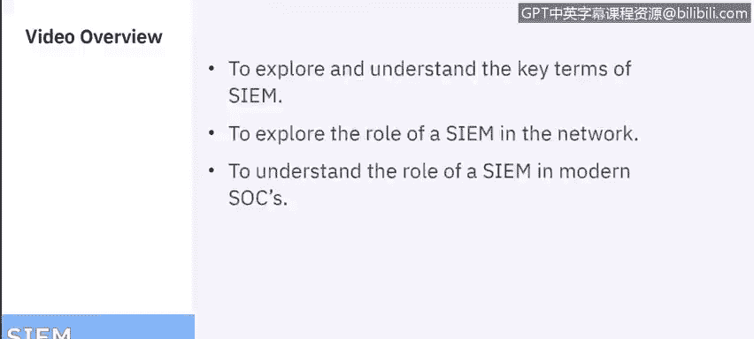
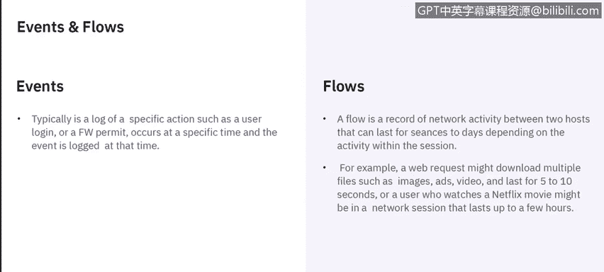
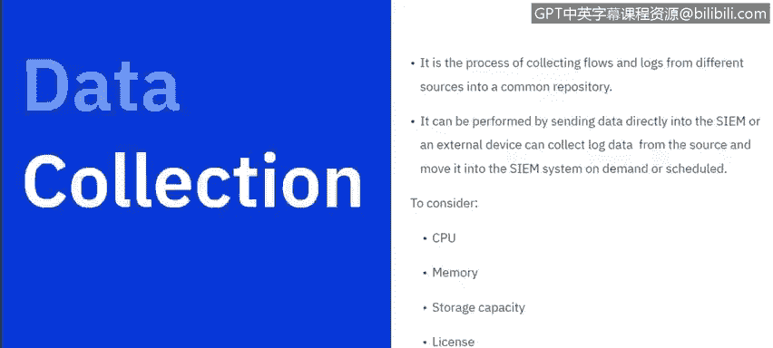
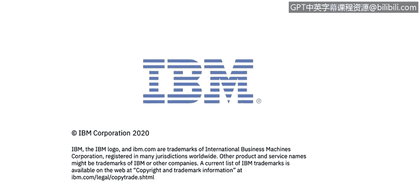

# IBM网络安全分析师专业证书课程6：《网络威胁情报课程（IBM）》｜ibm-cyber-threat-intelligence｜ - P29：28_SIEM概念和优势.zh - GPT中英字幕课程资源 - BV1jN411679K

Hi there， My name is Jude Lancaster and I'm a cybersecurity specialist with IBM Today we're going to talk about a security information and event management system and we'll talk about the concepts of it。

 some of the benefits of using one， a little bit about optimization and the capabilities of a SIM。😡。

We have three learning objectives today and they really are to explore and understand the key terms of what a SIM is。

 to explore the roles of a SIM on a network and to understand the role of a SIM in a modern security operation center。

 so let's get started。😡。

System or security information event management system is really a data aggregator search and reporting system。

 it really takes a lot of information from your network environment and consolidates that and makes that data available into a format that is easily accessible and easily readable by a human and it categorizes that data so it's all laid out at your fingertips to make things easier to understand。

😡，They really here are some key terms around what we're going to talk about today as far as a SIM goes。

 so we're talking about log collection， normalization， correlation， aggregation， and then reporting。

 and these are all important when you consider them in the context of what a SIM is。😡。

ASIM basically collects logs and other security related documentation for analysis and the logs。

 if you don't know are really information that happens on a device like a firewall or a web proxy or any kind of device that is providing network security or an application。

 so any application typically has a log file that will tell what exactly happened in the log。

 and the core function of a SIM is to manage your network security by monitoring network flows and events。

 events are things that happen within an application or on a hardware device。

 and then the SIM consolidate those log events and the network flow data。

 and it really pulls this from thousands of different devices， things like endpoints， application。

 network hardware， anything that is touching the network。

 and then it uses advanced analytics to normalize and correlate that data。😡。

And helps identify security offenses that might require investigation。

A SM really takes two different approaches， it can be a rules based approach or employ a statistical correlation to establish relationships between log entries。

😡，And then it will capture that log event and network flow data in near real time and apply analytics to that to reveal security offenses in the network。

There are several different ways that a SIM can be deployed or consumed， if you will。

 It can be on prem through either software or appliances in your own data center。

 it can be in a cloud environment， so I go to a web browser and log into a hosted environment。

 or it can be provided in what is called an MSSP， a managed security services provider where they would host it for a specific company and allow you to log on similar to a cloud environment。

😡。

So let's talk about events and flows， events are typically a log of a specific action。

 so things like a user loggged in or a firewall permit or denial that occurs at a specific time and the event is logged at that time and then that device or application would push that event to the SIM and the SIM would process that in eitherly is normal behavior or this is abnormal behavior。

😡，Flows are a record of network activity between two hosts and those hosts， or that connectivity。

 I should say， can last for a few seconds or days depending on the activity within the session。

 so if you're transferring a large file， it will last for longer than if it's just a very short burst of communication like an instant message or an email being sent。

😡，The network activity， when we say hosts， it could be a PC on your network that's talking to a hosted machine like you're on an internet page or if you're transferring a file up to a cloud service like a Dropbox or box。

 anything like that is considered a network communication between hosts。

 another example might be downloading multiple files， images， videos。

 and that might last for five or10 seconds or if you're watching a Netflix movie that might last for a few hours and those are all network sessions and those flows are records that are captured of the amount of time and what was transferred between the two hosts。

😡。

We talk about data collection in the context of a SIM。

 we're talking about the process of collecting those flows and logs from different sources and putting them into a common repository your database that the SIM will analyze in order to make determinations if something is normal or if it's anomalous or abnormal。

 and it can be performed by sending grade data directly into the SIM or an external device that can collect that log data from a source and aggregate it and then move it on demand at a schedule or whatever the SIM operator wants them to now to be frank。

😡，The SIM data is going to be be much more valuable if it's realtime。

 so if the data is pulled directly from the device at the time it happens to the SIM you get better information and you get much faster information so that analysis can occur in real time and provide the SOC analyst with data that is needed to determine if behavior or things going on or anomalous。

 things to consider as far as how much data to pull in and how often to do that are really considered are really governed by a couple of different things。

 the amount of CPUU that has been assigned to the SIM application or if you're using an appliance to that SIM appliance。

 SIM with memory and storage capacity， of course the license associated with your SIM is going to make a difference as well。

 most SIMs or license in the concept of what we call EPS events per second or。😡，FPM flows per minute。

 So the number of network flows per minute， and the number of events per second is how most Sim。

Providers or systems license their Sim。 And then， of course。

 the number of sources that are being pulled into the Sim are going to be important as well。

 So the more sources you bring in， the more Eps you're going to consume and then more flows you're going to consume as well。

 So those are all factors to consider when you're sizing how many resources to assign to your Sim。

Let's talk about normalization， normalization is the process that takes raw data and puts it into a format that can be read by a SoT analyst。

 so things like the IP address， the queue identification。

 any data that is needed to provide information that is usable。

 it involves parsing that raw event data and preparing the data to display so it makes it more readable and it results or allows for predictable and consistent storage of all the records。

 so regardless of what the system that is the data is being pulled from it gets normalized into a format that is readable so I can see things like IP address。

 I can see things like machine name if that's available， username if that's available。

 it gives me more information about what's going on in the environment。😡。

The other thing we should talk about is licensing and licensing throttling so most SIims as I mentioned before will be licensed by the number of EPS and the number of flows and license throttdling will number monitor the number of incoming events and manage that input queue into the EPS or flow licensing so if I go over that those events that are coming in might be throttled or might be queued until I go under my license threshold or in the event of too many at one time they may actually be dropped and put directly into storage or just dropped altogether it all depends on the system and how it's monitored so those are all considerations to think about when you look at the number of sources you bring in。

😡，Another concept that we talk about within SIM is we call coalescing and then coalescing events are parsed and then coalesed based on common attributes across events Q radar is IBM's SIM product so the examples we're going to use in this presentation are all based on Q radar an event coalescing it occurs after three events have been found with my matching properties within a10 second period so if I find three events coming from the same machine。

 I'm going to coalesce those into a single event with those three different properties into the same event essentially。

 and its processed in order to normalize it and really to keep the system from display too much information that makes it more difficult to sort and to analyze that information when we talk about coalescing and how we combine those there's five properties that are。

So if the five properties match and we have three events within a 10 second period。

 they will all go to the same machine and the same event， and that's the Q identification or QID。

 the source IP， the destination IP， the destination port and the user name。

 those are all things that go into what we call event coalescing within Q radar。

And then coalescing to get into more detail， those events are parsed and when we find common attributes across those events。

😡，And we normalize that data into those into those fields。

 we'll get more data than just those five things that we show on the screen。

 but those are the attributes that go into what makes up coalescing so when we have three events in a 10 second period all five of those things match the QI。

 the source IP， the destination IP， the destination port and the username。

 those are all going to be coalesced into a single event for the SoC analyst to look at and to be able to make sense of。

😡，And then let's talk about really what offenses are so offenses are our anomalous behavior that the system sees as hey。

 this is something that doesn't make sense or something that is outside of the norm。

 so you should probably take a look at it， and those data points can come from lots of different sources。

 so things like security devices， security， excuse me security devices， servers and mainframes。

 network activity， data activity， if I'm accessing a database。

 application activity if I'm using a chat application or Microsoft Office 365 configuration info on a system。

 vulnerability and threat data which is very important to a SIM and then users and identity。

 so one of the things that might be anomalous is。😡。

User logs in from multiple locations within a very very short period of time。

 You might see someone's user I trying to be logged in from the United States， then from India。

 then from Romania in a few seconds or a few minutes。

 that's obviously anomalous behavior because that couldn't happen logically。

 So those are things that might turn into what we would call an offense。

 And all those things are put into event correlation。

 So things like logs and flows and Ip and your geolocation。 As I mentioned in the example before。

 And then that activity is。Baseline to look for anomalies。

 and then those will be put into an offense。 And then offense is what the SC analyst will look at to see if I need to do some further investigation in this。

 And a good Sim will try to tune out the noise of false positives or anomalous behavior that really isn't an issue and provide what we call a true offense or something that can be and should be。

😡，Investigated。The challenge many organizations have when leveraging a SIM is you get all this data in and those filter into too many offenses that are not true offenses and then they can't be investigated in a timely fashion and so unfortunately the SIM just becomes noise in the environment。

 so the whole goal of the SIM is to be tuned well enough that I can look at all the data that's coming in and tune it effectively so that I'm only looking at offenses that really need to be investigated that are true offenses。

😡。

