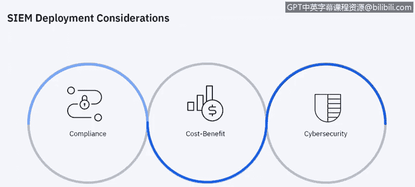

# IBM网络安全分析师专业证书课程6：《网络威胁情报课程（IBM）》｜ibm-cyber-threat-intelligence｜ - P30：29_SIEM部署.zh - GPT中英字幕课程资源 - BV1jN411679K

So when you look at deploying a SIM there are really a couple things that you want to consider and that is compliance。

 are there some mandates that you need to measure against things like GDPR or many regulations in the United States like HIPAA。

 the health and information Portability and privacyva Act。

 PCI which is what credit card processors measure against。

 so there are all kinds of regulations and compliance metrics that need to be。😡。

Measured against And if S can help do that。 there's also a cost benefit analysis。 of course。

 anytime you invest in a new technology， what is the benefit you're getting。

 what business value does it provide to the business， and then， of course。

 the cybersecurity aspect as we as technology becomes more prevalent in our lives。

 there are more things that bad actors that can try to cause。

Issues within the environment for monetary gain or for other nefarious purposes。

 So cybersecurity is also an important consideration。

 We want to protect the data within our environment， obviously。

I'm going to give you a brief example of a Q radar deployment。

 And this is really very similar for any Sim， whether it be IBM's Q radar or any of the other Sims on the market。

 so。When you look at the deployment scenario， what you will typically have is flows coming in from a network source like a span or tap or a router and that gets translated into what we call QFlow。

 which is the format that Q radar can read and then that's sent to a flow processor and these can all be either hardware appliances or they can be software and then that is brought into the console for the SoC analyst to look at event and log sources are done exactly the same way they go to an event collector and then an event processor and into the console in smaller environments。

 all of these appliances can be a single appliance so a small implementation may only have one appliance that is doing the work of all the things that you see here。

😡。

Let's go into a little bit more detail about the event collector and the event processor。

 the event collector collects the events from local and remote log sources and normalizes that log source events to a format that Qra can read Now an event collector is really used in remote location so if you have multiple locations or multiple data centers you may have an event collector in each of those data centers that feeds in on event processor and the event process or processes those events as its name implies that come from one or more event collectors and then those events are processed using what we call our custom rules engine or rules or how we determine if behavior is anomalous essentially so the event is processed it goes through the custom rules engine someone sees oh yeah this is behavior that doesn't look right so we're going to flag it as an offense and that's what happens on the event processor。

Flows are done in a similar fashion so the flow collector collects flow data from packets and those are collected for monitor port like a span or a tapAP or sessions like that。

 and then they can also be collected from sources like NeF or SF or JFlow and then it's converted into theator Q radar format which is QF and then it's sent to the event flow processor for processing and as with an event collector。

 a excuse me a flow collector would be put in a a remote data center。

 so you might have multiple flow collectors depending on your data center architecture。

 you may have a data center in one city and another one in another city and so you could put event and flow collectors in each of those data centers to then feed into a flow processor in your main data center。

 it depends on how large the organization is how many sources they have。

geographicographic distribution when we look at sizing a SM。

The flow processor then deduplicates those flows if those sources are coming into different flow collectors but it's the same source。

 the flow process will deduop that and then it will do things like asymmetric recombination which is combining the two sides of the flow when the data is provided asymmetrically so it recognizes flows from each side and then combines them into one record however you may not always get both sides of the flow you may only get that I went out to a specific network host and not the information from back in。

 but when you get it from both， we can recognize those two different flows and combine them into one。

There may be some reasons why you want to we talked earlier about an all in one deployment。

 which is a single appliance that would be used for a in this case， Q radar deployment。

 so if your data collection requirements exceed the collection capability of your all in one compliance。

 excuse me all in one appliance if you want to collect events and flows from different locations and you're not getting good throughput to the directly to the。

😡，All in one appliance。If you're monitoring packet based flow sources。

 you might want to add a flow collector and as your deployment grows。

 your workload may in fact exceed what you can do with an all in one appliance。

 So those our factors consider as well as the search speed。

 So if you have more analyst then can do concurrent searches that the all in one appliance can handle that would lead one to a more distributed。

Architecture， as opposed to doing everything on a single appliance。

 as well as things like retention period。 many organizations have。

A mandate for how long they need to retain this data。

 So if the storage requirements for your data retention periods。Get too large for a single appliance。

 That may require a deployment of multiple appliances。 And as your team grows。

 you might require better search performance。 So those are all things that will。

Lead to moving from a single appliance to a multi appliance deployment。

Here's how where we talk about a Sim and how it fits into the concept of a security operations center or Sock。

 So the security operations really is as you would expect， is the people。

 the process and the technology and of course， the Sim fits into the technology piece。

 So that would be things like other things in the technology piece， endpoints， your flow。

 your network monitoring any incident forensics you're going to do and threat Intel。 And then。

 of course， the people are probably the most important component of the Sock。

 because they are really what。Takes the data that the Sim is providing and provides intelligence around that to determine if an event or fence needs to be investigated more with more detail。

 So your formal training， your internal training， of course， on the job experience， nothing。

 can compete with that。 And if you have vendor specific training for the tools that you leverage within the environment。

 And then the process that is。Goes into your sock。 So what is what what is the process for what you do when an event turns into an offense and when that offense needs to be investigated。

 And it really is a closed loop kind of thing from preparation to identification。

 How do we contain it。 Get rid of it。 Re from it。 And then lessons learned。

 And that goes back into the preparation step。 So the process is a very important part of the sock component as well。

Here's how we talk about SoC data collection for improved incident handling。

 so we want to talk about the visibility because we're centralizing all those data sources into a SM or security monitoring system and and by getting all the information from things like network traffic。

 your system log your endpoint data， your external threat Intel feeds and your events all go into the SM and we want to make sure that everything that we have in the environment is visible so we really want to feed as many data sources as we can into the SM so that we have visibility across the entire environment。

 obviously there are things like licensing considerations and budget and those kind of things that will dictate how many sources we can bring into the SM but when we have determined all of of the sources that we want to bring into our SIM and we look at。

The monitoring system or the SIM for the analysis， you know we want the SIM to provide as much data and as much intelligence around that as possible so that when the security analyst actually analyzes it they're filtering out all the noise and really only looking at the things that should be and need to be investigated。

 and then the action around that， so once we have our findings and we determine what the correct investigation process is and then what the correct remediation process is。

 whether it be patching， modifying the firewall rules。

 quarantining a system to do further investigation or even potential reimaging。

 the action is what you're going to do to to take care of the issue that was found during the analysis and investigation。

So I hope over the last few minutes， we've given you some。

Introduction to what a Sim is and what it can do to help protect the environment。

