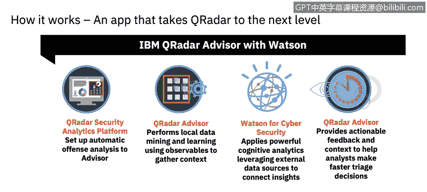
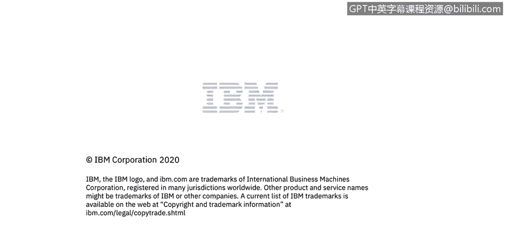

# IBM网络安全分析师专业证书课程6：《网络威胁情报课程（IBM）》｜ibm-cyber-threat-intelligence｜ - P35：34_人工智能和SIEM行业示例.zh - GPT中英字幕课程资源 - BV1jN411679K

Welcome to AI and Sim， an industry example brought to you by IBM。In this video。

 you will learn to understand the features and functions of an industry example。

 Q radar adviser with Watson。 Q radar adviser empowers security analysts to drive consistent investigations and make quicker and more decisive incident escalations。

 resulting in reduced well times and increased analyst efficiency。😊。

We need to look at the benefits of curator advisoror。

It won't waste human capital and routine analysis instead automate your repetitive so tests and better focus your analyst and more important elements of the investigation and increased analyst efficiency。

It'll drive consistent and deeper investigations， whether it's 4 PM on a Friday or 10 AM on a Monday。

 Advvisr augments human intelligence that you， as an analyst。

 are driving consistent and thorough investigations each and every time。

 It helps to reduce well times。 with a quicker and more decisive escalation process。

 It determines root cause analysis and drives next steps with confidence by mapping the attack to the mitre attack model。

When investigating an incident， curator Advisor first gathers greater context about that incident by mining local data available in Qar。

 it then consults with Watson for cybersecurity to perform external knowledge and threat discovery on discet observation it has made about the incident。

It delivers it via the IBM Security app Exchange powered by Watson for cybersecur to provide a quick to deploy easily consumable solution that will transform security operations。

Curator advisoror with Watson unlocks a tremendous amount of security knowledge。

 enabling rapid and comprehensive investigation insights。

 curator advisor with Watson looks at structured data， critical security， unstructured data。

 security related data on the Internet， Then it removes unnecessary information and extracts and annotates collected data。

😊。

Next， it aligns incidents to the attack chain through step1。

 compete level for each progression validates the threat and step two。

 visualize how the attack has occurred and is progressing。

 and step 3 will uncover what tactics can still possibly occur。

Cator adviser will automatically link investigations through connected observables。

 Itll avoid duplication of effort， extend your investigation beyond the current offense。

 and it will also determine if you need to do additional tuning in the case of multiple duplicate investigations triggered by the same event。

Through analysis of the local environment， advisoror recommends which new investigations should be escalated to assist you as an analyst。

Based on best practices， configuration assessments。

 curator assistant quickly scans your local environment and determines if you are ready to take a full advantage of advise with Watson。

 You will now have the opportunity to complete a virtual lab to apply the information you have learned about artificial intelligence and a。

😊。

