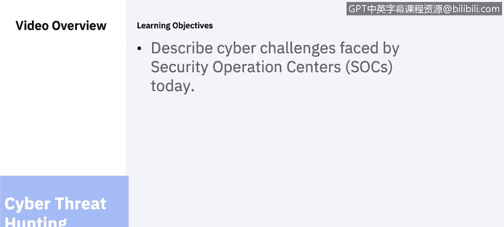
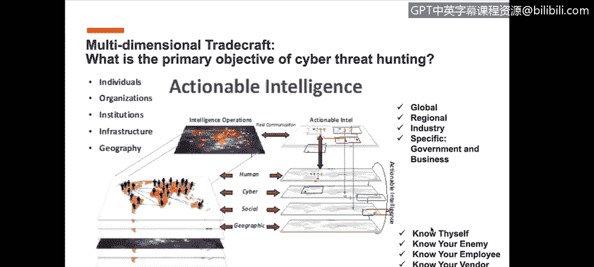

# IBM网络安全分析师专业证书课程6：《网络威胁情报课程（IBM）》｜ibm-cyber-threat-intelligence｜ - P37：36_SOC网络威胁狩猎.zh - GPT中英字幕课程资源 - BV1jN411679K

Sac cyber threat hunting， brought to you by IBM。In this video。

 Sydney will describe cyber challenges faced by security operation centers or so today。

 All the intelligence LED cognitive sock。 Now， it's a lot of words I realize for how do you define sock and how do you define next gen。

 unless's you simplify and say Next gen and sock LED by intelligence。

Driven by proactive cyber threat hunting is ultimately where we need to be able to get to so as I said earlier in my introduction I have worked within the SoC environment now for a number of years I spent 10 years at UniICs Corporation interfacing with working with the security operations centers at UniICs and with the clients there as well and as my role as executive architect very similarly here my role was to first and foremost understand what were the clients' requirements of course that's a requirement we all have whether it's us internal or external depending you know we're supporting clients or whether it's something we have to support internally ourselves we have to understand what we're trying to achieve with our current state of Pro and defend operations and traditional soC operations however what we're finding is that number of our clients。

 a number of GSIs number of MSSP are recognizing that I have got to find a way to start getting ahead of these threats before they become。

Actual problem。 And so what we want to introduce here today is how do we actually start to do this Now。

 I'm going to go back to my experience and the human intelligence space and the intelligence world。

 And here's one of the challenges that we're facing。And that is in the soC。

 security operations professionals， level1 through four analysts and engineers are very good at what they do in the context of the scripted environment that they need to work within。

 and there's absolutely no argument that the level three level4 investigations or actually analysts are conducting cyber forensic investigation。

 but let's be very clear that is not actual proactive cyber threat hunting that is reactive cyber forensic investigation and we're going to talk about what actual proactive cyber threat hunting is。

 but I want to share with you here is that in all things that we do in the world of intelligence。

In the world of threat and threat vectors。common denominator across each of these domains。

 whether that's cyber， whether it's physical threat， whether it's terrorism。

 whether it's nation states。TheBot line is is that this is all human driven。

 this is all human oriented， all human originated， and therefore when you start looking at how to identify proactively the threat vectors。

 understanding the transnational criminals， understanding how they're operating。

 now how do I start to now formulate a strategy，Around how to do proactive cyber threat hunting so the first place to start is how do you define what actual cyberth hunting is and the way IBM defines it in the context of the use of I2 is the ability to proactively and aggressively identify intercept。

 track investigate and eliminate your adversary before they can become a problem to your organization or before they become a problem for your clients this is the general direction this is the next gen soC that we're talking about the intelligence led cognitive soC that we're talking about now of course that needs to be linked to the cyber killll chain which then of course helps you understand the tech techniques and procedures the TTP as we define it in the intelligence world of course this a terminology used heavily by intelligence as well as law enforcement so as part of this it's understanding what is cyber threat hunting。

Again， clarify cyber forensic investigation。Is something that is done today by level 3 level4 analysts within the soC traditionally speaking。

 but that is reactive， and it is a forensic investigation that you're actually doing now now you could argue that say that well if a threat has been conducted and vulnerability has been executed and we now need to conduct an investigation。

 are you hunting for that threat， Yes， of course you are。

 but you're doing it within the context of a cyber forensic investigation and what we're saying is a cyber threatat hunting。

Is the proactive ability and aggressively identify。

 intercept and track and investigate and eliminate these types of threats before they become a problem。

 which then goes back to what we said earlier， how do you identify with the 80% known as they in a traditional protecting defend traditional sock environment today。

 how do you evolve to the next level of the next gen sock of proactive cyber threat hunting。

 and as you look at the skill set within the soC。It's when you look at the skill set between the sock。

 you're looking at skill set between the security analyst level one through four。😡。

AndThen what's really needed to conduct this type of work and how you structure a cyberth hunting team is actually an intelligence skilled person。

 and there's a gap there in the skill sets today， now GSIs。

 MSSPs can structure teams to do this type of work， but this is by and large a different skill set。

 a different team， a cyberth hunting team that consists of CTI， cyber threat intelligence。

 cyberth hunting， red team， etc ce， but with the goal and the objective to drive toward actionable intelligence。

 which is the intent of proactive for cyberth hunting by design now。

Where do you start if you don't have any place to begin and don't really know where to begin on how to do proactive sector hunting。

 you can start with a global global threat landscape view， bring it down to regional。

 which of course would include N and other locations。

 industry really tailoring the threat intelligence that we're identifying threat vector。

 threat actors etc ce， and then specific to the actual organization itself and as GSIs and MSSP and as IBM security sellers naturally as we work with our clients we work across these different industries。

 it's understanding what are the variables associated with this and then of course bringing that down even to further levels and that is how do you know yourself。

 how does the world see you， how do you know your enemy， how do you know your employees， your vendor。

 your customer these are all variables that organizations and if you're providing services to these organizations if you want to help them and help them move beyond the protecting the F space。

 these are all factors you have strength。ating in your environment now it would know your enemy。

 but would know your enemy and of course， know any aspects， but in particular， knowing your enemy。

You have to understand the cyber kill chain and the first place to start with that， of course。

 is in what're related to reconnaissance and what do I mean by that？

R to reconnaissance means that these threat actors。

 whether that's transnational criminals or nation states。

 are conducting reconnaissance on organizations on where they want to place their focus of targets and you can be a target choice or a target of opportunity。

 but nonetheless they are conducting their reconnaissance and they're gathering their information about organizations。

 whether those are your clients， about your organization about the industry。

 but understanding that when they define reconnaissance， they're talking about executives。

 they're talking about hours of operation， where do you do business， what is the easiest way in。

 and before we get into all the technical aspects of how to weaponize， deliver， exploit， install。

 to command and control and ultimately execute their actions and objectives。

First place is reconnaissance and they have as I said earlier， they have lots of time。

 lots of money and lots of resources to do this， and they've got all the time in the world。

 an example of that is a bank in Chile that was targeted by swiftt tie that cost $10 million now and there was also another attack on that same bank but they lost $475 million and they went low and slow in the environment because they were able to conduct their reconnaissance on where is the weak point in where they can deploy their malware to be able to execute these lowend transactions that never get recognized by rulebased system。

 so understanding the cyberkill chain is extremely important in this process now。

If you look at this visual of this graphic， please understand that the key driver here is the human element。

 it is the people， the art and science of Thr hunting。

All these factors around internal external data statistical analysis and intelligence has got to be driven and managed by the analyst。

 that is an intelligence analyst with strong security background that understand that understands the intelligence process。

 and links it to all of theseferbillls because and why is this important。

 if you don't understand who they are， what they're doing， how they're operating。

 where they're originating from， if you don't know how to ask those types of questions。

 as it relates to conducting cyber threat hunting and how will you be able to define where the data sources need to come from。

 both internal external data sources from Deep web， Doc web， open source， social media。

 internal being your SM， endpoint logs， et cea how do you bring all this data together and if you don't have the skill set to understand the big picture around the threat vectors。

 the threat factorss， who they are， what they're doing and how they're operating。

 then it's challenging for you。to be able to ask the right questions whether output good intelligence。

 so you need a place to begin and that starting place is your skill set。😡。

In this particular slide I just want to be clear that what we want to be able to show to you here is that this is not a linear process and so I hear often from organizations。

 you know said before I go to this tier3 advanced cyber threat hunting。

 I really want to be able to mature my sock well I'm going be very clear to everyone here on this call that is a reality in a level of maturity you can't afford to wait to mature if you're waiting to mature your soC to get your tier1 tier 2 systems in the state of perfection then and continue to work in the indicators of compromised reactive space。

 which we're going to continue to do if you wait to get started on conducting proactive cyber threat hunting。

 please understand that is a risk you are taking on because the threat actors。

 the threat vectors if this is continually evolving for them and they're already light years ahead of。

In a lot of situations and so how do you start to level the playing field and the truth is is that you really need to now start aggressively moving into this cyber threat hunting methodology space now be very clear indicators of compromise are reactive we're all familiar with IocCs IocCs are reactive indicators of compromise what we're introducing here is a different type of IOC which is called an indicator of concern which is proactive I'm seeing。

Various forms of intelligence that leads me to believe that there could be an attack on my organization。

 And here are the types of actions as a threat hunter I'm recommending to my organization or to my clients。

OfThe actions and the steps that need to be taken。 So this is how you start to mature your organization。

