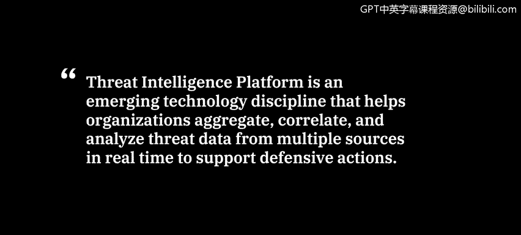
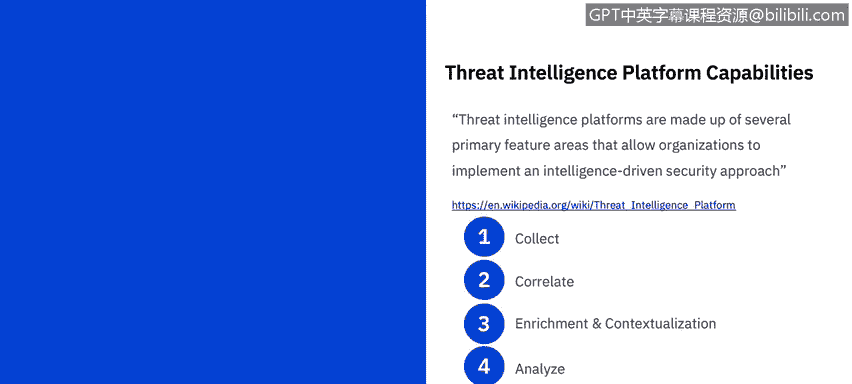

# IBM网络安全分析师专业证书课程6：《网络威胁情报课程（IBM）》｜ibm-cyber-threat-intelligence｜ - P3：2_威胁情报平台.zh - GPT中英字幕课程资源 - BV1jN411679K

Welcome to Thrht Intelligence platforms brought to you by IBM。In this video。

 you will learn to describe various threat intelligence platforms and resources。

A threat intelligence platform is defined as an emerging technology discipline that helps organizations aggregate。

 correlate， and analyze threat data from multiple sources in real time to support defensive actions。

Threread intelligence platforms are made up of a several primary feature areas that allow organizations to implement an intelligent driven security approach。

 These stages are supported by automated workflows that streamline the threat detection。

 management analysis and defensive process and track it through to completion。Collect。

A thread intelligence platform collects and aggregates multiple data formats from multiple sources。

 including CSV， Sts， XMl， email and various other feeds。 in this way。

 a thread intelligence platform differs from a SIim platform While Sims can handle multiple thread intelligence feeds they are less well suited for ad hoc importing。

 or for analyzing unstructured formats that are regularly required for analysis。

The effectiveness of the threat intelligence platform will be heavily influenced by the quality。

 depth， breadth and timeliness of the sources selected。

Most threat intelligence platforms provide integration to the major commercial and open source intelligence sources。

Correlate the threat intelligence platform allows organizations to begin to automatically analyze。

 correlate and pivot on data so that the actionable intelligence in the who。

 why and how of a given attack can be gained in blocking measures introduced。

 Automation of these processing feedats is critical。In richment and contextualization。

 to build in rich context around threats， a threat intelligence platform must be able to automatically augment or allow threat intelligence analysts to use third party threat analysis applications to augment threaded data。

 This enables the Sock and incident response team to have as much data as possible regarding a certain thread actor。

 His capabilities and as infrastructure to properly act on the threat。😊。

Analyze the threat intelligence platform automatically analyzes the content of threat indicators and the relationships between them to enable the production of usable。

 relevant and timely threat intelligence from the data collector。

 this analysis enables the identification of threat actors tactics。

 techniques and procedures or T T P。😊，In addition， virtualization capabilities help depict complex relationships and allow users to pivot to reveal greater detail and subtle relationships。

We will take a look at a few frameworks in the next video。

Integrate Ins are a key requirement of a threat intelligence platform。

 Data from the platform needs to find a way back into the security tools and products used by an organization。

 Full featured threat intelligence platforms， enable the flow of information collected and analyze from feeds and disseminate and integrate the clean data to other network tools。

 including Sims， internal ticketening systems， firewalls， intrusion detection systems and more。

Act a mature threat intelligence platform deployment also handles response processing。

Built in work flows and processes accelerate collaboration within the security team and wider communications like and information sharing and analysis organizations so that the teams can take control of course of action。

 development， Mitigation， planning and execution。 This level of community participation can't be achieved without a sophisticated threat intelligence platform。

😊，Powerful threat intelligent platform enabled these communities to create tools and applications that can be used to continue to change the game for security professionals。

😊，We will review a few of the many threat intelligent platforms on the market today。

 Most threat intelligent platforms will have a free and a fee offering。

 You and your organization will need to review the level of access needed。

 as well as the budget you have available for your specific needs。

One thread intelligence platform is from recorded future。

Some of the features of that platform include centralizing and contextualizing all sources of threat data。

 You can add your proprietary data and feeds， whether it's data from industry bodies。

 security vendors， internal risk list or independent research to the largest publicly available collection of data。

 second only to the governments。Their technology uses natural language processing and machine learning to structure the collected data and make connections to deliver rich intelligence and help you investigate faster。

Another feature is to collaborate an analysis from a single source of truth。

Centralized intelligence improves the efficiency of your team by collaborating an analysis directly in recorded future。

 work together in investigations and research， then export the analysis into an easy to share report。

😊，Finally， they also customize intelligence to increase relevance。

You can tailor threat intelligence to specific use cases before integrating with third party solutions。

Customized intelligence delivers more high fidelity alert。

 empowering teams to focus on what is most important。

Another threat intelligence platform is from Fireeye。

They have several subscriptions that are available to you and your organization Cho the level and depth of intelligence integration enablement your security program needs。

Fusion intelligence is a comprehensive package and includes operational cyber crime and cyber espionage intelligence offerings。

 which you can use to understand a full attack life cycle to prepare your defenses against the T Tpss of the threat actors of interest。

 Strategic intelligence。 Learn how to align your security resources against the most likely threats and actors and manage your business and technical risks around major business decisions and security resource planning。

Operational intelligence allows you to prioritize and add context to your alerts in order to respond more effectively and efficiently and improves defenses with high fidelity。

 machine readable indicators of compromise with associated contextual information。Vulnerability。

 intelligence provides the vulnerabilities that pose the most significant threats to the organization and understands the options for patching or otherwise mitigating these vulnerabilities。

Cyber physical intelligence includes actionable insights into cyber threats and risks facing industrial environments and the operational technology。

It includes all FireR eye operational technology and industrial control systems focused intelligence。

Cyber crime intelligence helps you understand the threat actors who focus on financial crime who they target。

 how they attack and what motivates them。 You gain analysis of broad activity， credential collection。

 underground market places and enabling infrastructure。 Finally， cyberber espionage intelligence。

 which facilitates the understanding of adversaries that attack。

That target corporate and government entities for strategic advantage。

 It leverages insight into the tactics， techniques and procedures or T Tps of track threat actor groups to better defend your organization。

IBMX Force Exchange。Is a cloud based threat intelligence sharing platform enabling users to rapidly research the latest security threats。

 aggregate actionable intelligence and collaborate with peers。

We quickly research and share information about threats by exploiting the depth and breadth of IBM X Force research。

 You can integrate with other solutions。 It allows you to programmatically access information using sticks and taxi standards。

 as well as through a Ruful API and JO format。😊，And incorporates intelligence with security operations in near real time decision making。

Finally， Truestar。 Truestar is an intelligent management platform that helps you operationalize data across tools and teams。

 helping you prioritize investigations and accelerate incident response。

 through some of the features of streamlined workflow integrations where industry leading integration partners connect with truestar to enrich analyst investigations。

 connecting internal and external data sources。 Analys can work in app or a native to truestar。

 depending on workflow needs。 They also have secure access control via true star enclaves。

 which help you manage your intelligence according to team or use case。

 Each enclave provides secure row based access to specific Intel sources。 when。

 where and how you need it。 There's also an advanced search feature。

 which better results equals more informed decisions Truestar provides advanced filtering options to search across Iocs and report。

😊，Giving you rapid access to the intel you need。 And finally。

 they have automated data ingest and normalization。No matter how you get your intelligence。

 truee star will help you operationalize it with minimal lift。

Their automatic and just extraction and normalization of unstructured data helps you correlate Intel sources quickly and easily。

These are just a few of the threat intelligence platforms you may come across as a cyberse analyst。

