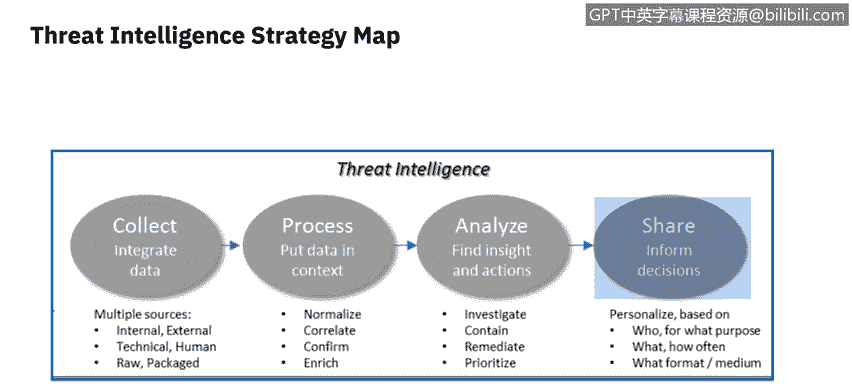
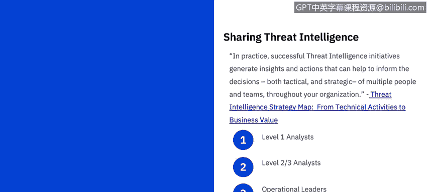
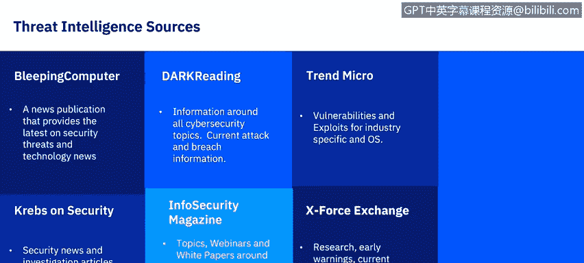

# IBM网络安全分析师专业证书课程6：《网络威胁情报课程（IBM）》｜ibm-cyber-threat-intelligence｜ - P40：1_04_threat-intelligence-strategy-and-external-sources.en_subtitled - GPT中英字幕课程资源 - BV1jN411679K

Welcome to thread Intelligence， strategy and externalnal sources brought to you by IBM。In this video。

 you will learn to identify threat intelligence external sources。

 Let's take a look at how organizations can use threat intelligence strategically。

 This diagram is taken from Dererick Brink's White Paper Thr Inlig strategy map from technical activities to business value。

Derek uses this diagram to describe that threat intelligence is more than just data， it's a process。

Let's take a look at the process and where we will touch on many elements during this course。

During the collect phase， based on the relevant information needed by your organization。

 several sources must be identified to discover the various threats。

 vulnerabilities and attacks that may compromise your organization's high value resources。

 In other words， needed to protect the confidentiality。

 integrity and availability of your organization's assets。

 Once identified the data needs to be collected from multiple sources。

 some external and some internal in this module， we will focus on external sources and throughout the remainder of the course。

 internal sources from network scanning。Data protection and endpoint security tools Once the threat intelligence data is collected from system tools or external resources。

 this data must be processed which may include normalization， correlation。

 verification and prioritization， this process must use automation and orchestration to keep up with the complexity and high volume of information。

Next， the threat intelligence must be analyzed to uncover what may be happening now and in the future in regards to threats to your organization。

 we will explore how Sims will help you， as an analyst。

 analyze what is happening in your systems and network to develop recommended actions。Finally。

 you as an analyst must share the information to various people within your organization your communication must be customized to different level of the organization depending on whether a vulnerability or attack is affecting your organization now。

 or the information should be used to educate your organization as un possible or maybe probable threat within your industry。

 such as a rising challenge to local governments and organizations around the threat of ransomware。

The communication for Le 1 analysts needs to support the real time monitoring， detection。

 initial investigation and the escalation that takes place in the security Op Center。

For level 2 and three analysts， you need to support the in depth prioritization， investigation。

 containment and remediation of an incident response team。

 and the proactive efforts of experts on threat hunting and counter fraud teams。

For operational leaders， for example， you need to help the leaders of the security operations and IT operations guide and prioritize the day to day actions and activities of their respective technical staff。

😊，Finally， for strategic leaders， you need to help chief information security officers or Cs and other senior leaders allocate resources and make better informed business decisions about managing cybersecurity related risks to an acceptable level。

😊。

Crowdstrtrike also looks at three intelligence areas that organizations and you as a security analyst should be aware of for your organization。

😊，They look at the intelligent areas in three ways， tactical， operational and strategic。😊。

Tactical is focused on performing malware analysis and enrichment。

Operationals focus on understanding adversarial capabilities， infrastructure and TTPs。

 and then leveraging that understanding to conduct more targeted and prioritized security operations。

😊，Finally， strategic is focused on understanding high level trends。

Let's review a few of the current trends and prediction publications available that should be reviewed for insights into strategic threat intelligence plans。

😊，Annually， you will find a variety of studies that took a look at a 12 month period or more to provide intelligence on what the trends were in the past and make predictions for the future。

Here are a few of those resources， you will need to keep up with the latest information to help guide you in looking at what attacks have affected or may affect in the future your industry the most。

😊，We've seen some trends from the 2020 global threatt report by Cloudstrtriike。

Disruption in 2019 was not punctuated by a single destructive wiper。

 rather it was plagued by sustaining operations targets and the underpinnings of our society。

Whereas the Co of data breachach report from 2019 explore several new avenues for understanding the causes and consequences of data breaches。

The Mtrens 20205 hour report has been around for more than a decade。

 and the goal is always the same to arm the security teams with the knowledge they need to defend against today's most often used cyber attacks。

And finally， the export force Thrt Intelligence index analyzes from the past year which re emerging old threats are being used in new ways。

 This report also looks at the emerging threats by industry and gives some suggestions for prevention。

As an analyst， you will want to make part of your routine every morning to see what new vulnerabilities。

 threats and breaches have occurred globally。 Here are a few resources I review as a cybersecurity professional regularly。

 Note this is only a small subset of the resources available。

 and you may find additional industry focused resources that better serve you as a cybersecur professional in the future。

😊，Most sources can either be accessed daily or have a feed you can receive to your email or other applications Bleeping Comp is a news publication that provides the latest on security threats and technology news。

You can either receive a feed or go out to their website on a daily basis。

Dark Read has information around all cybersecurity topics with current attack and breach information Info Securitycur magazine covers topics。

 they also have webinars and white papers around advanced persistent threats。

 cybercrime and other related topics， Trend Mi will help you keep up with vulnerabilities and exploits for industry specifics and O。

Exports Exchange has both a research section as well as early warnings and current threats。😊。

Within your next reading， take a look at these threat intelligence sources and review additional sources that may be recommended。

