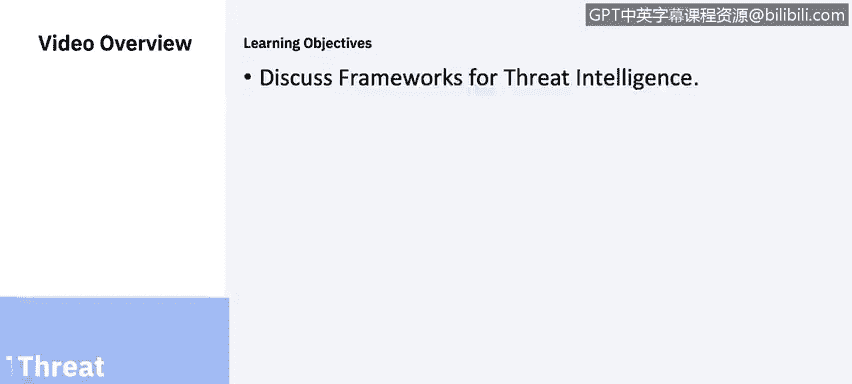
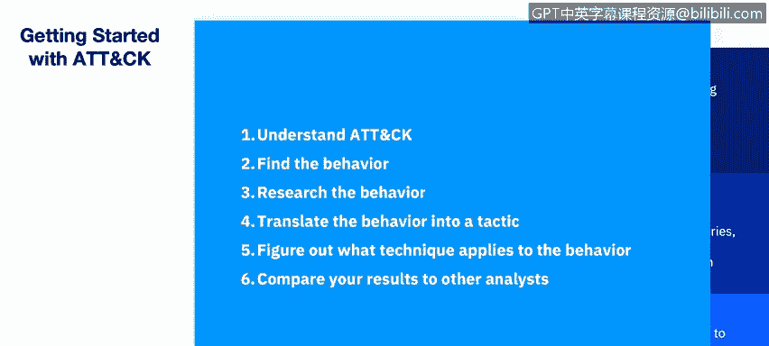
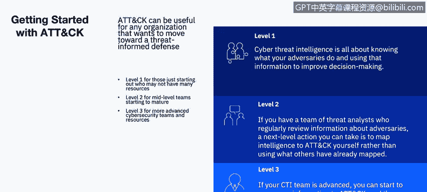

# IBM网络安全分析师专业证书课程6：《网络威胁情报课程（IBM）》｜ibm-cyber-threat-intelligence｜ - P42：3_01_threat-intelligence-frameworks.en_subtitled - GPT中英字幕课程资源 - BV1jN411679K

Welcome to threadht Intelligence Fs brought to you by IBM。In this video。

 you will learn to discuss frameworks for threat intelligence。

 Let us first set the stage of what the average I T security environment looks like。

 This is a snapshot of just some of the capabilities C sos already have in their arsenal。

 They have been acquiring those different and scattered technologies over the years to address the many challenges that their complex environments face。

 The average enterprise has 85 tools from 45 vendors。😊。

Once you start a conversation with them， you will hear them say， oh， yes。 We have got that。

 Which is fine。 But are they integrated， Are they working together across your multiple teams。

 Lo and platforms， or is it just creating more complexity， risk and costs。 And as a result。

 are they losing visibility into their network， How can a see so or frankly。

 any security professional gain any valuable insight and control over their security environments when all they see as this type of scattered chaos in the technologies they themselves are using。

😊，The basis for some threat intelligence is heavily rooted in one of three basic models。

 Lockheed Martin's cyber kill chain， miters attack knowledge base and the diamond model of intrusion analysis。

 We have talked about cyber kill chain in an earlier course， much like game theory。

 The diamond model of intrusion analysis is sufficient If there are two players。

 the victim in the adversary。But it tends to fall apart if the adversary is motivated by anything other than sociopolitical or socioeconal payoff。

 or if the adversary is artificially intelligent As a cybersecur analyst。

 you should use the mire attack knowledge base frequently。

Getting started is a series of blogs around specific use case topics。

 Let's talk about threat intelligence and how to use the mitre attack framework。 In level 1。

 cyber threat intelligence is all about knowing what your adversaries do and using what information to improve decision making for an organization with just a couple of analysts that wants to start using attack for threat intelligence。

 One way you can start is by taking a single group you care about and looking at their behaviors a structured an attack。

 You might choose a group from those mapped on the mire dot org website。

Based on what organizations theyve previously targeted， alternate。

 many threat intelligence subscription providers also map to attack so you could use their information as a reference。

Within level 2， if you have a team of threat analysts who regularly review information about adversaries。

 a next level action you can take is to map intelligence to attack yourself。

 rather than using what others have already mapped。

 If you have a report about an incident your organization has worked。

 This can be a great internal source to map to attack。

 or you could use an external report like a blog post to ease into this。

 You can just start with a single report。😊。

Here's a process you could follow to help with us。Understand attack。

 Famize yourself with the overall structure of attack， tactics， the adversaries， technical goals。

 techniques， how those goals are achieved and procedures， specific implementations of techniques。

Find the behavior。 Think about the adversary's action in a broader way than just the indicator like an I P address they used。

 Research the behavior。 If you're not familiar with the behavior， you may need to do more research。

 Translate the behavior into a tactic。 Consider the adversary's technical goal for the behavior and choose a tactic that fits The good news。

 there are only 12 tactics to choose from an enterprise attack。😊。

Figure out what technique applies to the behavior。 This can be a little tricky。

 but with your analysis skills in the attack website examples， it's doable。

 If you search the attack website for a specific tactic looking at the technique description。

 you'll find this could be where a behavior fits。And then compare your results to other analysts。

 Of course， you might have a different interpretation of a behavior than another analyst。

 This is normal and it happens all the time on cybercurcurity teams is recommended that you compare your attack mapping of information to another analyst and discuss any differences。

Level 3。If your team is advanced， you can start to map more information to attack and then use that information to prioritize how you defend。

 Take in the above process， you can map both internal and external information to attack。

 including incident response data， reports from thought Intel subscriptions。

 real time alerts and your organization's historic information， Once you map this data。

 you can compare groups and prioritize commonly used techniques。

The cyber threat framework was developed by the US Government to enable consistent characterization and categorization of cyber threat events and to identify trends or changes in the activities of cyber adversaries。

 The cyber threat framework is applicable to anyone who works cyber related activities。

 its principal benefit being that provides a common language for describing and communicating information about cyber threat activity。

 The framework in its associated lexicon provide a means for consistently describing cyber threat activity in a manner that enables efficient information sharing and cyber threat analysis that is useful to both senior policy decision makers and detail oriented cyber technicians alike。

 The framework captures the adversary lifecycl from preparation of capabilities and targeting to initial engagement with the targets or temporary nonintrusive disruptions by the adversary to establishing and expanding the。

😊，Presence on target networks to the creation of effects and consequences from theft manipulation or disruption。

IBM encourages organizations to think about their security imperatives in a more organized fashion。

 structured around logical domains and centered around a core discipline of security analytics。

 This core is enabled by cognitive intelligence that continuously understands reasons and learns the many variables that are affecting their environments and feeds the entire ecosystem of connected capabilities。

 Different layers of defense all working together to automate policies and block threats。

 The layers that understand the threat and send data up through the security analytics to gather information。

 prioritize and take actions。 The system is really not fully integrated until it's integrated with the extended partner ecosystem。

 integration that enables collaboration across companies and competitors to understand global threats and data and adapt to new threats。

😊，Integration can help increase visibility。 Notice how capabilities organize around their domains。

 You will start to get an idea of how this immune system works。

 There are different parts of a security portfolio working at one to recap the cost of cyber attacks is increasing。

 threats are escalating， becoming more complex。 Perimeter defenses are no longer sufficient and new techniques like flow analysis。

 anomaly detection and vulnerability management are needed。

That statement defines the problem and offers some capabilities that can help。

 But exactly what can you do about it。 What are the best practices that you should follow。

The first best practice is proactive in nature。Identify。

 predict and prioritize your security weaknesses so you can take actions to prevent a breach。

 Use resources， as we have discussed in the first two lessons to gather threat information。

 address vulnerabilities and risks based on priorities and network contacts and manage device configurations to improve security。

 You can improve security， for example， by removing ineffective firewall rules and adding new rules that are more effective。

 Use tools that can detect unusual behavior to follow up。

 De solutions that can find network anomalies， and provide visibly to network flows for the reasons mentioned earlier。

 Use security intelligence solutions that use integrations。

 automation and context to provide a complete view of what is happening in your network。

 Auto is key so that you can utilize existing staff more efficiently and reduce the large amount of collected data into a small number of events that can be acted upon by existing。

See personnel， we will review all of these best practices in depth in later in this course。

