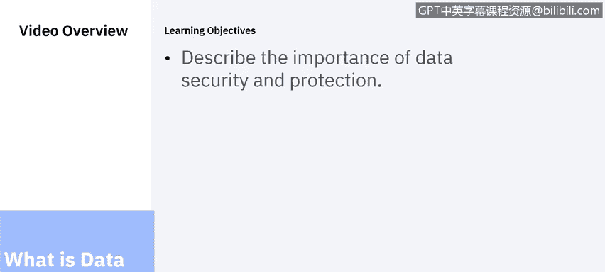
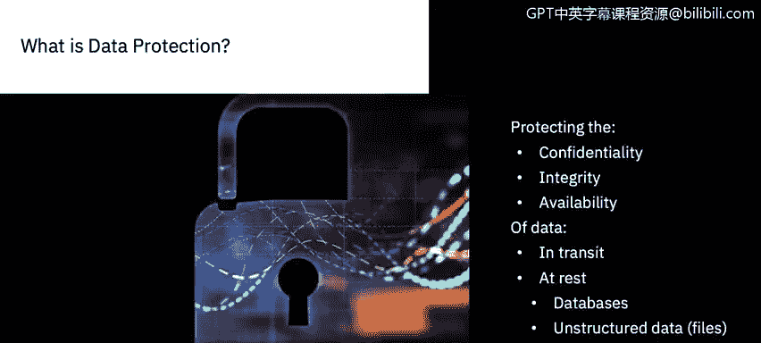
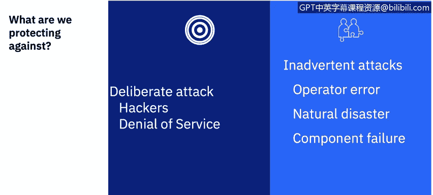
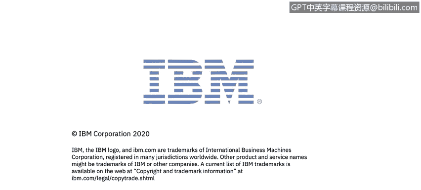

# IBM网络安全分析师专业证书课程6：《网络威胁情报课程（IBM）》｜ibm-cyber-threat-intelligence｜ - P44：5_01_what-is-data-security-and-protection.en_subtitled - GPT中英字幕课程资源 - BV1jN411679K

Hello， my name is Louis Fua and I am here to talk to you about data security and protection。

During this module， we will discuss what data security and protection is。

What we are protecting data from and why we are protecting data。

So what is data protection and security， what is its goal？

Data security is the process of protecting your most critical business assets that is your data against unauthorized or unwanted use。

 this not only involves deploying the right data security products。

 but also combining people and processes with the technology you choose to protect data throughout its life cycle。

Enterprise data protection is a team sport， let's talk about data security and protection in context of the confidentiality。

 integrity， availability or CIA Triad。You must protect the confidentiality。

 integrity and availability of data at rest and in transit from intentional and unintentional attacks。

 What does all this mean， Let's start with the difference between data at rest and data in transit Data in transit is data that is being transmitted from one point to another。

 The transmission may take place over a network between people from here to the next building or halfway around the globe。

Data at rest is data that resides on endpoints。 Such endpoints include database servers。

 file servers， laptops or mobile devices like tablets。

 where data is being stored for intended later use。

 It also includes backup devices like take storage。How about data confidentiality。

Confidentiality means maintaining data secrecy。This means that data access is restricted to those actors who have a right to know the data。

Confidentiality includes the concept of privacy， but also means providing the right level of access to the right set of users at the right times using the right methods。

As an example， consider a university dealing with the data related to a college aged adult student。

That student may have authorized the parents to view financial records in order to pay tuition bills。

 but that does not mean the parents are legally authorized to view grades in academic progress。

The student may themselves be authorized to view their grades in academic progress。

 but certainly not delete or edit them。The student's instructor may be authorized to view， edit。

 and delete information corresponding to grades in academic progress。

But only when that student is enrolled in an instructor's class。

 and even then the instructor will probably not be legally allowed to view the student's financial information Additionally。

 the instructor may be restricted to viewing the student's academic progress from authorized endpoints。

 such as a registered laptop connected through a virtual private network。

 not a smartphone connecting over onted cellular network。Now， let's turn to integrity of data。

 ensuring the integrity of the data means making sure that the data is trustworthy and accurate in that it has not been tampered with integrity overlaps with confidentiality and that only those allowed to change data are permitted to do so。

In the case of our college student， a small number of actors should be allowed to change a grade。

 much smaller than even the limited audience that is allowed to view academic progress。

Perhaps only a single instructor or perhaps a teaching assistant or two Indeed。

 defining who is allowed to change， insert or delete data is a significant challenge in ensuring integrity。

Another challenge is working with parties outside of your organization。

When our students' parents pay tuition using electronic banking。

 they want to be assured that the process is secure from tampering。

A breach of security will be seen as at least partially the fault of the university。

 even if it takes place on a network or an endpoint that the university cannot control。

Then there is availability data must be accessible by the appropriate users during the correct times。

This does not always mean right away， nor does it mean that the data has to be available continuously。

However， the data must be available within a reasonable amount of time。

This will vary according to application。Take one example。

The student must have academic progress information available when registering for a course。

The information need not be available 24 hours a day， seven days a week。

 but it must be available when the student is registered with a response time that provides a student ample time to complete registration actions。

The same sort of information must be available to the student when looking for a job or applying to a graduate school。

 However， the time frame may be different in this case。

 being able to respond in days rather than seconds will be acceptable。 however。

 it is expected that the data be accessed years or even decades after it is created。

Availability to a greater degree than confidentiality and integrity is affected by unintentional actors and third parties。

 Remember， data may need to be available for years or even decades。😊，As an example。

 a natural disaster may jeopardize data availability either temporarily by cutting network connections longer term by damaging application and database servers or long term by destroying archive data。

A planned network outage may inadvertently cut ties to access data；

 Carelessness can cause loss of backup tapes or drop a table from a database。

There is also a different timeframe in which breaches are discovered without careful data protection measures。

 violations of confidentiality or integrity may escape detection for weeks。

 months or years availability violations tend to be discovered quicker， but not always。

 as is in the case of losing a backup tape， so what are we protecting data against data must be protected against deliberate and inadvertent or accidental attacks。

When we think of data security and protection， our first inclination may be to think of only deliberate attacks。

 attacks by bad actors who wish to purposely compromise our system and damage or steal our data。

 and deliberate attacks are certainly worth our concern。

Deliberate attacks can come in a variety of forms such as a denial of service。

 socially engineered attacks， attacks from internal sources such as privileged administrators or users。

 as well as attacks from external sources。Attackers can have a widely varying level of skill。

From inexperienced script kitties who use tools or methods that they do not really understand to motivated discipline criminals to agencies of nation states with a higher level of skill and many resources。

Returning to our example， the university system may be preyed upon by disgruntled employees。

 board students trying to crack the system， more motivated students trying to facilitate cheating or change grades。

 outside criminals attempting to gain and exploit personal credit card information。

 or even foreign national agencies making a coordinated effort to steal valuable research。However。

 inadvertent breaches can be just as bad， these include such events such as failure of hardware。

 of weather or other natural disaster， or even innocent mistakes by well intentioned personnel or poorly implemented or insufficient procedures。

Threread profiles are used to predict what sorts of threats intentional and unintentional might pose a threat to data。

 and what measures should be reasonably considered to protect the data。This ties into the next point。

 why do all of this？Understanding the cost of attacks is important。

 This is challenging because some of these costs are difficult to quantify。

 You want to protect revenue and profits。 Comprom of data can cut into revenue and cleaning up after an attack adds costs。

 cutting profits。Also important is the reputation of your organization。Additionally。

 data protection and security solutions may be part of a digital transformation effort；

 your organization may be moving services online or even creating new service offerings。

Data protection is part of the foundation on which these transformative efforts can build。

 You must also consider regulatory mandates。 Laws may impose stiff penalties on data breaches A above and beyond the intrinsic costs of repairing the damage。

 Industry standards may be less directly punitive， but may be a de facto requirement for your customers to do business with you。

 Data protection and security are expected。 Security breaches can be devastating to a company's reputation。

One ten of security is not to spend more on security than an asset is worth。

 but in the case of brand or reputation， this worth can be very difficult to assess。

We see data security and protection are necessary， but they are also challenging。In the next segment。

 we'll talk about the top challenges and commons pitfalls of data security。

