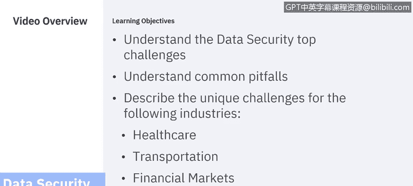
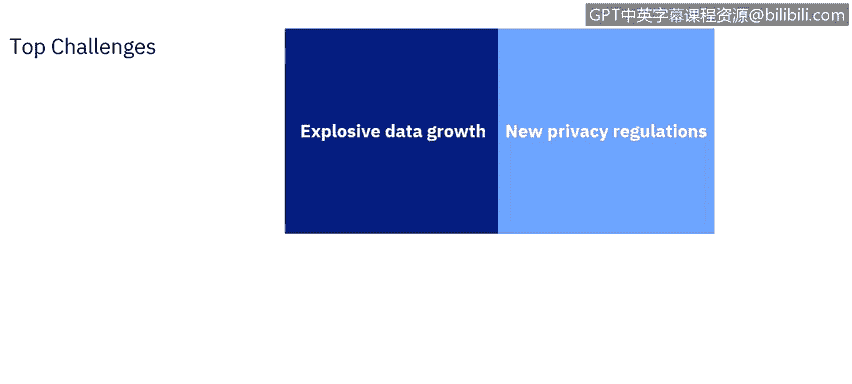
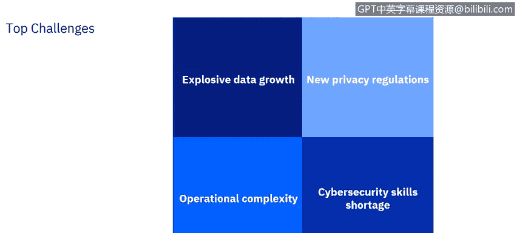
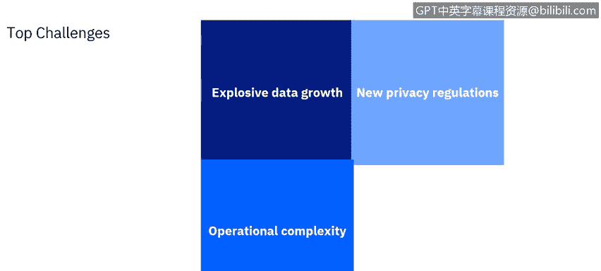

# IBM网络安全分析师专业证书课程6：《网络威胁情报课程（IBM）》｜ibm-cyber-threat-intelligence｜ - P45：6_02_data-security-top-challenges.en_subtitled - GPT中英字幕课程资源 - BV1jN411679K

Hello， my name is Louis Fua and in this section we will discuss data security challenges。

We will go over some of the top common challenges of data security and protection。

 then we will look more closely at four industries and their unique challenges。

There are many challenges to keeping your data safe and secure Here are four challenges that sea level executives face when ensuring their organization has a comprehensive。

 workable data security solution， they include explosive data growth。

New privacy regulations。Operational complexity。

And a cybersecurity skills shortage。

Explosive data growth， not only are businesses continuously accumulating data。

 the rate of data accumulation is increasing； data is coming in from new sources。

 new types of sources， and each source has its own data protection。

 privacy and security requirements。As an example， the data gathered for mobile phones used to be almost exclusively about which calls were made and when。

 as well as text messages。As phones got smarter and more connected， new types of data emerged。

With the advent of inexpensive global positioning system sensors， it became easy to track location。

Improvements in one type of technology would leverage other types of technology phone cameras could take pictures。

 but at first they had to be downloaded onto a secondary device before they could be shared widely。

The increase in inexpensive and ubiquitous bandwidth encouraged users to take and share more pictures and videos。

 it also allowed surreptitious monitoring。The ability to run an application meant more data sharing。

And more opportunity for background data gathering， As an example。

 fitness applications could gather health information。 More troubling。

 a game application could surreptitiously gather information not related to the game。

All this data must be protected from inappropriate use。As an example。

 automated red light cameras used for enforcing traffic regulations also gather time location information for vehicles of law abiding citizens；

 this data needs to be subject to privacy and protection requirements as well。

So keeping up with a growing number and variety of data sources。

 providing data across multiple contexts adds layers of complexity to the data security challenge related to this explosive growth in data。

 is the increase in new privacy regulations Concerns about data security and privacy have given rise to new legal requirements。

 These regulations vary in their scope and focus， many of them overlap， however。

 they carry the force of law and failure to comply can bring significant penalties。

 even if there is no data breach， In addition， when a data security breach occurs and no security protection solution can be perfect。

 Security breaches are inevitable， It is critical to be able to have a security solution that is legally defensible。

 that is it complied with applicable regulations。Furthermore。

 different regions and different regulatory agencies have their own sets of regulations。

 the general data Protection Regulation， or GDPR， was created to protect the privacy of individuals in the European Union。

It applies not only to organizations based in the EU。

 but also multinational organizations and even organizations entirely outside of the EU that offer goods and services to people in the EU or just monitor the behavior of EU citizens。

The California Consumer Protection Act， or CCPA has requirements that overlap but do not fully coincide with the GDPR；

 it applies to a different set of organizations than the GDPR；

 therefore it is possible to leverage some of the measures to taken to comply with the GDPR to implement CCPA compliance。

 however， there will be some differences。The future will bring new measures by other governments。

 Brazil's LGPD is scheduled to become effective soon。

 Some predict the United States of America will implement an overarching data security and protection regulation on the federal level soon。

Complying with these new regulations can be a daunting task Besidess these regulations。

 there are data standards that may not have the force of law behind them。

 but which are expected by your customers or are necessary to comply with to prove due diligence in case of a breach or legal action。

An organization must implement the payment card industrydustry Data Security Standard or PCI DSS in order to do business with major credit card bars。

The next challenge we will address is operational complexity。

An organization's critical business systems may span many different departments and be interwoven with other business systems and applications。

 movement to cloud and the adoption of big data technologies increases capabilities。

 but also increases operational complexity and introduces more points of vulnerability。

Critical business systems probably rely on crucial tools and resources from a variety of third party vendors。

These tools and resources have their own points of vulnerability。

 many of which are out of the direct control of your organization。

 one way in which operational complexity affects data security and protection is in determining who oversees various aspects of data security and which roles have which responsibilities and authority。

A key tenet of effective data security is the need for one role which has overall responsibility for data security and the authority to implement necessary measures。

The corporate culture may resist this consolidation of authority and transition to a centralized data security model。

Cross silo coordination is both necessary and difficult。To implement a useful data security solution。

 you must enact meaningful and effective policies and procedures not only for the many points of focus in the organization。

 but for third parties as well。Data security may drive operational strategy。As an example。

 you may decide that keeping certain types of data in a third party cloud is too risky。

 necessitating a movement to bring that function back internally to a private cloud。

 or moving to a more reliable vendor。This can lead to friction within an organization。As an example。

 a vulnerability assessment audit must function in the context of change management and will generally have to be carefully planned to mesh with business requirements。

You may not be able to just shut down a database server right away to fix a data security problem。

You must wait until a scheduled outage and receive the buy in of asset stakeholders such as database managers and business managers that depend on that database server to generate revenue。

Addressing the security of that database will take place over multiple iterations。

 each iteration targeted towards the most pressing issues。

 with changes and the resulting security improvements carefully managed and documented。

So we have explosive data growth。 that means more data to manage and protect。

 We have new privacy regulations， so we have new policies and procedures to implement more auditing reports to be generated and reviewed。

 we have operational complexity， which means complex resource intensive projects to plan and implement and who do we have to do all this。

We have a cybersecurity skills shortage， not just now， but for the foreseeable future。

We must plan for this。Cybersecurity is hard， it requires trustworthy， skilled， experienced people。

 people with not just technological skills， but people skills。

 because data security is ultimately about people， and we need people to do all this。

We need security professionals that are adaptable， compliant， dependable， inquisitive， and resilient。

 we need to seek these people from all sources inside and outside the cybersecurity industry。

We need to invest in these people and innovate new ways of facilitating their development。

We need to focus on skills and a whole new set of credentials besides traditional college degrees we cannot expect the government or the workforce itself to be able to fulfill this need Trad educational institutions are trying and struggling to fill the gap we need to help them in this struggle innovative training resources such as IBM's own Security Learning Academy can help address this problem。

Finally， you must leverage the people you have to get the most out of them。

 this means buying top quality tools and automating processes as much as practical。

So we have talked about four top challenges and remember there are more challenges than this we have just started with these four in the next segment we are going to talk about some common pitfalls。

