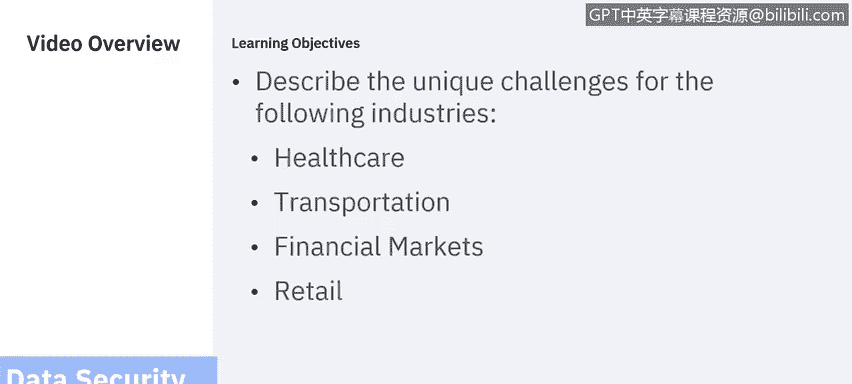
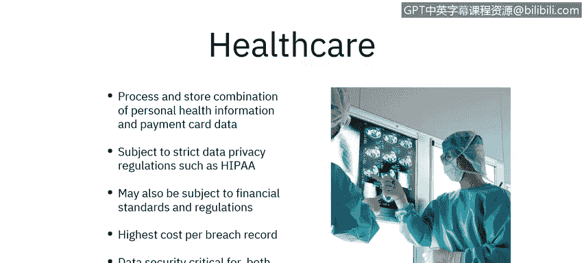
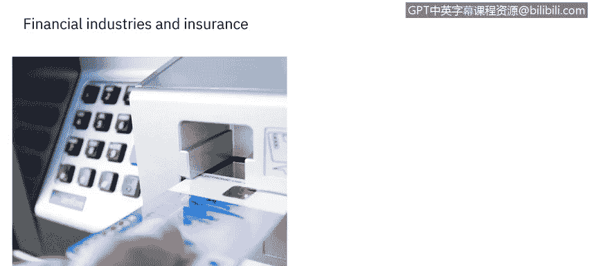
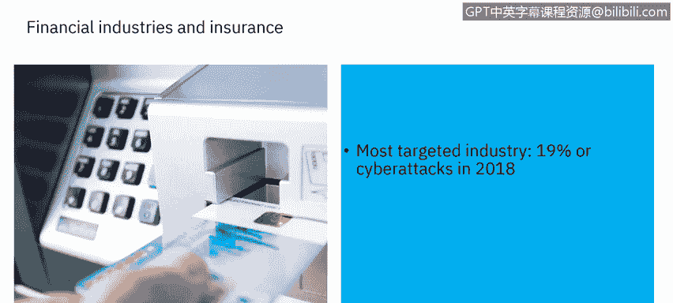
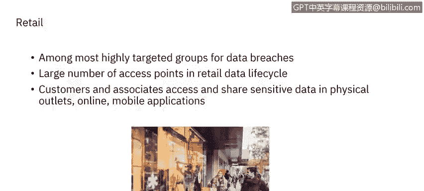

# IBM网络安全分析师专业证书课程6：《网络威胁情报课程（IBM）》｜ibm-cyber-threat-intelligence｜ - P47：8_04_industry-specific-data-security-challenges.en_subtitled - GPT中英字幕课程资源 - BV1jN411679K

Hello， this segment deals with industry specific data security challenges。In this segment。

 we will focus on four industries with specific data security needs。

You will learn about the unique data security and protection challenges for healthcare。

 transportation。Financial and insurance markets and retail industries。

Each industry has its own unique data security challenges。 Often。

 there are specific regulations for an industry that must be complied with malicious actors understand the unique vulnerabilities of these industries。

 and so should you Let us start with the healthcare care industry。

 The healthcare care industry stores a combination of sensitive information。

 including personal health information and payment card data。Both are vulnerable to inadvertent。

 as well as deliberate misuse。That means we must implement processes and procedures that promote safe handling of information。

 provide safeguards for the imperfection of even well intentiontioned humans。

 and provide a path for dealing with security breaches quickly and effectively when they occur。

This must balance with requirements to provide quick and reliable access to necessary personal health information across various parts of an organization and even between healthcare entities。

 as an example， a patient suffering from a heart attack needs emergency medical technicians。

 emergency room doctors， cardiologists， nurses and medical technicians to be able to input。

 edit and view health data in an environment where minutes， even seconds count。

But that data also must be shared with a primary care provider and with designated family members。

 as well as insurance companies， it may even need to be shared with a government entity such as a National Health insurance program。

 yet at the same time， a heart attack patient has a right to privacy。 The boundaries may be unclear。

 Perhaps a spouse has need for access， but due to a family situation。

 a sibling must be explicitly excluded。 The health care industry is also subject to strict data Protection regulations。

 The health insurance Portability and Accountability Act or HIPAA。

 regulates the privacy and security of certain types of health information。

The healthcare industry is also subject to financial standards and regulations such as payment card industrydutry。

 data security Standard， or PCI DSS due to payment information being processed。Finally。

 healthcare can reach across state or national boundaries。

 requiring compliance with regional or national standards as well。

Healthcare has the highest cost per breach record， about triple the average cost。

 making data security protection vital to maintain the financial slowness of a medical organization。

Data security is critical to keep the business viable and to meet regulatory requirements。

Now， let us consider transportation as a critical part of national and regional infrastructure。

 transportation presents its own challenges。 transportation data security requirements。

 Mel government and private sectors Senitive data may run a confusing gamut through multiple vendors and government agencies。

 making it difficult to determine who holds final responsibility。

 the IT infrastructure is generally widely distributed。 Take the example of a toll road。

 It may pass through multiple governmental jurisdictions on the local county。

 state and even national level。Assets may be government owned。

 but managed by private companies Services from multiple regions must be integrated to provide a single seamless offering。

As an example， a smart card that works on one transit system may be expected to work on another that is physically co located。

 but managed by a totally different entity， sensitive data。

 including license plate numbers and payment card information are vulnerable to abuse。

 should toll card information be available to traffic enforcement authorities。

A red light camera will capture sensitive location information for law abiding citizens。

 as well as red light violators。 How is that data to be stored and separated。

 Civil liberties and personal rights considerations must be considered。

 It is much harder to identify or designate a central responsible authority in many transportation entities。

 Centralized solutions are harder， if not impossible， to implement。

Data must be protected as it transits the system as well as at rest。Now。

 let us turn to financial industries and insurance。

 There's a story that American bank robber Willie Sutton was asked why he robbed banks。

 and he replied， because that's where the money is。 This story now considered to be apocryphal。

 gets to the crux of the challenge with financial industries。

Not surprisingly， financial services and insurance are the most targeted industry with 19% of total cyber attacks in 2018。

This sector handles highly sensitive data。

Both internal and external actors have strong motivation to steal。

 change and improperly exploit data。 At the same time， customers want personalized。

 seamless digital management of assets。They want to reliably sell or trade stocks and mutual funds。

 They want to be able to pay bills， deposit checks and transfer money between banks or credit unions When they go to an automated teller machine。

 they want to be able to withdraw money， no matter which financial institution owns the machine。

 We are also witnessing the rise of mobile payment applications。

 Another example of how consumer demand is driving the industry to provide services that must have proper data security and protection measures in place。

There are many industry specific regulations and standards。

 We have already mentioned the payment card industrytry data security standard。 Additionally。

 there are other regulations， standards and entities such as the Financial Industry Regulatory Authority Incorporated。

 FinRA， the Sarrbs Oxley Act， Sox。And Basil 1，2 or3， just to name a few examples。

 a financial services company may have to comply with regional standards such as the New York Department of Financial Services Regulation 23nyCRR 500 regulation on cybersecurity。

 as well as national and international regulation and standards， Additionally。

 Los business is the biggest contributor to this sector's data breach costs。

 Custom will not do business with a company that they do not trust。Finally。

 let us look at the retail industry， retail organizations are highly targeted。

There are many opportunities for data theft and exposure due to the many access points in the retail data cycle internet of things。

 IoT devices such as distributed points of sale must be integrated into the data security solution data must be protected in transit lowprofi margins also make cost reduction and streamline operations important。

Retail companies may look to cloud based offerings。

Customers want personalization of their retail experience while still maintaining privacy and security。

 This requires data， but the more data a retailer collects and uses the more vulnerability and risks they take on。

 PC DSSS compliance is an important factor in this environment。

In this section we have examined industry specific concerns。

 in the next section we will address the 12 critical data protection capabilities。

