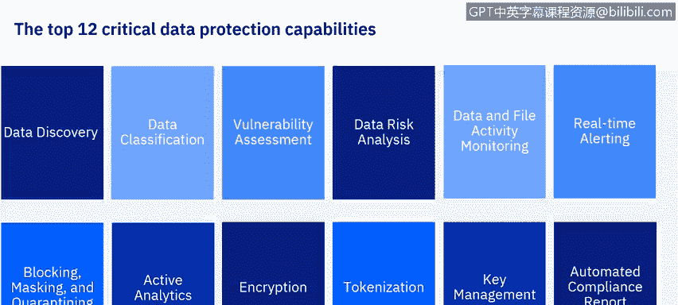
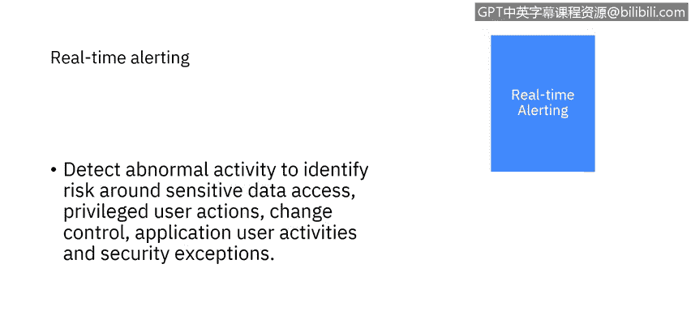

# IBM网络安全分析师专业证书课程6：《网络威胁情报课程（IBM）》｜ibm-cyber-threat-intelligence｜ - P48：9_05_capabilities-of-data-protection.en_subtitled - GPT中英字幕课程资源 - BV1jN411679K

Welcome back。In previous videos， we addressed the need for data security and protection and some of the challenges in pitfalls now let us examine what capabilities a data security and protection solution should have。

Our objectives are to examine the 12 critical data protection capabilities。

These are the top 12 data protection capabilities， they are data discovery。Data classification。

Vulnerability A。Data risk analysis。Data and file activity monitoring， Real time alerting， Bing。

 masking and quarantining。Active analytics。Encryption， tokenization。Key management。

And automated compliance reporting。We will examine each of these in more detail。

The first capability of a data protection solution is data discovery。

 You cannot reliably protect what you do not know about。 You must know where your data lives。

 You must have some process for seeking out databases and file systems in your enterprise that might potentially contain sensitive or regulated data。

Note the word potentially。With this capability， you are not classifying data。 You are finding it。

Data discovery will be performed iteratively， both because of new data sources that are always cropping up in a dynamic IT environment。

And also to capture previously overlooked sources of data。

The output of this capability is a catalog or inventory of data sources。

You will probably use multiple means to find this data。

 this means a cross silo comprehensive effort that requires high level buy in and sea level executive support。

You will need a lot of cooperation and trust。The capability must be able to find production data sources。

 data sources used for development and testing， and unauthorized data sources。

One means of discovery is to ask people such as line of business owners， database administrators。

 and network administrators。Another method is to employ tools to perform scans of the networks and individual servers。

The goal here is to cast as wide a net as possible。

 you want to find all the data sources in your organization。

 not just the data you should have or think you have sensitive data may exist beyond the knowledge of the data owner。

This is a common， yet an extremely unsafe and vulnerable scenario。

You cannot protect sensitive data unless you know it exists。

Data classification parses discover data and matches it against patterns or keywords to determine the nature and sensitivity of it。

Assign labels or keywords based on data type， this will make it possible to apply the correct security policies to the data。

 not all data will be sensitive data， and different types of sensitive data must be treated in different ways。

Classification allows you to determine what protective measures apply to which data。

A data classification scheme should consider the standards and regulations relevant to an organization。

 as well as unique organizational needs。Remember， some data may fall under multiple classifications。

Your data security solution requires some means to discover and address the vulnerabilities in your hardware。

 software， and networks that host the data。This method should address the process in a consistent fashion and should be automated。

This solution should assess the system configuration against a recommended state or baseline。

 determining areas of weakness。 Such areas may include user accounts that should be disabled。

 but are not inappropriate privileges， insecure authentication methods。Shared accounts。

 misconfigured configuration files， and missing security patches。

Vulnerability assessment should be an iterative process。

 which uses input from stakeholders to determine priority of focus。

 rather than trying to fix all vulnerabilities at once。

 it should use a phased approach to address the most urgent risks with an eye towards constant improvement。

Vulnerability assessment requires coordination and buy in across departments。Therefore。

 it requires high level support， careful gathering of metrics and progress reporting。

 and integration with change and configuration management processes。

The results of data classification and vulnerability assessment allow you to perform data risk analysis；

 This is where you assign risk levels to data sources and use that assignment to prioritize allocation of resources to the most appropriate efforts risk analysis considers not only what type of data you have but what threats pertain to the data source the probability of that threat。

And the amount of damage that threat would cause， as well as methods to counter the threat and the cost of the mitigation procedures。

 This process can be difficult。 However， it is important for the organization to understand the risks associated with their businesses。

 There are tools and frameworks that can assist with risk quantification。

Risk analysis results feedback into the data discovery， classification。

 and vulnerability assessment capabilities to refine those processes。

Risk analysis also helps in planning policies for monitoring data assets。

Dive monitoring of your sensitive data is critical to detect suspicious activity and security breaches in a timely manner。

A 2018 study by IBM showed that the average time to identify a data breach was a hundred and97 days。

 That is correct。 More than half a year。 Imagine the exploitation of data that can occur in that time。

 Think of the damage to an organization's reputation when the data breach is finally discovered and disclosed。

Active monitoring properly deployed can reduce the time to discover data breaches。

Activity monitoring is challenging。From a business perspective。

 you must use the results of risk analysis to develop a set of monitoring policies。

 targeting the highest risk data sources first， then iteratively moving to other priorities。

This requires close cross silo coordination and communication。

Line of business owners as well as database， server， application。

 and network administrators must be consulted。From a technical perspective。

 data activity monitoring requires filtering a huge number of database transactions。

 perhaps billions per day to pick out a handful of events that indicate possible suspicious activity。

This can be extremely resource intensive， and the monitoring solution must be carefully configured to avoid overtaxing CPU。

 RAM， disk， and network resources。The monitoring solution must address varied methods of accessing data remotely or locally by an internal privileged user or an external attacker or even a misconfigured application。

Data activity monitoring is also iterative。Results from data activity monitoring feed into vulnerability assessment and risk analysis。

 which in turn provides insight on refining monitoring policies。

Real time alerting involves acting quickly and appropriately on suspicious activity identified by data monitoring alerting requires the consolidation and centralization of relevant information。

 correlation with data from other security solutions and reliable routing of that information to parties that can act on it。

The alerting process must be automated and reliable integration with security intelligence and event management consoles is a must。

In this video， we have discussed the first six。Data security capabilities。In the next segment。

 we will continue our discussion of data security capabilities。

