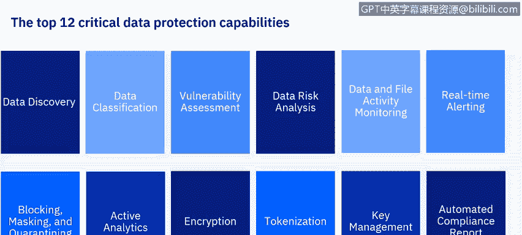

# IBM网络安全分析师专业证书课程6：《网络威胁情报课程（IBM）》｜ibm-cyber-threat-intelligence｜ - P49：10_06_critical-data-protection-capabilities.en_subtitled - GPT中英字幕课程资源 - BV1jN411679K

Hello again。In the last video， we started to talk about the 12 critical data protection capabilities。

We covered data discovery， data classification， vulnerability assessment， data risk analysis。

 data and file activity monitoring， and real time alerting。In this video。

 we will discuss the six remaining critical data protection capabilities。

To review the top 12 critical data protection capabilities are data discovery， data classification。

 vulnerability assessment， data risk analysis， data and file activity monitoring， real time alerting。

Blocking， masking and quarantining。Active analytics， encryption， tokenization。

 key management and automated compliance reporting。

Let's talk about blocking， masking， and quarantining。

A data security solution must also intelligently limit access to sensitive data on the fly。

When the security solution detects suspicious actions。

 it is useful to respond by obscuring data and or hindering further action。

These responses include blocking， masking and quarantining。

These measures are useful for complying with standards and regulations by limiting users to only the level of access to data necessary for their roles。

Blocking prevents a suspicious data request from being completed this request may be to view， change。

 add or delete sensitive information。Blocking is fine grained in that it pertains to individual requests。

 since the request is blocked， no data is affected or returned to the requester。

 the process just fails to complete。Perhaps however， you do not want to totally block a request。

 but still want to modify how the requester interacts with the data。In this case。

 either the request can be modified or the data returned can be modified。In the case of masking。

 data is partially returned， but portions of the data are omitted， as an example。

 a request to view personal identification number entries may return values that have some digits replaced with asterisks。

Or perhaps only a partial list of results may be returned， for instance。

 a request to view salary information may yield results that exclude executive salaries query Mo on the other hand。

 modifies the actual command being sent to the database server。

This might direct the command to a different table or a different column。

Quarantining is an action taken towards the user who generates suspicious activity；

 it terminates access to sensitive data either permanently or temporarily。Blocking， masking。

 quarantining， and query modification are usually combined with alerting and logging actions so that suspicious events may be reported and saved for auditing purposes。

These capabilities help prevent data security breaches by not only malicious actors。

 but also actions due to human error， or even in the faithful execution of required actions。

As an example， a privileged database administrator may be troubleshooting a problem which requires executing a query against a database table that contains sensitive information。

 the administrator neither needs nor desires to view this data masking hides the sensitive data from the administrator while allowing the administrator to see if the query works。

Active analytics take the data generated by data activity monitoring and use them to generate insights about threats。

These threats might include SQL injections， malicious stored procedures， denial of service。

Data leakage， account takeover， schema tampering， data tampering or other anomalies。

When these threats are identified， active analytics can provide recommendations for countermeasures to the threats in order to reduce risk。

Encryption is the process of transforming data into an unintelligible form in such a way that the original data can only be obtained by using a decryption process。

Encryption does not deny unauthorized users access to the data。

 It denies them the meaning behind or the understanding of the data。 Thus。

 the encryptryed data is useless to the unauthorized user。

 encryptncryption may so obscure the meaning of the data that is not even recognizable as data。

 effectively hiding its very existence， Enncryion can be applied to data in transit。

 that is while it is traveling from one endpoint to another， or at rest。

 that is while it resides on an endpoint。Since data has different vulnerabilities in transit than it does at rest。

 the requirements and methods for encrypting data may be different。As an example。

 a scheme for encrypting data in transit may prioritize speed and minimizing resources used in the encryption decryption process。

Data at rest may prioritize strength of the encryption and long term preservation of the encryption state。

 as well as ensuring that decryption remains viable for the life of the data symmetric encryption is where the decion key is easily derivable from the encryption key。

This requires the key be protected from disclosure。

 but symmetric encryption is generally faster and less resource intensive。

Asymmetric encryption is where the decryption key is not easily derivable from the encryption key。

In this case， the encryption key can be made public。

 but the decryption key must remain private and protected from disclosure。

Enccrypted data only becomes useful when decrypted， both encryption and decryption require keys。

These keys are themselves sensitive data， which must be managed and secured。

Tokenization is like encryption in that it attempts to hide the meaning of the data from unauthorized users。

However， instead of encrypting the data， tokenization substitutes the data with a token。

This token issued by a trusted party can be accessed but not redeemed by untrusted parties。Therefore。

 operations that do not require the specific sensitive data can be performed with the token as a proxy。

 this might include passing the token from actor to actor or using the token as a voucher when the original data is required。

 the token is redeemed。In this example， a shopper wants to make a purchase in a store。

 rather than provide their sensitive credit card information to the shopkeeper's point of sale。

 the shopper requests a token from a trusted server and provides that to the shopkeeper instead。

The shopkeeper is able to handle the token but is unable to map it back to the credit card number。

To complete the sale， the shopkeeper queries a merchant acquirer whether the token is good for the sale amount。

 and the merchant acquirer in turns queries the remote token service server about the validity of the token。

After receiving a reply from the server， the merchant acquirer verifies that the token is good for the purchase。

The remote token service server then matches the amount of the sale to the original data and updates the bank card issuer with the details of the sale。

As we have seen， encryption requires keys。These keys must be created， managed。

 and protected from disclosure。Keys are also used for authentication and other purposes。

The multitude and complexity of keys requires that your organization must have a key management capability。

Key management must be centralized。Key management must be organized in order to maintain data confidentiality。

 integrity， and availability。Inmpproperly exposed keys compromise data confidentiality and integrity。

 while lack of access to keys by authorized users compromises availability。

Since one goal of data security and protection is compliance with applicable regulations and standards。

 we must understand the requirements of these regulations and how to translate these requirements into processes。

 policies， and procedures in our data security solution。

Automated compliance support includes prebuil classification patterns to help us identify sensitive data covered by the regulations。

It provides preconfigured reports that gather and display the data required by the regulations。

 it provides workflows to implement mandated processes and procedures。

 it provides auditing resources and repositories to prove compliance。

Implementing compliance with even a single standard from scratch would require so many resources that the cost would be prohibitive。

Out of the box， preconfigured resources make the job feasible。In summary。

 we have discussed the last six data security capabilities。

In the next segment we will discuss the Guardian Data security solution。

