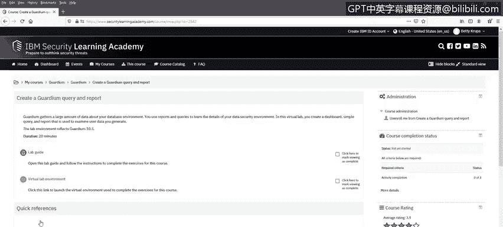
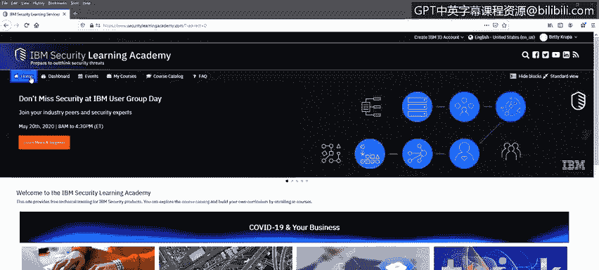

# IBM网络安全分析师专业证书课程6：《网络威胁情报课程（IBM）》｜ibm-cyber-threat-intelligence｜ - P50：11_07_data-protection-industry-example.en_subtitled - GPT中英字幕课程资源 - BV1jN411679K

Hello again and welcome back We have investigated the motivations， challenges。

 and pitfalls of data security and protection and discussed the top capabilities of a good data security solution。

In this video， we will explore IBM Security Guardian。

 IBM's solution to achieve smarter data security with visibility， automation and scalability。

We will talk about IBM Security Guardian Data encryptncion and IBM Security key Lifecycle Manager we will also visit the IBM Security Learning Academy and look at two labs for future learning。

Guardium is a powerful data security and compliance solution that supports a staged implementation。

This allows customers to implement increasing functionality。

 starting with the most urgent issues and growing to expand coverage。

Customers can start with basic and acute compliance needs。

 such as data access reports required by auditors or regulation。

Then they can expand coverage to other sensitive platforms。

 control and monitor the access of privileged administrators。

 seek out sensitive data throughout the enterprise。

 and create a comprehensive strategy to protect that data。

Guardian helps you protect data against unauthorized access， ensure data privacy， identify risk。

 and reduce the cost of compliance。Guardium addresses data sources on premise or in the cloud。

 it works with database servers， distributed data repositories。

 and unstructured data such as sensitive documents and files。

Guardian provides the following capabilities。Database discoveryy and Class。

 Unstructured Data discoveryy and Class， Vulnerability A。

Real time database access monitoring Realtime unstructured data monitoring。Realtime alerting。

Blocking， masking， session termination， quarantining， and query rewriting actions。

Built in and custom reporting。Compliance workflow automation out of the box and custom reporting。

Compliance Acccelerators for industry regulations and standards including GDPR， SoX， Basil2。

 and HIPAA。Configuration， auditing and active threat analytics。

Guardian provides a complete solution to a company's monitoring needs。

 it uses few database server resources， typically 3% to 5% CPU utilization。

Reducing the impact on the database system operations。

Guardium is implemented such that database administrators and privileged database users with high levels of access to the data itself have no access to Guardian。

Because Guardian intercepts database queries before they reach the database and intercepts query results before they are passed to the requester。

 data access can be blocked or reported and data can be masked。

Guardian works consistently in heterogeneous database environments。

This allows for standardization of policies， procedures， and which data is collected and reported on。

Additionally， a single Guardian system can monitor and manage the security of different vendor database products Guardian can also monitor Amazon AWS RDS database engines。

To provide heterogeneous support for databases and applications。

 Guardian uses host based probes by a distributed agent called the STAP。

This provides lightweight cross platform support。Because the STAP agent runs on database servers at a low level below the databases and applications。

 all access is monitored， unlike network monitoring。

 which does not detect activity running solely on the database server。For example。

 a privileged user working locally on the server console will not be detected by any solution that only monitors network traffic。

 but would be detected and could be monitored or even blocked by Guardian。Also。

 because STap runs at a level below the database and application。

 no changes to the database or applications are required when you install STAP。

Separate collector and aggregator appliances provide most of the resource intensive processing。

 allowing the database servers themselves to run with a minimum of interference。

Activity is logged in real time and is immediately available for alerting or reporting Additionally。

 the strings are parsed into smaller data elements so that activity information is easier to categorize and build reports on parsing is done in real time by default but can be deferred to a later time for resource utilization issues alerts happen in real time。

Gardian uses a tiered hierarchy of collectors， aggregators， and a central manager。

Collectors gather in parse activity about sensitive data from data repositories。

 provide real time analysis， and stored for further processing。

A Guardian implementation has at least one and generally many more than one collector。

Aggregators collect and merge information from multiple collectors This provides an enterprise view of sensitive data operations。

 Guardian implementations with more than a few collectors have one or more aggregators。

A guardian environment has one central management system。

 which controls and monitors all collectors and aggregators in that environment and provides a holistic view through a single console。

 Centralized management provides uniformity of policies。

 which can be created once and distributed to many diverse endpoints。

Centralized aggregation gathers data security information from distributed sources for unified processing。

 storage and reporting。Hetrogeneous data source support provides similar security capabilities for different sorts of data repositories。

IBM Security Guardian data encryptncion is an integrated suite of highly scalable products。

 it helps minimize risk and reduce operational costs of encryption key management。

It provides encryption for files， databases， applications， and cloud container data。

 it also provides tokenization in cloud key management capabilities， including key storage。

 rotation and lifecycle management。It will secure data assets across the enterprise， including cloud。

 virtual， big data， and on premiseise environments。

It provides support for regulatory compliance efforts。

IBM Security key Lifecycle Manager provides encryption key management capabilities。

It supports multimaster clustering， allowing synchronization and real time delivery of keys to increase flexibility and ease of use。

It simplifies security key life cycles， including generation， distribution， and lifecycle management。

 reducing costs。It can be simply and securely integrated with IBM storage systems。Finally。

 I would like to draw your attention to some Guardian labs available on the IBM Security Learning Academy。

At wwwsecurityLarningAcademy。com， let us examine the Guardian area of the acade。

There are roadmaps for getting started with Guardian， for Guardian users。

 and for Guardian administrators。These roadmaps are excellent stepping off points for building on what you have learned in this video series。

Two excellent labs are here。Guardian Database vulnerability Assess is a foundational level course。

It contains an explanatory video， a lab guide， and a virtual lab environment。

Returning to the roadmap， another excellent lab is creating a Guardian query and report。

It has a lab guide and a virtual lab environment。

In summary， we have discussed IBM Security Guardian products and previewed the Guardian section of the IBM Security Learning Academy。

Thank you for your time and attention。

