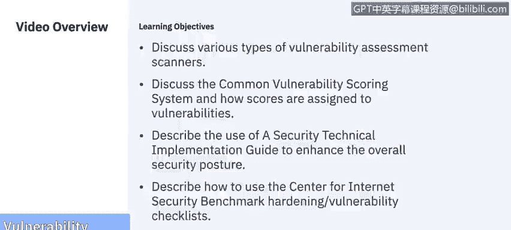
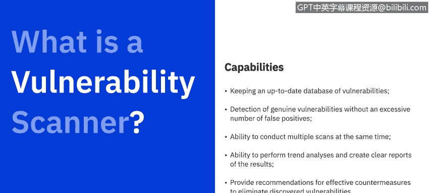
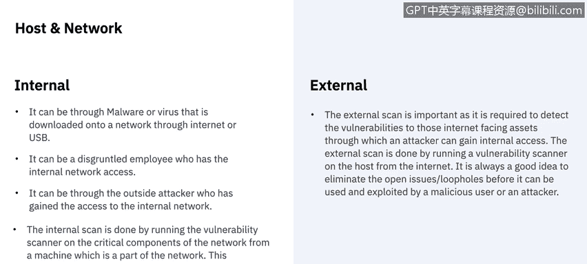
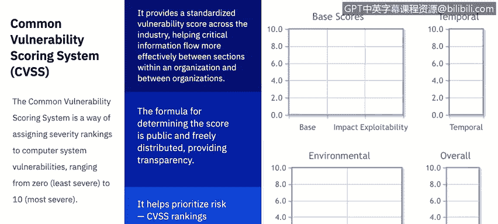
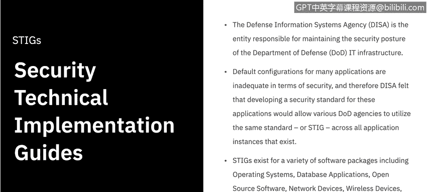
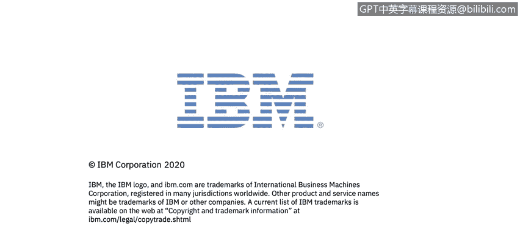

# IBM网络安全分析师专业证书课程6：《网络威胁情报课程（IBM）》｜ibm-cyber-threat-intelligence｜ - P52：13_01_vulnerability-assessment-tools.en_subtitled - GPT中英字幕课程资源 - BV1jN411679K

Welcome to vulnerability assessment tools brought to you by IBM。In this video。

 we'll discuss various types of vulnerability assessment scanners。

 We'll discuss the common vulnerability scoring system and how scores are assigned to vulnerabilities。

You will be able to describe the use of a security technical implementation guide or a STig to enhance the overall security posture。

And last， you'll be able to describe how to use the center for Internet security benchmarkch hardening s vulnerability checklists。

 Let's get started。 According to the National Institute of Standards and Technology。

 vulnerability scanning identifies hosts and host attributes like operating systems， applications。

 open ports， but it also attempts to identify vulnerabilities rather than relying on human interpretation of the scanning results。

Vulnerability scanning can help identify outdated software versions。

 missing patches and misconfigurations and validate compliance or deviations from an organization's security policy。

What is a vulnerability scanner， Vulnerability scanners are a software suite that have many capabilities whose main job is to assess in a system for potential weaknesses that threats could expose。

Capilities of a vulnerability scanner include keeping an up to date database of all known vulnerabilities and exploits。

 detection of genuine vulnerabilities without excessive number of false positives and has the ability to conduct multiple scans at the same time and perform trend analyses and create clear reports of the results。

And they also provide recommendations for effective countermeasure to eliminate any discovered vulnerabilities。

Vulnerability scanners are made up of four main components。Engine scanners， databases。

 report modules， and the user interface。The engine scanner performed security checks according to its installed plugins。

 identifying system information and vulnerabilities。

The built in databases store all the vulnerability information， the scan results。

 and other data used by the scanner。The report module provides scan result reporting such as technical reports for system administrators。

 summary reports for security managers， and high level graph and trend reports for corporate executive leadership。

Unless， the user interface allows the administrator to operate the scanner。

 It may be either a graphical user interface， Gui or just a command line interface。

 Vulnerability scanners can exist either looking for internal threats and s or external threats。

 It's the difference of its scanning a host or the network。Internal threats。

 whether intentional or not， make up a large portion of attacks on a system。

It could be through malware or a virus that is downloaded onto a network through internet or USB。

 it could be a disgruntled employee who has internal network access。

It could be through the outside attacker who has gained access to the internal network。

The internal scan is done by running the vulnerability scanner on the critical components of the network from a machine which is a part of the network。

This important component may include a core router， switches， workstations， web server， databases。

 etc。On the other hand， the external skin is important as it is required to detect the vulnerabilities to those internet facing assets through which an attacker can gain internal access。

The external scheme is done by running a vulnerability scanner on the host from the Internet。

 It is always a good idea to eliminate the open issues or loopholes before it can be used and exploited by a malicious user or an attacker。

One way to determine just how big of a threat something is is to use the common vulnerability scoring system。

The Common vulnerability scoring system is a way of assigning severity rankings to computer system vulnerabilities。

 ranging from zero least severe to 10， most severe。

The CVSS provides a standardized vulnerability score across the industry。

 helping critical information flow more evenly between sections within an organization and between organizations。

The formula for determining the score is public and freely distributed， providing transparency。

And it helps prioritize risk， the CVSS ranking provides both a general score and more specific metrics。

The score itself is broken out into three main areas， a base score， a temporal score。

 and an environmental score， which will provide the overall score of 0 through 10。

The C VS S score has three values for ranking of vulnerability， A base score。

 which gives an idea of how easy it is to exploit the vulnerability and how much damage in exploit targeting that vulnerability could inflict。

The temporal score， which ranks how aware people are of the vulnerability。

 what remedial steps are being taken， and whether threat actors are targeting it。

 and an environmental score， which provides a more customized metric specific to an organization or work environment。

Let's break these down further。 It should be noted that this will be a pretty high level overview of the breakdown of the CSS score。

I highly recommend after the video is over to check out a C VSS score calculator where you can see all the different things that make up each sub score。

 With that being said， the base score is actually broken into two sub scores。

 exploitability and impact。For the exploitability subcore， they take a look at the attack vector。

 the attack complexity， the privileges required， and what the user interaction was involved。

The Imp score has to do with the CIA Triad。 How does it impact the confidentiality。

 integrity and availability of services。The temporal score takes a look at three things。

 The exploit code's maturity， the remediation level， and the report confidence。And last。

 the environmental score takes a look at the security requirements subcore and then also takes into account an impact score of the CIA Triad。

Another assessment tool are the use of StGs， a security technical implementation guides。

The Defense Information Systems Agency or DSISA is the entity responsible for maintaining the security posture of the Department of Defense IT infrastructurefra。

Defaultt configurations for many applications are inadequate in terms of security。

 and therefore Desa felt that developing a security standard for these applications would allow various Do O D agencies to utilize the same standard or stick across all application instances that exist。

Stings exist for a variety of software packages， including operating systems， database applications。

 open source software， network devices， wireless devices， virtual software。

 and the list continues to grow， now even including mobile operating systems。

In order to view the most current Stigs， you can view the Department of Defense's Public Cyber exchange website。

 that's public do cyberbert mill s Stigs。And here you can see the most current updates。

 you can download an application viewer， they have one for each operating system so you can explore those databases and see what the most current security technicalical implementation guide is for any given application。

The last vulnerability assessment tool we'll be discussing in this video is the Center for Internet Security's Benchmark and Controls。

The C I S benchmark and controls are much like the Sts in that they provide guidelines and recommendations for security settings and configurations for any given application or process。

 The difference is， instead of being from the Do OD。

 Its from the security professionals and those in the industry。

The CIS S benchmarks are the only consensus based best practice security configuration guides。

 both developed and accepted by government， businesses， industry and academia。

The initial benchmark development process defines the scope of the benchmark and begins the discussion creation and testing process of working drafts。

Using the C I S Workbench community website， discussion threads are established to continue a dialogue until consensus has been reached on the proposed recommendations and the working drafts。

 Once consensus has been reached in the C I S benchmark community。

 the final benchmark is published and released online。

The CIS controls are a prioritized set of actions that collectively form a defense in depth set of best practices that mitigate the most common attacks against systems and networks。

The CIS controls are developed by a community of IT experts who apply their first hand experience in cyber at cyber defenders to create these globally accepted security based practices。

The five critical tenets of an effective cyber defense system， as reflected in the CIS controls are。

Offence informs defense。Prioritization， measurement and metrics。

 continuous diagnostics and mitigation and automation to be able to use the controls。

 you need to take a look at what implementation group your business or company falls under。

 and then compare that to the 20 different controls that the community has come up with。

 Let's take a look at those。 Now。 The implementation groups are defined by the company's security needs。

 One being the least amount or normal amount in  three being the maximum。

So for the group one or the implementation group one。

 the subcontrols for small commercial off the shelf or home Office software environments where sensitivity of the data is low and will typically fall here。

 any implementation group one step should also be followed by organizations in two and three and this will go for all of them where three should be able to do two and1 two should be able to do two and1 one should be able to do。

Just one。For the second group， the subcontros focused on helping security teams manage sensitive client or company information fall under here。

And then for the largest security needs， they are the subcontrols that reduce the impact of zero day attacks and targeted tax from sophisticated adversaries。

 typically。It's going to fall here。Now these implementation groups will be applied to the 20 different control groups。

 so for each of these control groups there will be a implementation group12 and three level response so you can imagine there's a lot of different combinations let's go ahead and take a look at those now。

Here are the 20 CIS controls， they're broken down into three categories， basic。

 foundational and organizational， I'm not going to sit here and read you a list of 20。

 you can pause the video and read these or you can go to the CIS's website and download in a PDF or Excel format to review these yourself。

And that'll do it for this video on vulnerability assessment tools。 Thanks for watching。

 We'll see you in the next video。

