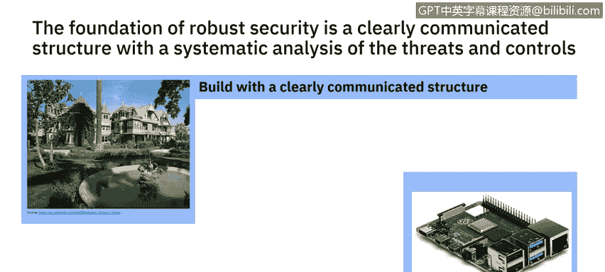
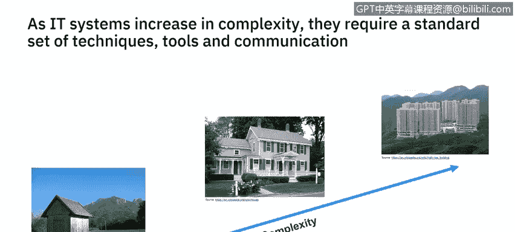

# IBM网络安全分析师专业证书课程6：《网络威胁情报课程（IBM）》｜ibm-cyber-threat-intelligence｜ - P55：16_01_characteristics-of-a-security-architecture.en_subtitled - GPT中英字幕课程资源 - BV1jN411679K

Hi， everyone。 I'm Mark Buckwell。 I'm a security architect with IBM focusing on the security for cloud transformation。

 I joined IBM 26 years ago as an open system specialist。

 and my first project required a high security solution。

I continued getting involved in a wide variety of security projects。

I've been interested in security architecture， teaching courses for IBM globally and for MSC modules at UK universities。

It is the process of constructing security controls in a systematic way to create a robust security architecture that interests me。

This is a series of four short videos that will be used to describe security architecture concepts。

The first video will explain the characteristics of a security architecture。

 including why architectural thinking is important。

The next video will go on to discuss different types of high level security architecture representations that can be used。

And when to use them in practice。The third video will go on to look at how to describe security solutions as they are decomposed to identify threats and specify the required security controls。

In the final video， I will discuss how security patterns can be used to accelerate the development of security for infrastructure and applications。

So let's start this video by explaining the characteristics of security architecture。

I believe architecture forms the foundation of good security。

How you put the security together is just as important as what security controls are used and how they're managed。

This house， you see is the Winchester mystery House and is a good example of how not to construct a house。

Sarah Winchester inherited $20 million on the death of her husband。

She recruited a dedicated crew of carpenters to build  a hundred60 rooms so quickly that nobody bothered to drop up blueprints。

And she didn't hesitate to make unorthodox building decisions。A stairway ascending to a wall。

 a closet about an inch deep and a doorton nowhere that opens to empty space。

This is a good example of how not to build a complex system without an architect to define how the components of the house are to be put together。

And a project manager to ensure it is built to specification。

This is also true of security architecture。It is needed to provide assurance that the solution has been designed and construct it effectively。

 integrating each of the components into a system。So build with a clearly communicated structure。

The second lesson is about a raspberry pie。The jet propulsion labs in the US perform sensitive research。

 but also needs to be connected to the Internet。 In 2018。

 an employee brought in their own Raspberry reply and bridged the internal network with the Internet。

 allowing hackers to extract around 500 MB of data。

It was found there were many shortcomings with the JPL security， including a lack。

Of a mechanism to detect unauthorized devices on the network and in insufficient networking segmentation。

They could have done a better job of systematically assessing the potential threats and designing controls to meet those threats。

So systematically， analyzing threats and controls would have helped。Finally。

 don't build security like this security gate。Let's talk about the complexity and where security architecture is most effective。

When a shed is constructed and can be completed with one person and planned with a list of components on a scrap of paper。

With a house， there will be a team of skilled professionals， including net electricion， plumber。

 carpenter， etc cetera。They will work to a solution provided by an architect and managed by a project manager。

As the complexity increases， as with these high rise buildings in Hong Kong。

There will be many teams of people involved in the construction。

Different techniques and tools will be used。 Plans will be at differing levels of abstraction。

 with high level architecture showing the overall solution without any specific details。

This high level architecture will be decomposed into a design for each building。

 a design for each floor， and then a design for each flatter apartment。

Rather than creating a separate design for each floor and flat。

 a series of patterns will be defined that can be reused。

Pattterents provide a rapid way of developing similar systems or components。

Special solutions will be developed for the different professions。

There may be a solution for electricity， a solution for plumbing。

There are different viewpoints of the same overall solution with more detail for a specific profession。

The same approach is used with I T architecture， with differing levels of abstraction targeted at different members of the team designing。

 delivering and operating the system。There might be an architecture diagram for the overall system with decomposition to more and more detail until there are documents describing how to install hardware in Iraq。

There will be differing viewpoints。 One of those viewpoints will be security to identify the security capabilities within a system。

Each document describing the solution will need to be integrated with other viewpoints across the team。

 whether it's storage， platform or availability。All of this should use a systematic approach to communicate an architecture。

That is created using a standard set of tools and techniques。

Using a standard way of communicating will enable team members to ensure a robust system is constructed。

Let's look at architectural thinking。

Architectural thinking is about creating and communicating good structure and behavior with the intent of avoiding chaos。

In I systemss， we talk about the architecture being described using different levels of abstraction covering。

Both the implementation and the operations。This needs a careful balance as the solution needs to be affordable and yet secure。

There are many ways to describe an architecture， but essentially。

 the architecture will be made up of a static structure and dynamic behavior。What does that mean？

The static structure describes how the components will be connected together。

 If I connect two components together using a wire。

 it doesn't mean it will perform a useful function。

The denied dynamic behavior describes how the components will interact over time。

 including how the communication is secured。As the system is put together。

 there is a series of design decisions that shape the system， balancing security， usability。

 resilience and cost。As a security architect， you need to consider。

Security does not override the other characteristics needed in a system。That's it for now。

 In the next video， you will get to understand the different types of architectural models and when to use them。

