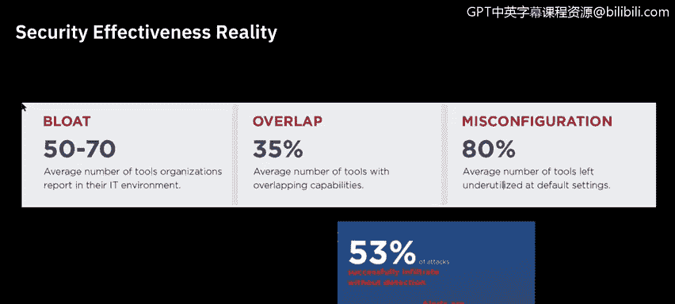
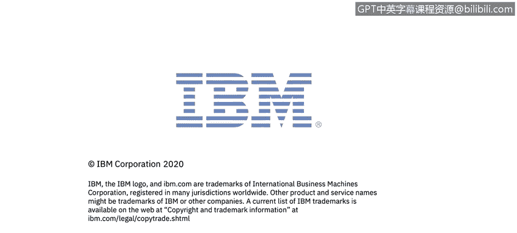

# IBM网络安全分析师专业证书课程6：《网络威胁情报课程（IBM）》｜ibm-cyber-threat-intelligence｜ - P5：4_安全情报.zh - GPT中英字幕课程资源 - BV1jN411679K

Welcome to Security Intelligence brought to you by IBM。In this video。

 you will learn to describe security intelligence。Several years ago。

 I introduced the term security intelligence to describe the value that organizations gain from security data by treating and analyzing security information in much the same way they do outputs produced from other business functions such as marketing。

 The goal of security intelligence is to provide actionable and comprehensive insights that reduces risk and operational effort for any organization。

 regardless of its size， data collected and warehouse by security intelligence solutions includes logs。

 events， network flows， user identities and activities， asset profiles and locations。

 vulnerabilities， asset configurations and external threat data。

Security intelligence provides analytics to answer fundamental questions that cover the full， before。

 during， and after timeline of risk and threat management。

Securing today's businesses and public organizations requires a new approach。

 Everyone needs to gain insights across the entire security event timeline。

Security intelligence can be characterized in two ways。 First。

 security intelligence is a result of advance in analytics。

 It is a wisdom gained from reviewing every available bit of data and normalizing， correlating。

 indexing and pivoting it to discover the dozen things your team needs to investigate as soon as possible。

Alternatively， security intelligence characterizes the iterative process of eliminating false positive results by continuously tuning the system analytics and rules to improve an increasing number of interesting but non threateningate incidents。

 adding a risk manager vulnerability manager and incident forensics to the core security information and event management or Sim engine。

 improve accuracy androv context throughout the entire security event timeline from detection and protection through investigation and remediation。

 working together。 these solutions can help you both reduce exposures and recognized attacks as early as possible。

 We will dive deeper into each of these solutions in this course。😊。

There are three pillars required to improve the current situation， effectivelyect detect threats。

 First， you need visibility into the entire enterprise from a single place fee。

 all that siloed data into one centralized solutions。

 so you can get a comprehensive view of the security state of your entire environment。

 including your on premises environments， cloud environments and even operational environments。

 Second， you need to automate your security intelligence。

 You've got too much data to not automate intelligent insights。

 by layering an analytics engine on top of your data。

 you can get actionable and prioritize insight into your most critical threats。😊，Third， be proactive。

 The more you're able to automate upfront。 The more time you'll be able to free up so you can transition from a solely reactive stance to a more proactive stance With more time。

 you can proactively hunt threats to find attackers early in the attack cycle。

 Repon faster and build those lessons learned backed into your defenses so you can continuously get better。

 We will look at threat hunting later in the course。😊。

To underscore the critical importance of understanding improving a company's security effectiveness。

 the security effectiveness report 2020， a deep dive into cyber reality offers some startling revelations。

 primarily that a large percentage of companies believe their security investments are delivering expected value by protecting critical assets and data when in reality they are unaware that they have already experienced a breach。

This scenario correlates with cyber hedge data， which calculates the ongoing financial and operational impact when an undetected breach occurs。

 both sets of data provide insights that have never been available。

 Security effectiveness combined with financial impact all before a breach even occurs。

 The fire eye executive summary is just the tip of the iceberg。

 The full report reveals the details of how despite the growing number of threats and attacks。

 Many organizations still incorrectly assume that they are protected。

Finally， let's discuss some key takeaways from the CNNs report before we start digging deeper into specific topics and solutions around collecting and correlating intelligence data。

Visibility is a key concern for many organizations。 Organizations are concerned with privilege。

 use or and credential abuse。Inpointint alerts and network access devices are the top sources of incident information。

 providing alerts and investigation support respectively。

Many organizations have a blend of on promise and cloud environments。 Now。

 let's dive deeper into several solutions as you go through the remainder of this course。

