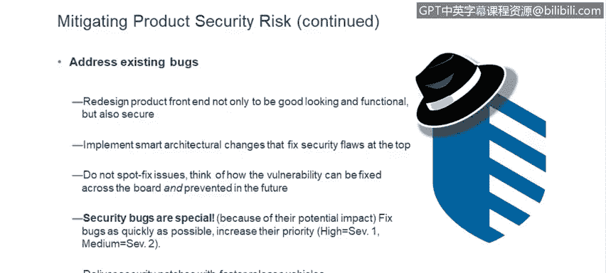

# IBM网络安全分析师专业证书课程6：《网络威胁情报课程（IBM）》｜ibm-cyber-threat-intelligence｜ - P64：25_01_application-security-defects-writing-secure-code.en_subtitled - GPT中英字幕课程资源 - BV1jN411679K

All right， thank you for joining everyone， my name is I I'm Ron Craiggg I'm the program manager for secure engineering first question I think we should ask ourselves is what if your security defect became famous？

As you guys know， starting with Heartbleed and Shell shock around 2014。

 the big thing now is for security bugs to get their own website。

 to get their own snazzy name and to get a lot of press and security issues have been you know becoming really a boardroom issue and we've seen a lot of things with Wiki leakaks and so on and the field for security research is really expanding。

And the best way for someone to make a living at this is to cash in on fame like this。

 so the people who found heart bleed or shell shock or the recent specter and meltdown issues。

 those folks， they have they face some financial security。

A lot of folks are trying to start up their businesses on security research and so the number one way to do this is to find bugs in software security bugs the number one goal in your life if you are security researcher is to find a big security bug and you know one of these security vendors flagship products and that will set you up these bugs are sensational and they have a tremendous cost really for our customers and for us and don't forget too that security breaches can lead to litigation one of the main things though that remind everyone is that the Federal Trade Commission in the United States watches any company that has some claims about the security of their software and if the Federal Trade Commission decides that you have overblown the security claims then they will come in and be very happy。

Happy to institute what's called a consent decree。And since 2000。

 I've seen over 45 just four insufficient security practices。And care lately。

 those consent decrees tend to run about 20 years and what that would mean is。

The US federal government would come in and dictate exactly how we run our security program。

 as you can imagine， management is pretty keen that that not happened。

 So one of the ways we do that is make sure that the。

Security of the software that we have is real it's effective so next slide here what me worry absolutely you should just a quick collection of some facts here Pomon Institute does a study each year the last one that i've got right now is from 2017。

Where they were estimating $141 per record。Average for a data breach 3。62 million。

Something you may not be aware of is that there is a growing black market for zero day vulnerabilities and what this means is over on the dark web。

 there are companies， individuals， crime syndicates that are watching for vulnerabilities。

 look for vulnerabilities and if they find them。There's two things you can do。

 you can responsibly disclose those to a vendor， let us fix those and then take some credit for it once the fixes are available or you can hold on them and sell them to a rival nation state。

A vulnerability that we learned about a few weeks ago found the cost the price for that was between five and $25000 so we can make some serious money if you decide that that's that's your inclination rather than doing responsible disclosure and you know we have these breaches and everybody's heard about this but the question is have we really learned our lesson a couple of quick examples here trend micro。

Is another cybersecurity vendor。And a couple of researchers decided to concentrate on their security products。

 and in six months they found 223 vulnerabilities。In fact。

 the person who used to have my role thought that was such a challenge then to go try to help Tra microsystem that he went over there to help them do the same sort of thing that we're doing with you now to try to raise awareness and help make sure that our developers。

Can in fact， do a good job with the software that we put out。

And then don't forget afax I was affected by that many， many Americans were。

 and that was a relatively minor vulnerability in an open source package and we use open source very extensively and one of the things we're supposed to do is be scanning that for known vulnerabilities。

And this was a known vulnerability。But the folks that applied the patches and so on there just they didn't get to it they were going to handle it at the start of the next quarter unfortunately meanwhile the hackers were out searching websites looking for any websites that had that vulnerability and they found equifax and as a result of that the CEO the CIO and the chief security officer all lost their jobs so it gets to be a big deal and I hope you're convinced there that that's it's an important thing that we should be avoiding all right so in this series we're going to tackle a number of different types of issues and I wanted to try to take a moment to explain why we chose what we've chosen crossite scripting is the vast majority as far as number of vulnerabilities。

And so that's why we started with with this topic the vast majority and certainly anything going on the cloud proidescription tends to be the vast majority of what what we see and you'll see crypto vulnerabilities on here as well OS command injections SQL injection those are very high severity issues even though their numbers are a little smaller those kinds of issues are really serious so the next presentation that will be happening in July is on injection so now that you're all sad and depressed I'll say there's a there's a good reason for this writing secure software is really not an easy task you know I was in development for30 years and we do face a lot of time pressure。

Lots of functionality you've got to do you don't have a lot of time to do it so you concentrate on making sure that the feature and function that you've been assigned gets done unfortunately the hackers they might have all the time in the world to sit there and to study and to analyze and to look for that one vulnerability or those one or two or three small vulnerabilities they can link together and use to cause some real damage。

So not a lot of time， again， as I said， our focus is really on the feature that we've got to get。

 oftentimes security is not our primary focus， the hackers， meanwhile。

 they're looking for that one vulnerability。And then for motivation and resources。

 your developer is responsible for that product's primary functionality。

And they're often not personally affected by product successes and failures。But the hackers。

 security researchers， those folks are motivated by bragging rights by reputation by making really some serious money。

 sometimes by politics and you know they may be supported by nation states。

 so there's lots of resources behind them， you can't really blame。

 I think some of these nation states for taking this approach because in terms of where you invest your time and money investing 30 years and universities and research programs and all this to come up with the technology you need。

takes a lot longer and a lot more money than it does simply to bring on some really good hackers and go steal it。

So we have to watch for that。And then of course developers are asked and we're asking them now to learn a little bit about security enough not to introduce issues。

 but those hackers they are specializing in security。

 looking at that very care again with good security education。

 you do a good job with the design and implementation practices it is not all doom and gloom and how do we do that so。

We've got several approaches here preventing new bugs one of the best things I think that developers can do is know the sands 25。

It's there on a website， theres it's listed and laid out in three or four different ways。

 depending on how you learn best， how you remember things。

It's really good to do that every year every developer is supposed to go through the SAs 25 to make sure that they're reminded to keep in mind what issues they need to be watching for。

You need to think like a hacker， which is one of the reasons for this presentation。

 not just what are your use cases， but what are your abuse cases。

 what evil can be done against your application。And what could someone accomplish with that？

And then building defenses into your software， the key ones are always input validation。

Output sanitization， strong encryption。Strong authentication and authorization if you handle those。

You know， I think 90% of the issues that we have will go away。And a lot of times， you know。

 I'll see teams struggle， they maybe chose a framework that doesn't have a very good reputation in security。

 and so they are from then on forever trying to patch one crossite scripting issue and then one more crossite scripting issue rather than choosing a framework that will provide crossite scripting protection。

For the application， so if you try to do it。You know。Catchches， catch can。

Somebody else is going to catch some things that you miss。

Another thing that it's good to remember is don't think if you're not internet facing that you're not at risk。

 the majority of breaches still are from insiders。So being behind a firewall。

 being inside the network is no defense。Because sometimes the bad guys are on the inside。And们。

You know， same thing for files and databases just because they're local does not mean that they don't need to be protected。

And then so that's preventing new bugs and then it makes sure you address the existing bugs and sometimes it may make sense to redesign your product front end。

Um chooseose a new technology， the folks that use struts one are all。

 they've all had to move to another version， some of them chosen not to go to strut2 to go to something else。

It's worth taking the time to look into the security features。

That are in the technology that you're using and look and see what the history looks like for those。

Implement architectural changes that can fix your security flaws at the top if you can put in a layer that does validation。

 then if somebody forgets to do validation at some particular point for some particular parameter elsewhere。

 you're better off then if you're depending and counting on everyone to think of everything every time they write。

And you know the same goes here， don't spot， fix your issues， see what you can do。

And then please recognize that security bugs are special， yes， they're software bugs。

 their're software errors。But they compromise your customers's data。And they are sensational。

And they can show up in the press。And they can cause real real problems so a lot of teams like to well。

 we'll deliver next quarter so we're going to get an exemption or an extension。

You really about look at those things and think hard， it may not be very wise。

 that's what Equifax do。

And the sea suite was basically empty because of that。

