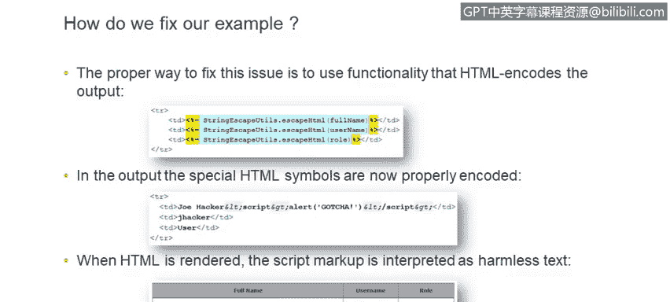
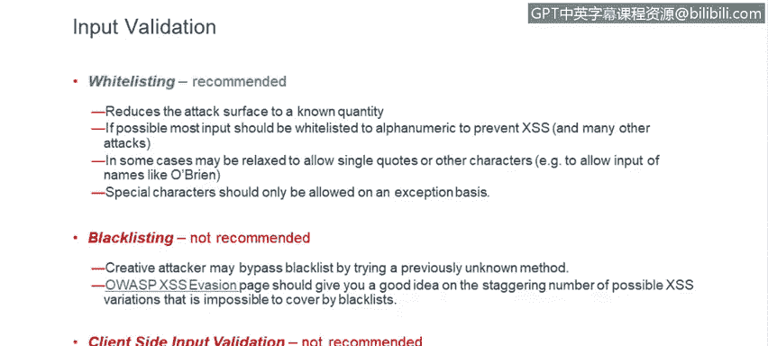
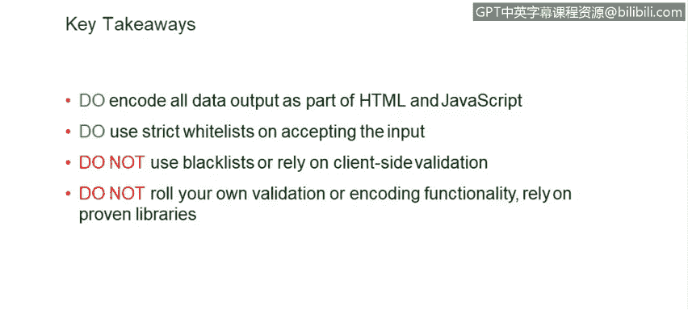
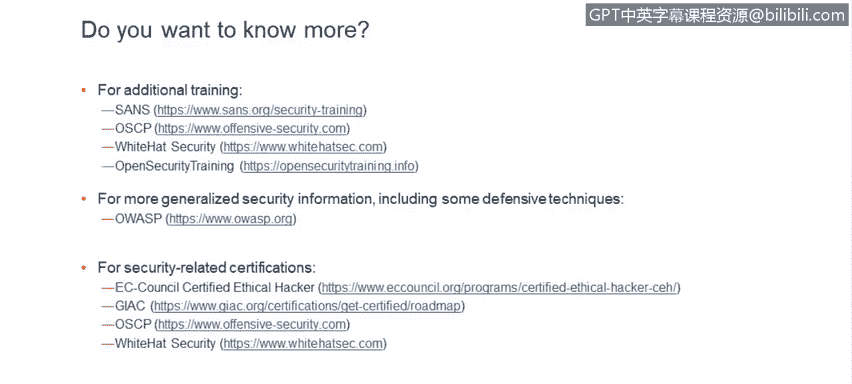

# IBM网络安全分析师专业证书课程6：《网络威胁情报课程（IBM）》｜ibm-cyber-threat-intelligence｜ - P66：27_03_cross-site-scripting-effective-defenses.en_subtitled - GPT中英字幕课程资源 - BV1jN411679K

It's actually not very hard to prevent cross size scripting。

 you just have to be careful when you develop code， output encoding works very well。😊。

And it's quite effective for HTML， you use HTML encoding for cross sky scripting that comes across in URLs。

 you could use URL encoding for special characters。How does it work in HTML encoding。

 if you just render data as is like in this example for test。Tex with surrounded by the bold tags。

 when the browser sees that， it renders that as the bold text。However。

 if you were to HTML encode code。😊，Which means that you would replace characters that are significant to HTML format with what we call HTML entities。

 this input will no longer be considered as valid HTML will just become harmless text。

 and as you can see if we replace angle brackets。Programmatically， with corresponding H TP entities。

 which are M percent L T， semicolon and。M percent GT semi。

 then the browser will actually render the string exactly as it was entered by the user。

And it will not no longer have that special meaning。 It will not be interpreted as HTML or ja。

 Of course， as with everything， there are special cases， there's something to watch out for。

Encoding may not help in some corner cases， such as。UDF7 encoding， it's a pretty rare type of attack。

 but to neutralize that particular case you also have to watch in what encoding you render your pages。

 so if it's UDF 8 you have to actually force that in order for browser not to kind of automatically recognize UDF7 encoding and trigger cross size scripting if it's there so going back to our example how do we fix it。

There's lots of functionality for escaping and properly neutralizing dangerous output。

 so in this particular case there's a Java function in screenscape utilities class called escapescape HTML and if for every field you use that all the special characters that user may have entered will be properly。

Replaced with HTML entities。 and as you can see at the bottom。

The text displayed will be exactly as the attacker entered it will look nice。

 but it will lose its special meaning it will no longer be interpreted as HTML and embedded ja escaping HTML characters is only part of a problem sometimes cross scripting may show up when you let user input actually appear as part of ja code that you are generating so in this particular case。

The user， the variable， particularly input variable that user specified search。Is set to a cookie。

 but nothing is done to neutralize possible malicious input there and an attacker may add an alert ja function and surround it with single quotes。

 which will let them break out of single quotes in the code and make alert function actually execute。

 So when you are rendering user data as part of ja that you generate。

You also have to pay attention to this and escape things like single quotes as。

 as shown in an example at the bottom in modern applications。

We use a lot of rich client U eyes， and unfortunately， often they are built。

Using unsafe handling of Do document object model。And in particular there is an attribute in the domo called inner HTML anything that you put in there will be interpreted as the HTML so if somehow user input makes it its way into that attribute。

 whatever was in the user input will be interpreted as HTML and also corresponding ja if there is some embedded in there。

 like in this example there is a response text variable that comes from the user if user embeds an valid image text specification in there。

 the on error handler of that specification will fire and it will execute the alert function。

 Of course in the real case the ja functionality will not be as benign so in such cases it's important to pay attention and use safe alternative to inner HTML which is text content attribute or inner text in some versions of Internet Explorer。

There are also。Special cases where you could use JavaScript Eval function。Eval is。Really。Dange。

 very powerful function that will essentially take whatever input you give it and interpret it as JavaScript。

 who would like to strongly discourage use of this function because a lot of things could go wrong。

 but if it's unavoidable you have to really carefully scrutinize what goes into the input of that function。

And same goes in general for generating pieces of JavaScript dynamically。

It's something that's quite dangerous if you don't do it correctly。

 so it's best to keep the data that comes from the user and your code separate as much as possible and below you see a particular example of what could happen if you were。

To take Eval function and just， you know with any sanitization。

 use the input that user provided in it。Output encoding is only part of the solution， another。

Important thing is input validation。 You really don't want malicious data entering your product。

 There are different ways of doing input validation。

 The one that we recommend is called white listing。 And as the name suggests。In this particular case。

 you build a list of hopefully very short list， very restricted list of either set of characters that that you would like to accept or a set of strings that you would like to accept and then prohibit anything else that shows up this is this will reduce the attack surface to a known quantity you know exactly what youre dealing with and you reject。

All all the other input。If possible， most input should be whitelist to a really reduced set like Al America。

 I think in most data entry that's enough， there are special cases where you need to allow single quotes or other characters but。

Really special characters should be allowed in on an exception basis and you really have to think carefully。

 do you really want to allow a particular character into your application in our testing work we see other ways being implemented blacklisting。

 which has the name suggests is the reverse of wise listing。

 it's really not effective if you implement a white list you basically are saying I know this particular types of malicious output I don't want to accept that but I'll accept everything else。

And as you can imagine now you're dealing with unknown quantity。

 you're dealing with the whole universe of possible inputs。

 some of which may be malicious but you just don't realize that they are。

 there is a very interesting page that I really recommend all developers take a look at。

 which is OSAP cross high scripting evasion。And when you look through it， you will。

 I think you'll be unpleasantly surprised by the sheer number of different。🤢，Patterns。

 different ways to bypass whatever blacklist you've put into your application。

 There are a lot of really smart people out there that really can you know。

 wreckreak some havoc and it's really not recommended that you take this approach that you use blacklisting。

 We also from time to time see client site input validation。

 This is where you basically embed jascript code in the browser。 And as user enters。The data。

 you take the value and you check whether it's。Valid or not and reject something that's。

 that's not valid。 It's very good for user user friendliness， for product usability。 Unfortunately。

 that's nothing for product securityuring because very often。

 attackers won't even be executing their attacks from the browser。 They'll be using。

So called attack proxies that go directly against the server。 So your jascript。

Functionality that you implemented in the browser to check the values。

Won't actually be even executed when you。Protect the your application for malicious input and。

And code the output。 I really think you should implement both approaches。

 This is something that we call defense in depth principle。There's a。Chance that， let's say one of。

The two mechanisms has a bug in it， but in that case the other one will take over if you have multiple layers of defense。

 there' is a higher chance that one of them will be solid and will actually protect your application。

 so implementing many mechanisms is better than choosing just one。When you implement。

The input validation or an output encoding。Try not to roll your own functionality。

 It's not easy to do it properly。 It's very easy to make a mistake to forget some edge case。

 and that's all that hackers need。 They just one case to get into into your application。

 There are proven libraries out there。In， in many languages and。When you use。

Proven established functionality， a lot of people have already used it probably a lot of bugs have been found and fixed so you're really better off using something that than the industry uses rather than something you just wrote yourself it would be safer and also as Ron mentioned I want to reiterate that in our code reviews see a lot of places where people just pepper their code with different checks and that's really an unsafe approach it's very easy to miss just one place where you check for malicious input or where you do not encode the output properly and your application could be broken into it's much better to build a framework where let's say you have your validation functionally in one place and it's called from everywhere where you accept input and you encode your data that you output in one place and that way it's much easier to maintain it will be a tighter code and if you have a case where。

Let's say new developer joins your team or you're a season developer but just forget to put some check on some input field if you have a framework that protects you。

 it will still be safe it will not hinge on the skills of individual developer so to summarize。

 please encode all data output that you generate as part of HTML or maybe some dynamic pieces of JavaScript that you generate。

Please use strict whitelists on accepting the input。

We do not recommend using blacklists or client side validation。

 these methods are just not that effective。And finally， try not to roll your own functionality。

But rather， rely on proven libraries。 Of course， we're。Just scratching the surface here。

 it's a much broader topic。 There are a lot of details to be aware of。So in the slides。

 we listed a number of links that you can check out。

To learn more。

