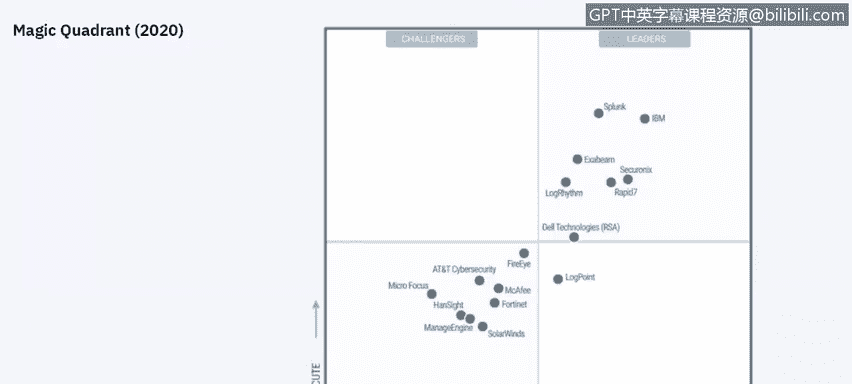
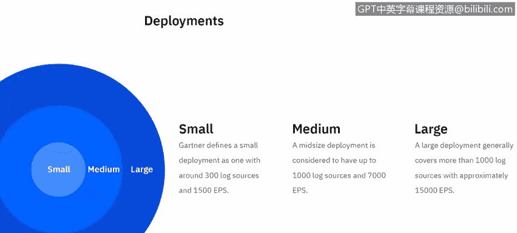
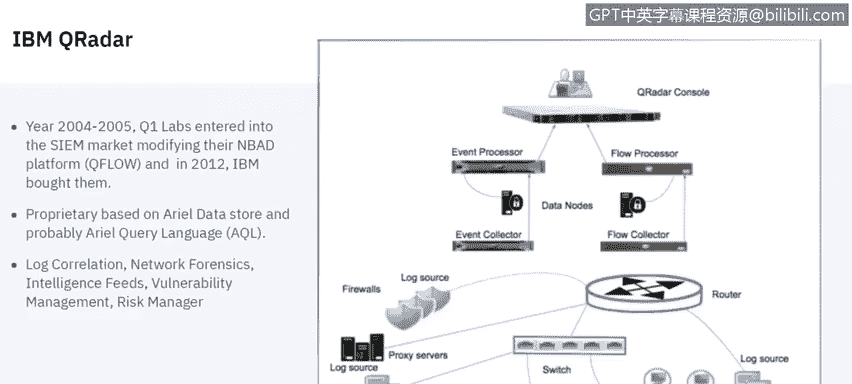
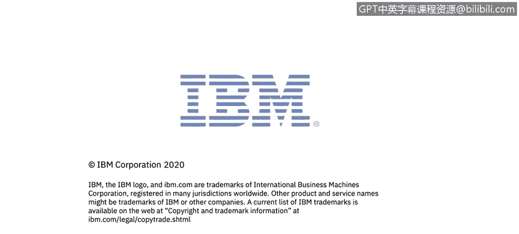

# IBM网络安全分析师专业证书课程6：《网络威胁情报课程（IBM）》｜ibm-cyber-threat-intelligence｜ - P69：30_03_siem-solutions-vendors.en_subtitled - GPT中英字幕课程资源 - BV1jN411679K

Hi there。 This is Jude Lancaster。 And Today， we're going to talk about different Sim solutions in the marketplace。

 all the different vendors that are out there and focus on a few of them。

Learning topics of this video， as I mentioned to explore the different Sim vendors and what their different components are。

 So let's get started。 The security information and event management market is defined by customers need to analyze security event data in real time。

 And that really supports the early detection of attacks and breaches。Sim solutions， collect， store。

 investigate and support， mitigation and report on security data for incident response。

 forensics and regulatory compliance。 We'll talk about the vendors mostly included in the magic quadrants and they have product design for this purpose。

 And we actively market and sell them to。Security buying customers in all ranges of industries。

This is Gartner's magicic quadrant， which many of you might be familiar with。

 obviously up and to the right is the preferred placement for a technology。

 you'll see IBM and Splunk very high there as well as exubam log rhythm and rapid se and a few other technologies and then you have some more point solutions that we really don't see in the marketplace as much as those in the magic quadrant。

 we're going to focus on IBMQ radar Splunk， Xub and log rhythm today。😡。

So let's talk about deployments for a moment， Gartner defines a small deployment as one with around 300 log sources。

 so 300 different devices or software that are providing data into the SIM and about 1500 EPS EPS is events per second which is how SIM solutions are typically measured and license a medium deployment is about 1000 log sources and 7。

000 EPS and large deployment would be about 1000 log sources and then about 15。

000 EPS this slide doesn't talk about flows which are the communication between devices on a network but flows are also very important and not every SIM solution collects flows but they really are an important。

😡，Facet of the overall security policy。 They tell what communication is happening between an endpoint on your network and an endpoint somewhere else。

 such as a web page or a server or something like that。

So let's talk about some concepts， SIM is the security information and management tool and it provides that realtime analysis of alerts which are generated by network hardware as well as applications。

 a rule is a procedure that attempts to correlate these events into a report or an incident so that you can see what's going on in the environment。

 a rule threshold is the point which the rule is triggered and then that correlation event is generated。

 event threshold is the number of times the event must occur before triggering the rule threshold。😡。

A rule action is a procedure that occurs when all rule conditions and threshold settings have been met so what's going to happen when those things occur and then a trend is a resource that defines how and over what time data will be aggregated and evaluated for trend so a trend executes a specified query on a defined schedule and time duration an event is the actual log of a specific user action such as a log in。

 a firewall permit it occurs at a specific time and the event is logged at that time as I mentioned before flows which are equally as important as events is a record of network activity and it can last for seconds。

 minutes， hours or even days depending on the activity within the assess so as an example might be sending an email might be flow that last for a few seconds whereas downloading a large file might last for hours or even days。

Data collection is the process of collecting flows and logs from different sources and that typically goes into some kind of common repository like a database built into the SM。

 normalization is what happens when raw events are turned into a format that has user readable fields such as IP address。

 machine name， things like that， and that helps the user look at those raw events。😡。

Licenseing and license throttling monitors the number of events and flows to the system to manage your licensing。

 And most Sims are license in this way， either events per second and flows per second or a combination that do coalescing。

Combines those events based on common attributes。 So if we see several actions from one endpoint in a short period of time。

 those will typically be combined into a single event。

So the first is。Technology we're going to talk about is IBMQ radar IBMQ radar came out in 2005 it originally came out as Q1 labs and it really started a little bit differently than most SIims because it started with flows so Q radar looked at network behavior anomalies and its Nbad platform from Q network network behavior anomaly detection platform and then was purchased by IBM in 2012 and really has been the pillar of IBM security business since that time。

 it's proprietary based on aerial data store and a proprietary aerial query language so it uses an aerial database to store data and events and flows that come into the into the system it does log correlation network forensics leverages intelligence feeds。

 vulnerability management and then it has a risk management component。

It as well。There are several components。😡，To Q radarD these are not all of them but are probably the most popular ones。

 vulnerability manager discovers and senseenss network devices and applications and then pulls in security vulnerabilities and provides context around that so you can prioritize remediation of those particular devices it's part of the security IBM security Q radar platform is an addon for that and it allows you to do vulnerability stands of machines and devices on your network user behavior analytics which is becoming more and more popular because users whether through malicious activity or just through mistakes or incidental activity are really the main place where breaches and risks occur and Q radarDR user behavior analytics is an add on。

It's a free add on for Q radar that analyzes user activity and can detect insider malicious behavior。

 can detect things like whether users credentials have been compromised and you can prioritize users as far as their risk activity so it's something is very very useful for QRD customers and then the QR network insights to leverages flow data which is really a differentiator between QR and other SIims on the market。

 most other SIMs do not bring flow data into their SIM natively。

 some will take flow data and then pull that in as an event but that really doesn't give you the full picture of what's actually going on network insights can pull in network data real time and really give insight into what's happening in the environment because the first thing that a hacker or。

Aad actor will do is turn off logging so that really hides the information that is coming into the SIim if logs are turned off。

 however the network doesn't lie， you can't turn off information that's going on in the network and that's why flows are so important because you can detect things like phishing emails。

 malware data exfiltration which is really important lateral movement within the environment and other application of uses and compliance gap so flow data is really important and network insights around that is important。

😡，Well let's talk next about Arcite and there's a SIM solution that does event correlation in security analytics is comprised of several different components。

 Arcite Manager， its core engine， which is the correlation， optimized retention and retrieval engine。

 it has a console to view all this data together， and then the command center。

 and then it also leverages APIs from which you can integrate other solutions into the ArcQ site。

 ESM， as with other SIMMSs it allows you to monitor events in real time and correlate those events to be easier viewed by the by the solution。

Slunk has been around for about 10 years now and didn't really start out as a SIM but has gained a lot of popularity in this space it really the Splunk's goal is to make machine data accessible usable and valuable to everyone。

 so the whole goal is to take that information and from multiple different sources and combine it into a single data store if you will so that that data can be viewed in a single pane of glass and that's Splunk's Op intelligence and that's the unique value proposition that they bring。

 they also have several free technology add on that can provide some additional value the distributed management console pulls all the Splunk architecture management together in a single set of dashboards。

 as I mentioned before Splunk didn't start out as a SIM but has really broaden its offerings into a very robust SIM solution。

😡。

嗯。Here's a kind of a representation of a Splunkx services or Splunkx Arch， I should say。

 so it has a data collection layer that are forwarding things like cisISL， potentially API， scripts。

 things across the wire， etc ce， and then it provides that into a data indexing layer。

 which then goes into the data presentation layer， which is what the web browser will present to the end user through its visibility。

And then finally let's talk about logarith and they also have a robust security intelligence platform also in the Gartner Magic quadrant that supports centralized management of a logar implementation。

 that's what platform manager does has a data processor which performs log collection and management so that would be the item or the piece of hardware that actually pulls in the collection of the different logs。

 your data indexer indexes your data and metadata and it has an AI engine and artificial intelligence engine that provides the correlation and analysis capabilities。

 so that's what does all the correlation of log events。

 pulls it all together and gives you some information around rules and analysis。

 they offer also an all in one for smaller implementations that combines all of those solutions into a single appliance。

 that can also do some network monitoring which does deep analysis of network traffic。Content。

 so allows for。Information around the network itself。

 and then the data collector collects log data from remote systems and then prepares it for transfer to the centralized log rhythm platform implementation。

 So if you have different different locations， you can put a data collector there。

 and that will forward that data onto。The main logarith implementation。

