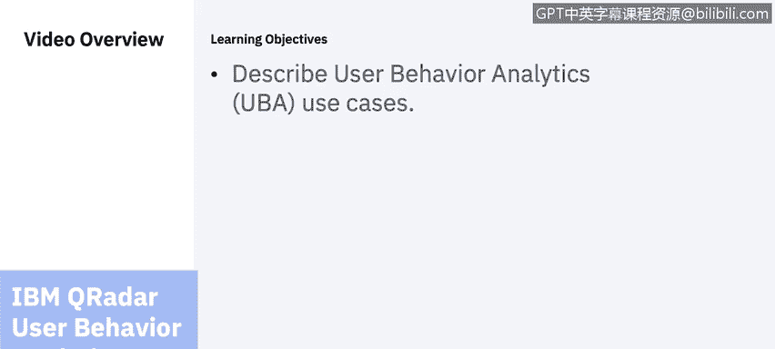
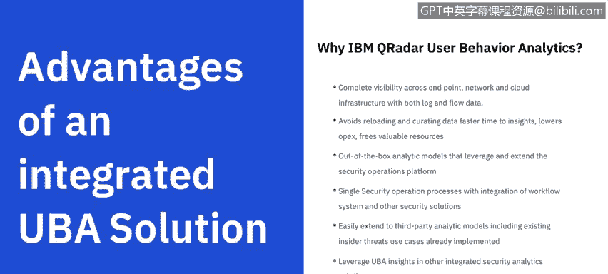
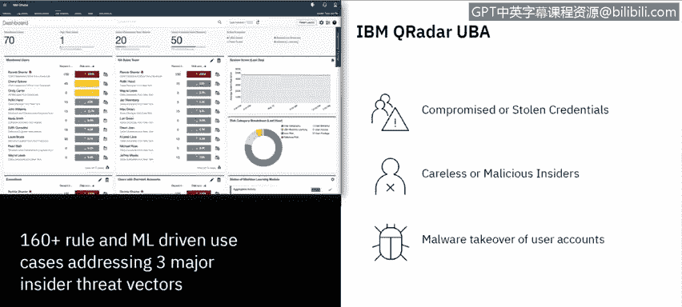
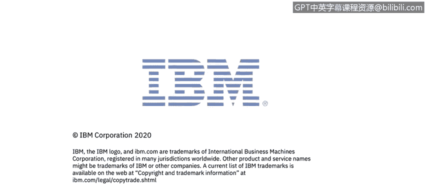

# IBM网络安全分析师专业证书课程6：《网络威胁情报课程（IBM）》｜ibm-cyber-threat-intelligence｜ - P71：32_01_user-behavior-analytics.en_subtitled - GPT中英字幕课程资源 - BV1jN411679K

Hi there。 This is Chde Lancaster with IBM。 And today。

 I'm going to spend a few minutes and talk to you about IBM Q Ra's Use behavior analytics application。

😡，And we're going to look at some user behavior use cases。 So let's get started。

 Let's talk about how。

UBA and a SIM can help and what things they can actually monitor and protect and you'll see UBA written a couple of different ways。

 you'll see it written as UBA user behavior analytics or UEBA user and entity behavior analytics so an entity could be a machine an entity could be an account that is not an actual user so those terms are essentially the same thing we're monitoring the same thing when we talk about UBA or user and entity behavior analytics really it all fundamentally comes down to the SIM because that's where all this data is brought into and then UBA will look at that data in a different way and evaluate risks based on users and so we're getting things from threat andtel sources like IBM's X force your networking equipment or network infrastructure so things like firewall。

switchches， routers， those kind of things， systems that are in the cloud。

 your identity and access systems become very important with UA because that is tracking who has privileged account access and what they're logging into。

 of course data is very important things like datas and any of your data that is important customer data。

 those kind of things， your applications， homegrown applications or applications where you're storing your data and then of course mobile devices as we see a prevalence for people working from home now as I record this we're in the middle of the COviID-19 pandemic so most people who can are working from home in the United States and poses even a more fundamental problem around user behavior and then of course your endpoint so the actual machine that someone is logging into to access corporate resources and the security info ecosystem that brings all these log source。

And flow sources together in the SM are really what make up our security ecosystem。

 that's the fundamental part of the security ecosystem to help protect organizations。

So there really are some of advantages of an integrated UVA solution and then we'll talk a little bit about specifically about IBMQ radar UA or user behavior analytics。

 it gives you complete visibility across the endpoint your network and your cloud infrastructure with both log sources and flow data。

 the first thing that malicious actors will do when they get into a corporate resources turn off logging and if loggings turned off you can't see anything and you're pretty much blind。

 however network data does not lie so if I can see the infiltration from a network perspective I see that the malicious actors IP address was able to gain access to an IP address in my organization I'm able to see what's going on from a network perspective and depending on what type of solution I have。

 I may be able to even be able to see what kind of communication is happening between those devices。

 whether it's a。😡，DataExfiltration， whether it's a command and control。

 but the nu of it is that network data doesn't lie。

QRar user behavior analytics gives you faster time to insights and frees up valuable resources for other investigations as well。

 provides analytic models that leverage the security operations platform and works because is integrated with QR it works with the same workflow and same pane of glass that QRD provides as well as also leveraging artificial intelligence from Q radarR advisor。

 and it also can help with third-part analytics models that may be using existing insider threat use cases that you've already implemented so it can integrate with other tools and other use case models that you may have implemented in your organization。

So this is a screenshot of IBM Q radar user behavior analytics and there really are three use cases we're going to talk about。

 compromised or stolen credentials， careless or malicious insiders。

 and we really won't distinguish between those because essentially the activity may be the same even though one the motivations are different。

 and then malware takeover of user accounts， within Q radar user behavior analytics。

 we have 160 more than 160 rules and machine learning driven use cases that address those three major inside threat vectors that I mentioned。

😡。

So here's how QRDR detects compromise credentials and you'll see that we have map this to the MIre attack framework。

 so this may look familiar to many of you and here are some of the vectors that we're looking at so things like ph download so if someone is forced to go or it clicks on a link and goes to a URL download some weaponized malware and the use cases around that are accessing risky IP and then getting those malware and then you'll see that the third row shows some of the data sources that will help。

😡，UbaA figure those use cases and give you information around those。 So when you look at fishing。

 it's things like your firewall and your web gateway，'s if you're looking at command and control。

 it's potentially that the tactic is an outbound communication with a command and control server。

 And then you can look at these at your leisure。 But these are things that cur radar UbaA can help protect organizations from across the line from fishing all the way to data exfiltration。

Miicious behavior， unfortunately is very hard to track because there are many different types of malicious behavior。

 so it could be someone with VPN access to VPN access that has someone else's credentials so they're using someone else's VPN certificate。

 abnormal login time， so logins outside of normal hours or from different location。

 know one of the things that we'll track is is someone logging in say from one state and then a state 1000 miles away within a very short amount of time that would make a geographically impossible for that to occur。

 abnormal file access and download so changes in download behavior things like activity and frequency change and potential escalation or privileges are all things that could be an issue and bear investigation and would be alerted within UBA and then also excessive printing that that does data exfiltration or a large。

Transfer files to a particular print server for exfiltration later you secondly we'll look at an abnormal drop in file activity。

 abnormal drop in email activity so like I said before user access an unusual time。

 an abnormal drop in web activity or visits to job search sites are all things that we may want to track and then I talked about it before abnormal login time abnormal file access and download we can also track whether USB devices have been inserted and what types of data is being saved to those USB devices from writing to the USB from things like endpoint logs。

 print server logs or DLP solutions， data loss prevention solutions。

User behavior analytics does require some maturity in order for it to be effective。

 You're not going to buy a SIM install it and then start using UVA right away and get data from it。

 it really is a curve of and are more mature organizations are ones that are able to successfully leverage UVA you have to get your SIM set up and tuned correctly and so you need to get your log sources input correctly and make sure that they're parsing correctly in the SM your LDAP set up that does those reference maps around users and different parts of the organization user ID coalescing so oftentimes the same user may have multiple IDs so we need to make sure that we're tracking those things and make sure that you're aligning with your business needs and then you need to configure and tune the system so that you're getting the correct data within the。

😡，And making sure that you're not getting false positives in those kind of things so when you look when you look at leveraging UBA。

 whether it's IBMQ radar UBA or any UA solution the steps are to focus on your accounts and the access that people have expand to your user views with networking session data and then building compared to the peer group so other people within the organization that have a similar job and those are all things that can be track with machine learning within Q radar and then you look at some outcomes from the analytics that you are gathering or the data you are gathering I should say。

 so things like account anomalies access deviations looking at abnormal user behavior so if someone may download 10 megs of data a month and all of a sudden they're downloading gigs and gigs of data that might be something we want to obviously investigate and then detect users deviating from their normal behavior which I。

or from people within the peer group are all things that are anomalous behavior that can be tracked with QRDR and would need to be investigated。

UbaA， and specifically， Q rate our UbaA really does deliver。

Additional value to your security operationseration center。

 it makes your analyst more effective because they can help detect known as well as unknown threats and it helps reduce your time to detection and identify activities that need to be investigated more quickly。

 makes your analyst more effective and efficient， and provide a pretty positive RoOi because every Q radar customer is eligible or I should say。

 is able to use UbaA， it's a free out on for Q radar， you just download it from the IM Act exchange。

 you install it on your system and you start enabling the rules that are important to you in your organization and you'll get data very quickly when you turn on machine learning。

 you'll get even better insights because it will track the kind of behavior that particular users and groups do。

 and then will help identify anomalous behavior if they deviate from their normal behavior。

It's quick to deploy and configure， as I mentioned it's just an app that is downloaded and it's really easy to tune。

 so the time to value is very short as well。😡，Thanks for your attention。

 That's what I wanted to cover today。😡。

