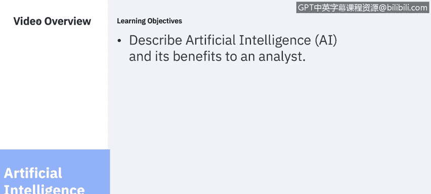
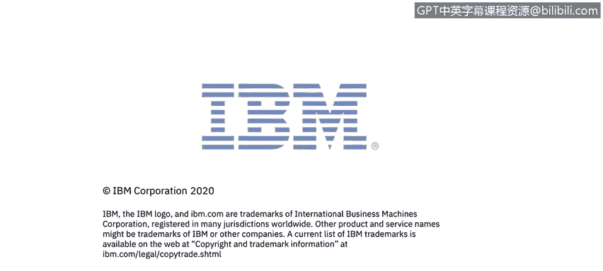

# IBM网络安全分析师专业证书课程6：《网络威胁情报课程（IBM）》｜ibm-cyber-threat-intelligence｜ - P72：33_01_ai-and-siem.en_subtitled - GPT中英字幕课程资源 - BV1jN411679K

Welcome to Artificial Intelligence and Sim， brought to you by IBM。In this video。

 you will learn to describe artificial intelligence or AI and its benefits to you as an analyst。

Whether you're part of a security team of 2 or 100， your goals are to ensure the business thrives。

 And that means protecting systems and data to stay compliant。

 stopping threats and staying ahead of cyber crime。

 But the pressures plague in the modern so today day make it difficult for you to achieve your goals。

 Let's take a closer look at the five challenges Mosss are facing today day。

Organizations are facing more challenges than ever to achieve their business goals。

 You might find yourself saying there's so much information。

 it's impossible to find what's useful and connected。 My workload is overwhelming and repetitive。

 and I don't know where to begin。 I'm new to the industry and it'll take me time to develop my skills。

 I don't know where to focus my time on。 And I'm facing increased scrutiny from executive leaderships。

 clients， employees， investors and regulators。

Cs are adopting more point solutions than ever before to stop new evolving threats。

 Too much information is overlied， simply because you， as an analyst。

 may not know how the information is connected。 It's difficult to uncover actionable insights。

 and you， as an analyst， may then choose to work on only cases that you are confident about。

 which could lead to missing certain investigations in exposing your organization to risk。

The sheer volume， variety and speed of insights to analyze make it difficult for you to prioritize your work and get to the root cause。

 This is true for companies of all sizes， not just enterprises。

 No analyst knows where to start piecing together local context that helps them quickly and effectively identify the problem at hand。

Sometimes you become overwhelmed with repetitive work and fatigue。

 which results in a breakdown of this process and a high probability of an incident exposing the organization to risk。

So how do security professionals know they're successful in protecting and defending their data。

 There are multiple metrics that you can use， but one that is quite popular and often uses is dwell time。

 D time is basically the duration a threat actor has undetected access in the network until it's completely removed。

Whenever we talk to security analysts， the most commonly used words they use to describe their job is overworked and understanded and overwhelmed。

 Tier when analysts are often new to the industry and the workforce。

 It takes time for them to truly develop the skills。

 confidence and maturity in your investigation skills。

Most analysts have to deal with a plethora of inside sources and may be getting an alert from multiple sources at any given time。

Regardless of where the alert is coming from， you， as an analyst。

 need to quickly understand the context of a potential threat and correlate trends between different sources。

 unusual domains， Ipss。 Jude went through a lot of these during his same overview。

 You must stay up to date on cyber attacks against specific business industries and geographies and use external research as you learned about in module one of this course。

 You must prioritize and validate potential malicious activity that could have severe business impact。

 You must understand expected system behavior to recognize divergent and actual system behavior report valid threats to appropriate teams for remediation and share knowledge with other analysts。

 and most importantly， you， as an analyst have to provide reliable information to build personal reputation。

 This process， as you can imagine， is extremely time consuming。But there's got to be an easier way。

The main takeaway here is that there needs to be a partnership between analysts and their technology。

They are not mutually exclusive。 Each has strengths such as common sense with humans and bias elimination and trade off analytics with AI。

 But together gatherler as a team， they can better stop threats and reduce well times。Also。

 you as a security analysts play a key role here as well。 Remember。

 AI learns your environment and provides actionable intelligence based on the data that you feed it。

 So if you're not feeding AI reliable data， you more than likely won't trust the decisions being made for you by AI。

😊。

