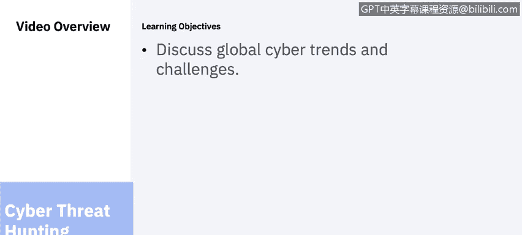
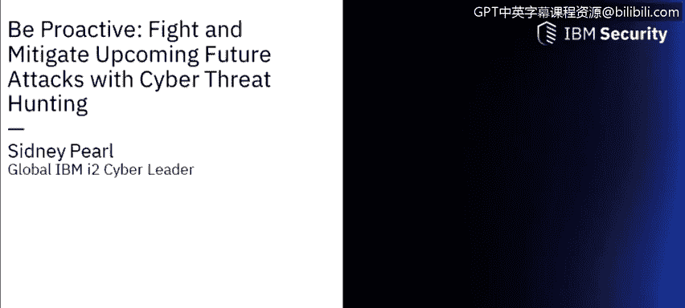
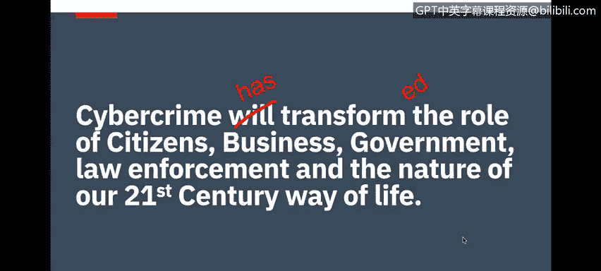
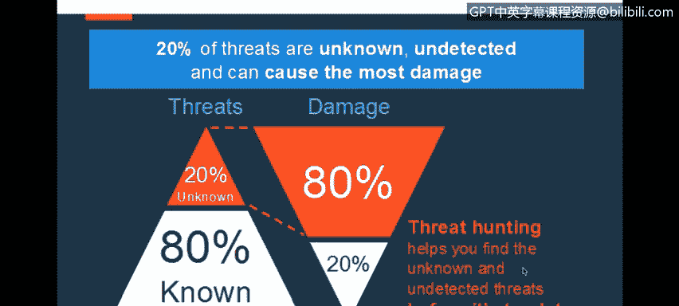
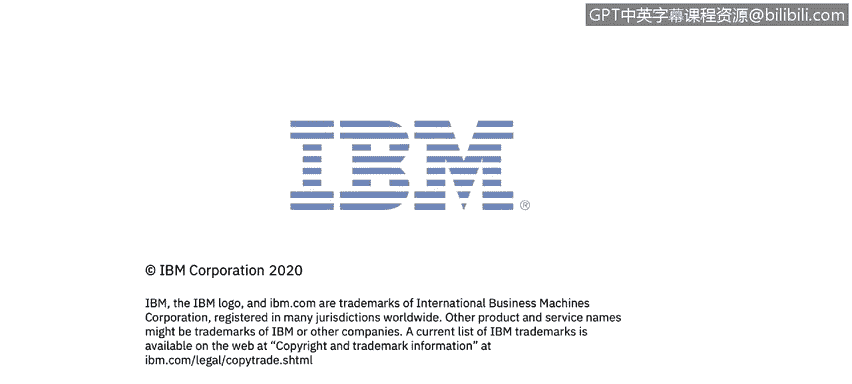

# IBM网络安全分析师专业证书课程6：《网络威胁情报课程（IBM）》｜ibm-cyber-threat-intelligence｜ - P74：35_01_fight-and-mitigate-upcoming-future-attacks-with-cyber-threat-hunting - GPT中英字幕课程资源 - BV1jN411679K

Be proactive， fight and mitigate upcoming future attacks with cyber threat hunting brought to you by IBM。

In this video， you will learn to discuss global cyber trends and challenges。

Cyber threats vary greatly， and so do the methods of attack to counter those various sources。

 organizations need intelligence to fortify themselves from both internal and external threats to prevent future attacks organizations can identify and investigate attacks after an incident。

 All insights become part of the organization's cybersecurity strategy and tactics resulting in an intelligent approach to cybersecurity。

 The next three videos are a replay of a webinar that Sydney Pearl。

 a cybersecurity expert at IBM presented to a global audience。 Good afternoon， everyone。

 Thank you for your time today。 pleasure you're speaking with each of you。

 Quick introduction over myself beyond the global IBM I2 Cy leader I have My background is part United States Navy 12 Act Res and special operations Inligence and communications。

 I've worked with a number of organizations。😊。

In addition to my military career， I've also worked at UNIC Corporation as an executive architect working within the eight global security Operation centers at UNICs。

 also served as the executive principalnc for cyber intelligencetelligence and Ana at UNICs。

 that was my last role prior to leaving and joining IBM。

And I joined IBM to lead the cyber threat huntinging initiative for IBM's I2 technology additional capabilities and backgrounds that I have is I also serve as the executive director of the Traking counter trafficffickking information sharing analysislysis organization I a Kennedy Space Center at NASA facilities down in Florida and also serve as the volunteer chief cyber intelligence officer as well。

 so I've been at it around not only traditional Pro and Def cybersecur aspects。

 I also bring a combination of both intelligence experience from my military years all the way through to working with law enforcement。

And also now into working in the cybersecurity industry as well for a number of years over 12 plus years in doing that so as part of that I want to talk to you today about what are some of the global cyber trends and challenges that we're seeing the good news is that I've now talked to a number of organizations around the world I've been in 18 countries and I've delivered now cyber threat hunting workshops to a number of clients across each of those different countries and I can certainly share with you that from global systems integrators to managed security services providers to multi industrydustry opportunities and situations clients and partners and service providers are recognizing that cyber threat hunting proactive cyber threat hunting need to be integrated into stockck operations today so as part of that I just want to say that we can all conclude that cybercr has transformed the role of citizen。

Business government law enforcement， etc cetera cyber touches everything that we do is not something we can turn a blind eye to as an example of that let's just take the healthcare industry as an example。

 let's say that for example， that you have a defibrillator because you have a heart problem all of these devices are what we are defining as internet of things and all these devices are now moving into。

The state of all being wireless and w-fi and IP enabled so over the next five years you're going to see a definitive trend as the internet of things continues to take hold and to drive and defined who we are path the culture globally and as more of these technologies take hold naturally that introduces a number of different cybersecurity challenges as part of that but the is is that cyber touches everything today and what we can call it cyber we can call it internet we can call it whatever form of electronic forms of communication that we want to define it as but the bottom line as we're all connected and with those types of connection that leads to a number of challenges so as part of those challenges a number of breaches of course are caused by non malicious and criminal actions and activities a number of organizations are facing a numerous challenges from cyber cyber skill shortages certainly not even talking about cyber damage。

and cybersecur specifically and the challenges that we're facing in the cyber skills space to be able to fill those types of。

Types of responsibilities and skills as we look to deploy and support these types of solutions。 Now。

 without a key point here， that's very important。Is that what we call the dwell time。

 the dwell time by which a vulnerability or threat has been within your network or other networks that has been there without it being identified and recognized and that average dwell time is approximately 191 days now that varies from organization to organization the bottom line is that all organizations and industries today are facing a number of challenges as it relates to how to identify the threat before it actually becomes a problem and identify the sophistication of this。

Now as part of that， the advancement of these threats continue to grow so as we all know threat actors。

 whether that's transnational criminal organizations。

 the criminal underground whatever form may come in whether it's nation states against nation states the reality is that they are highly resource and that means they have more time。

 more money and more resources than we ever will they're also highly sophisticated in what they do and what I mean by it is is that they are actually running a business and you can see here the types of attacks that have occurred in the United States and of course this is not necessarily limited to the United States but these are good examples。

Of the length of time that a wrapped was in the organization before it was actually found and they the amount of damage that was actually done。

 so when we talk about sophistication，These transnational criminals and criminal underground activities and nation state。

Have accessed more time， more money and resources， and that means for example they can run businesses like ransomware as a service。

 like malware as a service。And as part of that certainly these are all challenges。

 but as part of this we can certainly see that the dwelling in the network is a challenge。

 how do you identify those threats before they become actual problem and these are other examples as to some of the challenges that we're facing now as I speak to a number of chief information security officers around the world across multiple industries military government law enforcement。

Financial services， insurance， healthcare to me， you know。

 I've been around this a very long time and data is data and criminal activities is criminal activity so for example。

 some of the work that I've done in the past，I've helped gather information around international fugitives。

 criminal fugitives that have been there are fugitives from justice that have moved and relocated and delocated to different locations around the world and some of the information and intelligence have gathered and help provide as of course to help delocate and get eyes on location of what these people are located so they can get captured and an extradited back to the countries from already they originate。

 so to me data is data。And whether you're talking about cyber criminalmins or you're talking about terrorist organizations or whether you're talking about financial crimes to meet data and data and how do you identify that data now cisos are saying that from the realm of target acts of war and terrorism to indirect criminal activities to target data that espionage hackivist groups。

 the reality is that the threat vectors are multidimensional as well。

 and they're coming from various environments and activities and from zero day threats to ransomware to malware all these types of threats or causing and challenges for ourselves as well as for our clients and naturally the SOC has to understand and the ministry services organization has to be able understand that if you continue to play the game of protecting defend。

 which is extremely important， no doubt about it is very important， protecting defend is critical。

However， well also need to evolve to the next level of getting into more proactive cyber threat hunting。

 so as part of that is we look at some stock challenges。As to what we're finding。

 as we speak to a number of directors of stockck operations， global systems integrators。

 managed security service providers， we're finding that one of the current trends and needs。

In the marketplace is to increase the speed and accuracy of the response now how do you do that we don't have insight to the hidden and unknown and emerging threats how do you know how to increase the speed and accuracy of the response Now reality is is that in the traditional sock today the tier1 tier 2 systems the endpoint systems the firewalls tier 2 systems being the S know those systems are certainly doing their job but they're only going to find 80% of the known threats challenge is that the 20% of the unknown threat is causing 80% of the greatest damage and so as you look at the pyramid of how it is inverted from the actual threats of being 80% known to the 20% being unknown and the 20% being the greatest amount that's doing the greatest amount of damage you can see here where。

After you now start evolving your so to the next gen capability。

 that means we now need to start ingesting andcorporating。

Intelligence led analysis and what we call the intelligence lead cognitive stock。

